# KIBANA-OO — Architectuur & Documentatie

**KIBANA-OO** is een AI-ondersteunde observability-tool voor het KOOP / Plooi-platform. Het laat een
operator (1) in natuurlijke taal **chatten** over Elasticsearch-logs & -metrics, en (2) een
admin-**monitoring dashboard** openen dat critical issues, certificate-expiry, "document not
found"-errors en de OVS→NVS pipeline-migratiestatus toont — alles gelezen **via Kibana** (de app
praat nooit direct met Elasticsearch en probet nooit externe URLs).

- **Frontend:** React 19 + Vite, geserveerd door nginx.
- **Backend:** FastAPI (Python 3.13), praat met Kibana's console-proxy en een lokale Ollama-LLM.
- **LLM:** Ollama die `llama3.2:3b` draait (CPU).
- **Auth:** Keycloak OIDC, via Kibana's interne login (de app bewaart alleen de Kibana `sid`-cookie).

---

## 1. Systeemarchitectuur (container view)

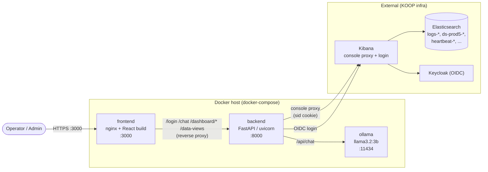

**Belangrijke invariant:** de backend bereikt Elasticsearch **alleen** via Kibana's
`/api/console/proxy`-endpoint, geauthenticeerd met de Kibana-sessiecookie van de user (`sid`).
Er is geen directe ES-client en geen outbound probing van gemonitorde websites.

---

## 2. Repository-layout

```mermaid
flowchart TD
    root["KIBANA-OO/"]
    root --> be["backend/ (FastAPI)"]
    root --> fe["frontend/ (React + Vite)"]
    root --> dc["docker-compose.yml"]
    root --> docs["docs/ (specs, plans, this file)"]

    be --> b_main["main.py — app, /health, /data-views, /login, /logout, /chat"]
    be --> b_dash["dashboard.py — /dashboard/summary, /briefing, /certificates"]
    be --> b_mon["monitoring.py — fact layer (aggregations, snapshot)"]
    be --> b_cert["certificates.py — TLS expiry from Kibana data"]
    be --> b_brief["briefing.py — grounded LLM prompt"]
    be --> b_sess["session.py — in-memory session store"]
    be --> b_auth["auth.py — require_admin"]
    be --> b_el["elastic.py — Kibana proxy client + Keycloak login"]
    be --> b_llm["llm.py — Ollama client"]
    be --> b_cfg["config.py — settings"]
    be --> b_cache["cache.py — TTL cache"]
    be --> b_tests["tests/ — pytest suite"]

    fe --> f_app["src/App.jsx — Login + Chat + router"]
    fe --> f_dash["src/Dashboard.jsx — dashboard + panels"]
    fe --> f_api["src/api.js — fetch helper"]
    fe --> f_css["src/styles.css"]
    fe --> f_nginx["nginx.conf — static + reverse proxy"]
```

---

## 3. Backend module-map

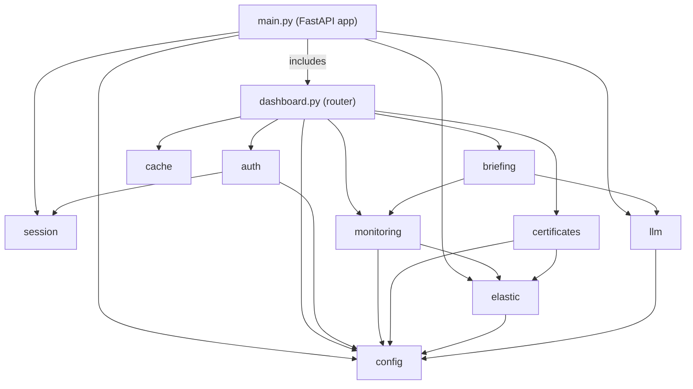

Elke module heeft één verantwoordelijkheid: `elastic` (Kibana I/O), `monitoring` (deterministische facts),
`certificates` (TLS-expiry), `briefing` (LLM-narratie), `auth`/`session` (identity), `cache`
(memoization), `config` (settings).

---

## 4. Authenticatie-flow (Keycloak via Kibana)

```mermaid
sequenceDiagram
    participant B as Browser
    participant FE as nginx (frontend)
    participant BE as backend
    participant K as Kibana
    participant KC as Keycloak

    B->>FE: POST /login {username, password}
    FE->>BE: proxy /login
    BE->>K: POST /internal/security/login (oidc)
    K-->>BE: Keycloak auth URL
    BE->>KC: GET auth form, POST credentials
    KC-->>BE: 302 -> Kibana callback
    BE->>K: GET callback (sets sid cookie)
    K-->>BE: sid cookie
    BE->>BE: create_session(token -> {username, sid})
    BE-->>B: { token, username }
    Note over B,BE: Browser stores token in sessionStorage;<br/>sends "Authorization: Bearer <token>" thereafter.
```

The backend never stores the password and never sees the Keycloak token — only the resulting
Kibana `sid` cookie, kept in an **in-memory** session map (resets on restart).

---

## 5. Chat-flow (streaming)

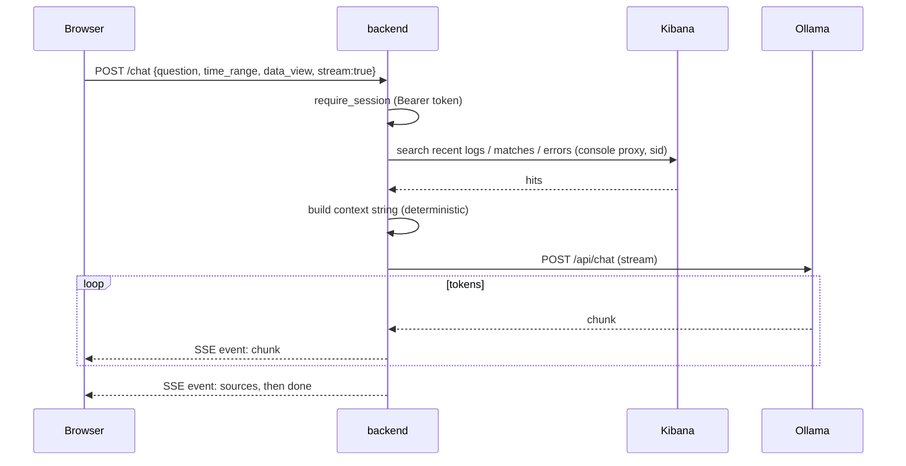

---

## 6. Dashboard data-flow (de fact layer)

`GET /dashboard/summary` resolves the window **once**, then fans out concurrent Kibana queries and
assembles a single consistent snapshot. Numbers are 100% deterministic; the LLM only narrates them.

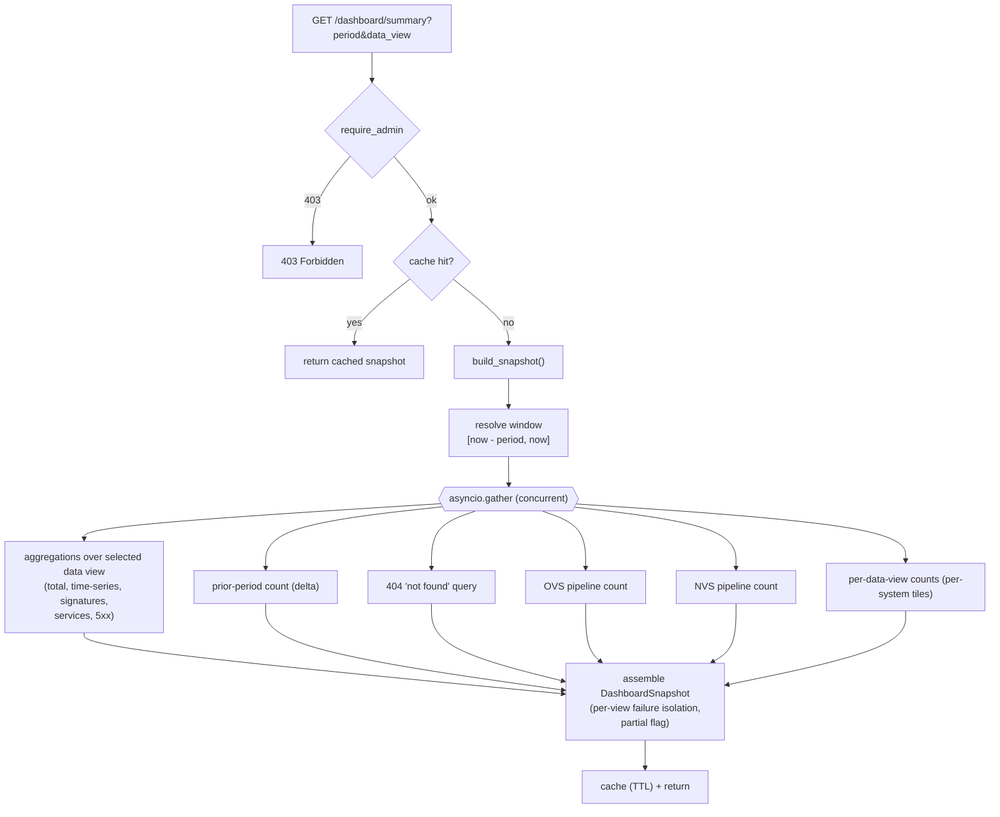

**Robuustheid:** als de core-aggregatie faalt → `502`. Als een *secundaire* query (een data view,
de baseline, 404s, een pipeline) faalt, degradeert dat deel naar empty / "unavailable" en wordt de
snapshot gemarkeerd als `partial` — de rest rendert nog steeds.

### "What is critical?"

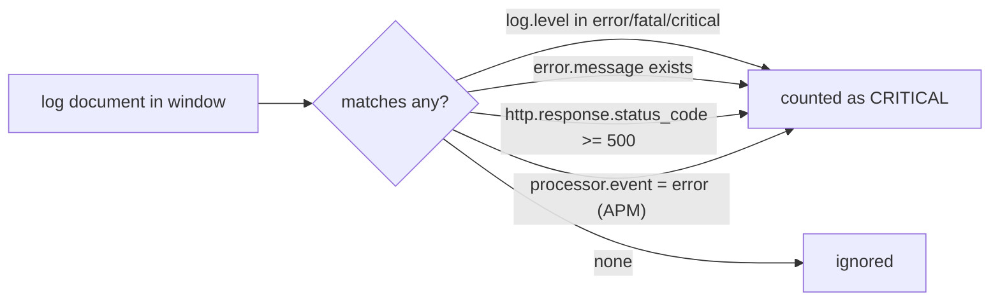

404s zijn **niet** critical (client error) — ze hebben hun eigen panel.

---

## 7. Dashboard-panels

| Panel | Vraag die het beantwoordt | Bron |
|-------|--------------------|--------|
| Status banner + KPIs | Hoe erg is het nu vs. de vorige periode? | aggregations + baseline |
| Certificate expiry | Welke TLS-certs gaan binnenkort verlopen? | Heartbeat/Synthetics (`CERT_INDEX`) |
| Documents not found (404) | Welke documenten konden users niet openen? | 404-query op geselecteerde view |
| Verwerkingsstraat OVS→NVS | Is de migratie naar de nieuwe pipeline klaar? | `PIPELINE_*_QUERY` counts |
| Criticals over time | Wanneer piekten de issues? | date_histogram |
| By system | Welk systeem is getroffen? | per-data-view counts |
| Top error signatures | Wat faalt er? | `error.type` terms agg |
| Affected services | Waar eerst kijken? | `service.name` terms agg |
| HTTP 5xx | Welke endpoints gaven server errors? | status-code + url.path aggs |
| AI daily triage | Samenvatting in gewone taal van het bovenstaande | grounded LLM over de facts |

Elk panel/elke KPI/control heeft een on-demand **ⓘ tooltip** met een uitleg in gewone taal.

---

## 8. Certificate-monitoring (read-only, vanuit Kibana)

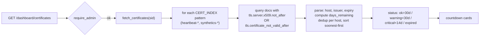

De expiry van het certificaat wordt **gelezen uit monitoring-data die al in Elasticsearch staat** — de app
opent **geen** TLS-connectie naar de site. Bestaat zulke data niet, dan toont het panel een
vriendelijke "not set up yet"-melding.

---

## 9. OVS → NVS pipeline-monitoring

OVS = *oude verwerkingsstraat*, NVS = *nieuwe verwerkingsstraat*.
Het platform migreert OVS → NVS, dus de **oude pipeline moet naar nul tenderen**.

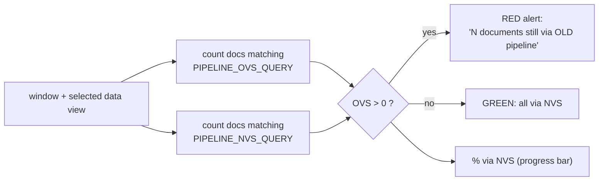

Matching is **instelbaar** (`PIPELINE_OVS_QUERY` / `PIPELINE_NVS_QUERY`) zodat het zich aanpast aan hoe de
logs de pipelines labelen, zonder code aan te raken.

---

## 10. Datamodel — `DashboardSnapshot`

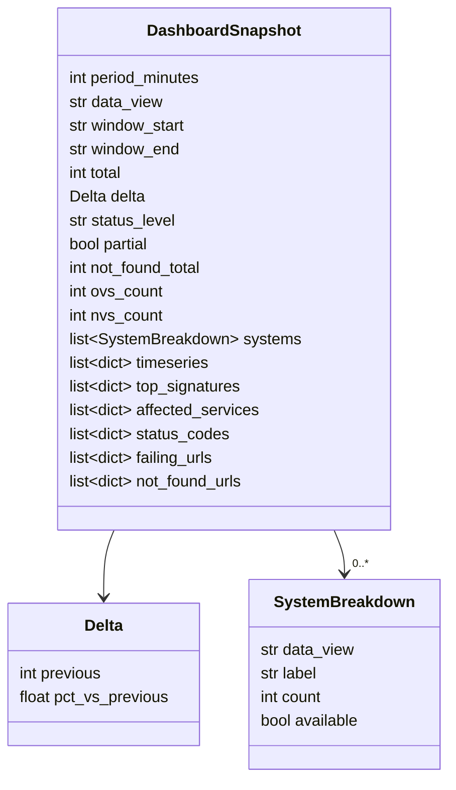

---

## 11. HTTP-endpoints

| Method | Path | Auth | Doel |
|--------|------|------|---------|
| GET | `/health` | none | liveness + model name |
| GET | `/data-views` | none | list of selectable data views |
| POST | `/login` | none | Keycloak login → session token |
| POST | `/logout` | token | drop session |
| POST | `/chat` | session | SSE-streamed LLM answer over log context |
| GET | `/dashboard/summary` | **admin** | deterministic snapshot (cached ~60s) |
| GET | `/dashboard/briefing` | **admin** | grounded AI triage (cached) |
| GET | `/dashboard/certificates` | **admin** | TLS expiry cards (cached ~1h) |

---

## 12. Configuratie (environment variables)

| Variable | Default | Doel |
|----------|---------|---------|
| `KIBANA_URL` | `https://kibana-prod.cicd.s15m.nl` | Kibana base URL |
| `KIBANA_SPACE` | `koop-plooi-prod` | Kibana space |
| `OLLAMA_BASE_URL` | `http://ollama:11434` | Ollama endpoint |
| `OLLAMA_MODEL` | `llama3.2:3b` | LLM model |
| `DATA_VIEWS` | `logs-*,ds-prod5-koop-plooi*,ds-prod5-koop-sp` | selectable / whitelisted index patterns |
| `DEFAULT_DATA_VIEW` | `logs-*` | default data view |
| `DASHBOARD_ADMINS` | — | comma-separated admin usernames/emails |
| `DASHBOARD_TIMEZONE` | `Europe/Amsterdam` | display timezone |
| `DASHBOARD_CACHE_TTL` | `60` | summary/briefing cache seconds |
| `DASHBOARD_SUPERSET_VIEWS` | `logs-*` | views excluded from rollups |
| `CERT_INDEX` | `heartbeat-*,synthetics-*` | where TLS monitoring data lives |
| `PIPELINE_OVS_QUERY` | `OVS OR "oude verwerkingsstraat"` | match docs to the old pipeline |
| `PIPELINE_NVS_QUERY` | `NVS OR "nieuwe verwerkingsstraat"` | match docs to the new pipeline |

Index-patterns worden gevalideerd tegen een regex en whitelist voordat ze in het
Kibana-proxy-path geïnterpoleerd worden (injection guard).

---

## 13. Security-model

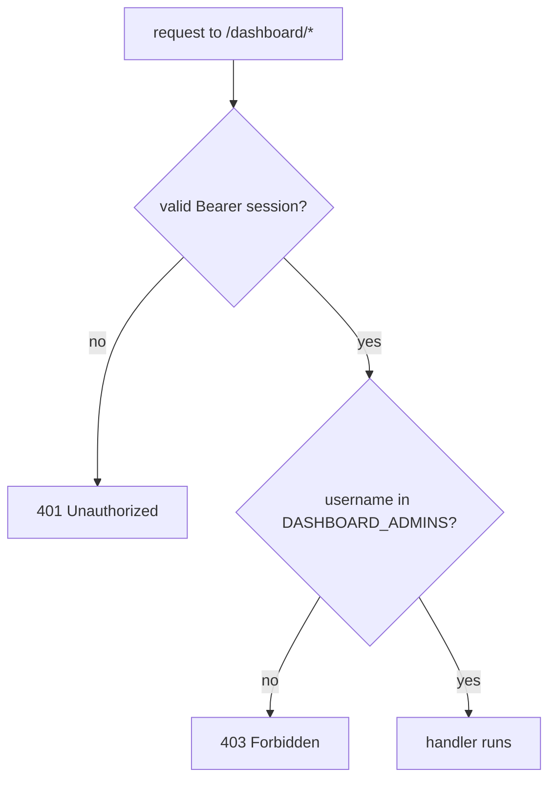

- **Server-side** enforcement op elk dashboard-endpoint (de UI *verbergt* alleen de nav-link).
- Admin-gating vandaag = env-allowlist; Keycloak group-claim-gating is een gedocumenteerde fase-2
  (login captured nu alleen de `sid`-cookie, niet OIDC group claims).
- Geen secrets in de repo; index-patterns whitelisted + regex-guarded.

---

## 14. Deployment

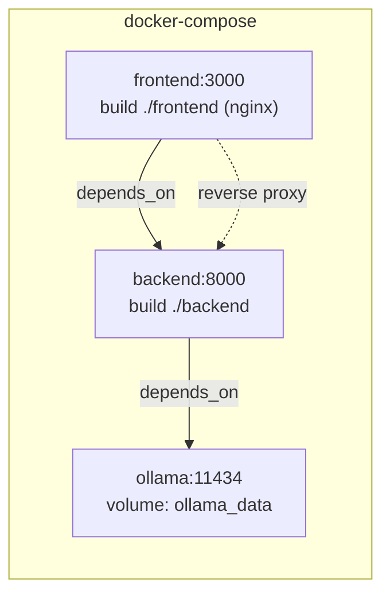

Opstarten: `docker compose up -d`. De nginx van de frontend serveert de gebouwde SPA en reverse-proxiet
`/login`, `/logout`, `/chat`, `/health`, `/data-views` en `/dashboard/` naar de backend (met
buffering uit voor SSE-streaming).

---

## 15. Draaien & testen

**Draai de stack**

```bash
docker compose up -d            # ollama + backend + frontend
# open http://localhost:3000
```

**Backend-tests** draaien in een Python 3.13-container (matcht prod; de Python 3.14 van de host kan
pydantic-core niet builden):

```bash
MSYS_NO_PATHCONV=1 docker run --rm \
  -v kibana_oo_pipcache:/root/.cache/pip \
  -v "$PWD/backend:/app" -w /app python:3.13-slim \
  sh -c "pip install -q -r requirements.txt && python -m pytest -q"
```

**Frontend-build** wordt geverifieerd via de Docker-image-build (`docker compose build frontend`).

---

## 16. Roadmap (fase 2)

- Spike / baseline anomaly-detectie ("critical alleen bij afwijking vs. trailing baseline").
- Dagelijkse digest (Slack / email) die dezelfde fact layer hergebruikt.
- Geplande snapshots voor instant loads en resilience tegen Kibana-hiccups.
- Keycloak **group-claim** admin-gating (vereist het capturen van OIDC-claims bij login).
- OVS/NVS **trend over tijd** (migratiecurve).
- Verfijn OVS/NVS- en 404-field-matching tegen echte productie-fields.

---

*Design-spec: [`specs/2026-06-08-monitoring-dashboard-design.md`](specs/2026-06-08-monitoring-dashboard-design.md) ·
Implementatieplan: [`plans/2026-06-08-monitoring-dashboard.md`](plans/2026-06-08-monitoring-dashboard.md)*
