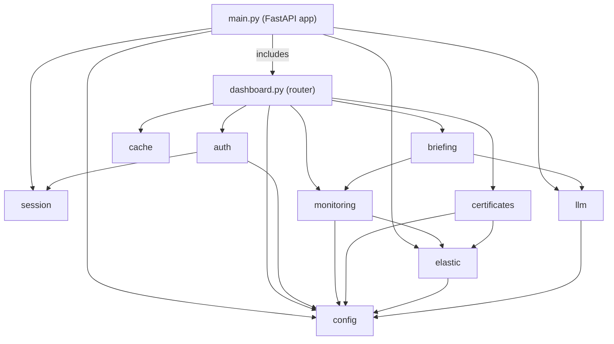
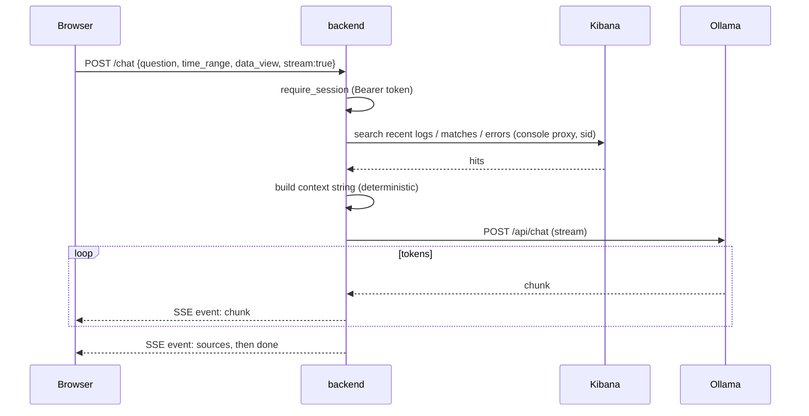
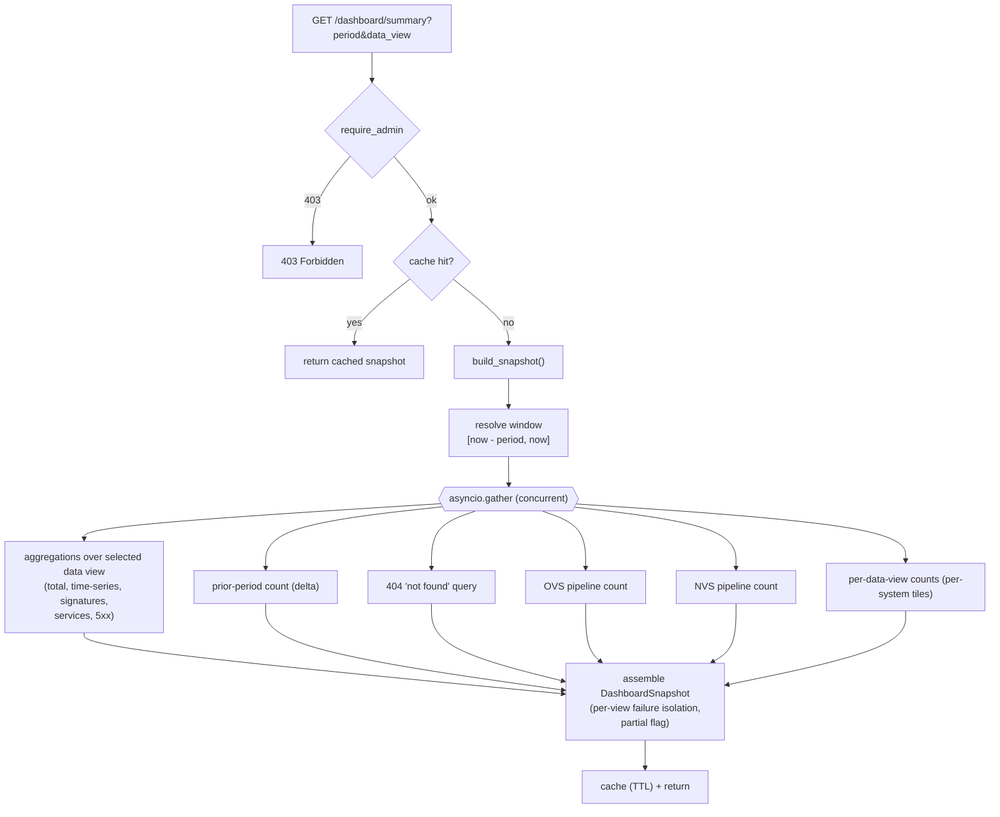
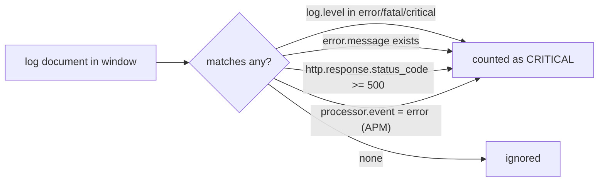
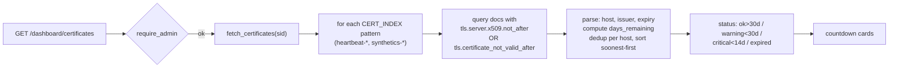
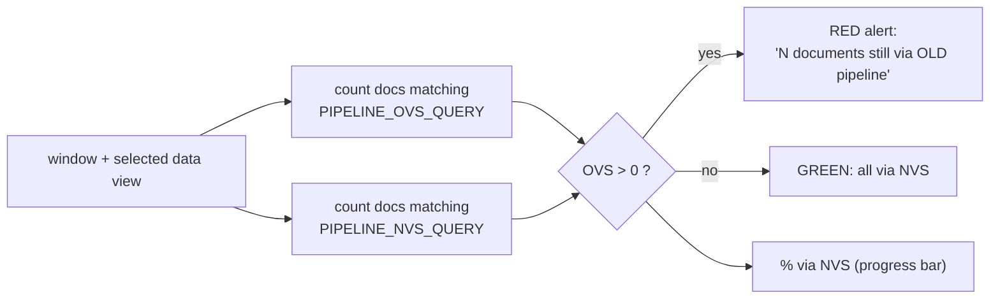
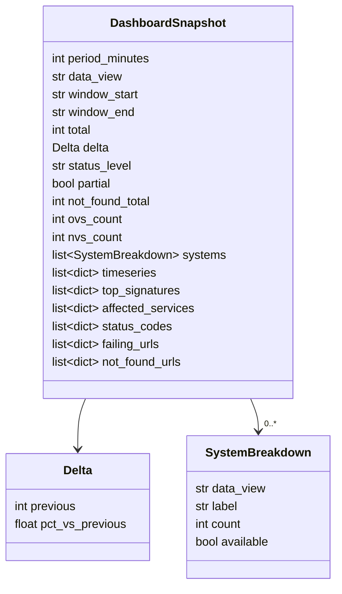
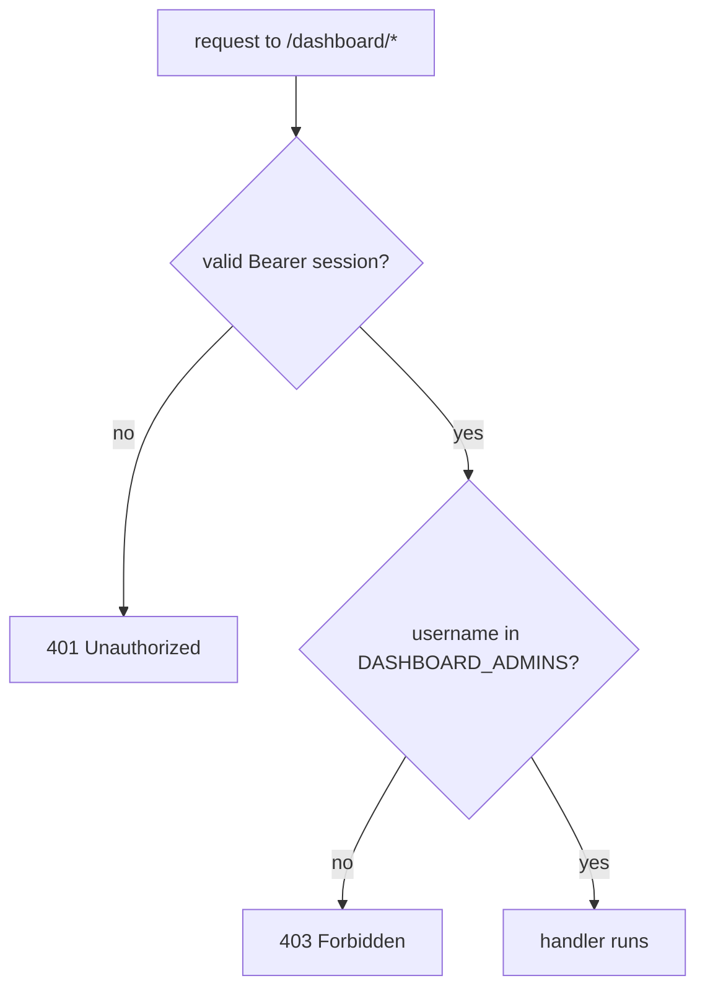
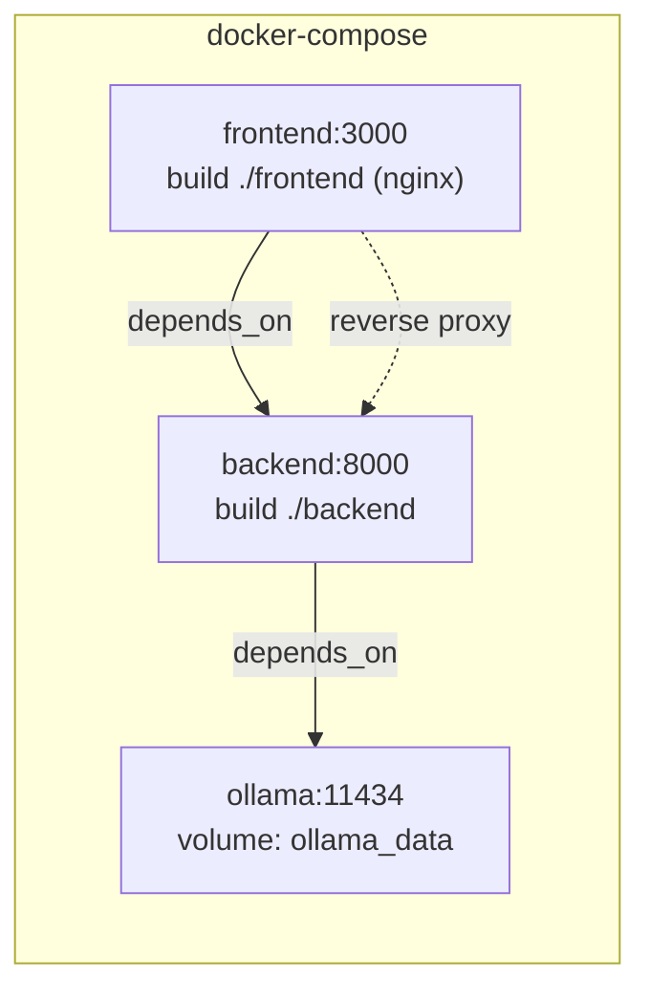

# KIBANA-OO — Architecture & Documentation

**KIBANA-OO** is an AI-assisted observability tool for the KOOP / Plooi platform. It lets an
operator (1) **chat** in natural language about Elasticsearch logs & metrics, and (2) open an
admin **monitoring dashboard** that surfaces critical issues, certificate expiry, "document not
found" errors, and OVS→NVS pipeline migration health — all read **through Kibana** (the app never
talks to Elasticsearch directly, and never probes external URLs).

- **Frontend:** React 19 + Vite, served by nginx.
- **Backend:** FastAPI (Python 3.13), talks to Kibana's console proxy and a local Ollama LLM.
- **LLM:** Ollama running `llama3.2:3b` (CPU).
- **Auth:** Keycloak OIDC, via Kibana's internal login (the app stores only the Kibana `sid` cookie).

---

## 1. System architecture (container view)


**Key invariant:** the backend reaches Elasticsearch **only** via Kibana's
`/api/console/proxy` endpoint, authenticated with the user's Kibana session cookie (`sid`).
There is no direct ES client and no outbound probing of monitored websites.

---

## 2. Repository layout

```mermaid
flowchart TD
    root["KIBANA-OO/"]
    root --> be["backend/ (FastAPI)"]
    root --> fe["frontend/ (React + Vite)"]
    root --> dc["docker-compose.yml"]
    root --> docs["docs/ (specs, plans, this file)"]

    be --> b_main["main.py — app, /health, /data-views, /login, /logout, /chat"]
    be --> b_dash["dashboard.py — /dashboard/summary, /briefing, /certificates"]
    be --> b_mon["monitoring.py — fact layer (aggregations, snapshot)"]
    be --> b_cert["certificates.py — TLS expiry from Kibana data"]
    be --> b_brief["briefing.py — grounded LLM prompt"]
    be --> b_sess["session.py — in-memory session store"]
    be --> b_auth["auth.py — require_admin"]
    be --> b_el["elastic.py — Kibana proxy client + Keycloak login"]
    be --> b_llm["llm.py — Ollama client"]
    be --> b_cfg["config.py — settings"]
    be --> b_cache["cache.py — TTL cache"]
    be --> b_tests["tests/ — pytest suite"]

    fe --> f_app["src/App.jsx — Login + Chat + router"]
    fe --> f_dash["src/Dashboard.jsx — dashboard + panels"]
    fe --> f_api["src/api.js — fetch helper"]
    fe --> f_css["src/styles.css"]
    fe --> f_nginx["nginx.conf — static + reverse proxy"]
```



---

## 3. Backend module map



Each module has one responsibility: `elastic` (Kibana I/O), `monitoring` (deterministic facts),
`certificates` (TLS expiry), `briefing` (LLM narration), `auth`/`session` (identity), `cache`
(memoization), `config` (settings).

---

## 4. Authentication flow (Keycloak via Kibana)

```mermaid
sequenceDiagram
    participant B as Browser
    participant FE as nginx (frontend)
    participant BE as backend
    participant K as Kibana
    participant KC as Keycloak

    B->>FE: POST /login {username, password}
    FE->>BE: proxy /login
    BE->>K: POST /internal/security/login (oidc)
    K-->>BE: Keycloak auth URL
    BE->>KC: GET auth form, POST credentials
    KC-->>BE: 302 -> Kibana callback
    BE->>K: GET callback (sets sid cookie)
    K-->>BE: sid cookie
    BE->>BE: create_session(token -> {username, sid})
    BE-->>B: { token, username }
    Note over B,BE: Browser stores token in sessionStorage;<br/>sends "Authorization: Bearer <token>" thereafter.
```

The backend never stores the password and never sees the Keycloak token — only the resulting
Kibana `sid` cookie, kept in an **in-memory** session map (resets on restart).

---

## 5. Chat flow (streaming)



---

## 6. Dashboard data flow (the fact layer)

`GET /dashboard/summary` resolves the window **once**, then fans out concurrent Kibana queries and
assembles a single consistent snapshot. Numbers are 100% deterministic; the LLM only narrates them.



**Robustness:** if the core aggregation fails → `502`. If a *secondary* query (a data view,
the baseline, 404s, a pipeline) fails, that part degrades to empty / "unavailable" and the
snapshot is marked `partial` — the rest still renders.

### "What is critical?"



404s are **not** critical (client error) — they have their own panel.

---

## 7. Dashboard panels

| Panel | Question it answers | Source |
|-------|--------------------|--------|
| Status banner + KPIs | How bad is it right now vs. the prior period? | aggregations + baseline |
| Certificate expiry | Which TLS certs are about to expire? | Heartbeat/Synthetics (`CERT_INDEX`) |
| Documents not found (404) | Which documents did users fail to open? | 404 query on selected view |
| Verwerkingsstraat OVS→NVS | Is migration to the new pipeline complete? | `PIPELINE_*_QUERY` counts |
| Criticals over time | When did issues spike? | date_histogram |
| By system | Which system is affected? | per-data-view counts |
| Top error signatures | What is failing? | `error.type` terms agg |
| Affected services | Where to look first? | `service.name` terms agg |
| HTTP 5xx | Which endpoints returned server errors? | status-code + url.path aggs |
| AI daily triage | Plain-language summary of the above | grounded LLM over the facts |

Every panel/KPI/control has an on-demand **ⓘ tooltip** with a plain-language explanation.

---

## 8. Certificate monitoring (read-only, from Kibana)



The certificate's expiry is **read from monitoring data already in Elasticsearch** — the app
does **not** open a TLS connection to the site. If no such data exists, the panel shows a
friendly "not set up yet" message.

---

## 9. OVS → NVS pipeline monitoring

OVS = *oude verwerkingsstraat* (old pipeline), NVS = *nieuwe verwerkingsstraat* (new pipeline).
The platform is migrating OVS → NVS, so the **old pipeline should trend to zero**.



Matching is **configurable** (`PIPELINE_OVS_QUERY` / `PIPELINE_NVS_QUERY`) so it adapts to how the
logs label the pipelines, without touching code.

---

## 10. Data model — `DashboardSnapshot`



---

## 11. HTTP endpoints

| Method | Path | Auth | Purpose |
|--------|------|------|---------|
| GET | `/health` | none | liveness + model name |
| GET | `/data-views` | none | list of selectable data views |
| POST | `/login` | none | Keycloak login → session token |
| POST | `/logout` | token | drop session |
| POST | `/chat` | session | SSE-streamed LLM answer over log context |
| GET | `/dashboard/summary` | **admin** | deterministic snapshot (cached ~60s) |
| GET | `/dashboard/briefing` | **admin** | grounded AI triage (cached) |
| GET | `/dashboard/certificates` | **admin** | TLS expiry cards (cached ~1h) |

---

## 12. Configuration (environment variables)

| Variable | Default | Purpose |
|----------|---------|---------|
| `KIBANA_URL` | `https://kibana-prod.cicd.s15m.nl` | Kibana base URL |
| `KIBANA_SPACE` | `koop-plooi-prod` | Kibana space |
| `OLLAMA_BASE_URL` | `http://ollama:11434` | Ollama endpoint |
| `OLLAMA_MODEL` | `llama3.2:3b` | LLM model |
| `DATA_VIEWS` | `logs-*,ds-prod5-koop-plooi*,ds-prod5-koop-sp` | selectable / whitelisted index patterns |
| `DEFAULT_DATA_VIEW` | `logs-*` | default data view |
| `DASHBOARD_ADMINS` | — | comma-separated admin usernames/emails |
| `DASHBOARD_TIMEZONE` | `Europe/Amsterdam` | display timezone |
| `DASHBOARD_CACHE_TTL` | `60` | summary/briefing cache seconds |
| `DASHBOARD_SUPERSET_VIEWS` | `logs-*` | views excluded from rollups |
| `CERT_INDEX` | `heartbeat-*,synthetics-*` | where TLS monitoring data lives |
| `PIPELINE_OVS_QUERY` | `OVS OR "oude verwerkingsstraat"` | match docs to the old pipeline |
| `PIPELINE_NVS_QUERY` | `NVS OR "nieuwe verwerkingsstraat"` | match docs to the new pipeline |

Index patterns are validated against a regex and whitelist before being interpolated into the
Kibana proxy path (injection guard).

---

## 13. Security model



- **Server-side** enforcement on every dashboard endpoint (the UI only *hides* the nav link).
- Admin gating today = env allowlist; Keycloak group-claim gating is a documented phase-2
  (login currently captures only the `sid` cookie, not OIDC group claims).
- No secrets in the repo; index patterns whitelisted + regex-guarded.

---

## 14. Deployment



Bring up: `docker compose up -d`. The frontend's nginx serves the built SPA and reverse-proxies
`/login`, `/logout`, `/chat`, `/health`, `/data-views`, and `/dashboard/` to the backend (with
buffering disabled for SSE streaming).

---

## 15. Running & testing

**Run the stack**

```bash
docker compose up -d            # ollama + backend + frontend
# open http://localhost:3000
```

**Backend tests** run in a Python 3.13 container (matches prod; the host's Python 3.14 can't build
pydantic-core):

```bash
MSYS_NO_PATHCONV=1 docker run --rm \
  -v kibana_oo_pipcache:/root/.cache/pip \
  -v "$PWD/backend:/app" -w /app python:3.13-slim \
  sh -c "pip install -q -r requirements.txt && python -m pytest -q"
```

**Frontend build** is verified via the Docker image build (`docker compose build frontend`).

---

## 16. Roadmap (phase 2)

- Spike / baseline anomaly detection ("critical only if abnormal vs. trailing baseline").
- Daily digest (Slack / email) reusing the same fact layer.
- Scheduled snapshots for instant loads and resilience to Kibana hiccups.
- Keycloak **group-claim** admin gating (requires capturing OIDC claims at login).
- OVS/NVS **trend over time** (migration curve).
- Refine OVS/NVS and 404 field matching against real production fields.

---

*Design spec: [`specs/2026-06-08-monitoring-dashboard-design.md`](specs/2026-06-08-monitoring-dashboard-design.md) ·
Implementation plan: [`plans/2026-06-08-monitoring-dashboard.md`](plans/2026-06-08-monitoring-dashboard.md)*
