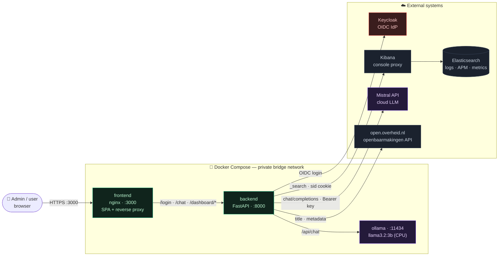
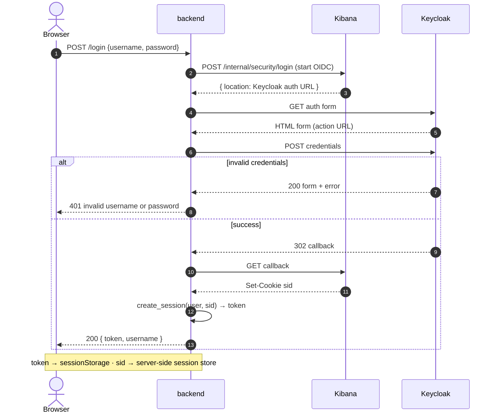
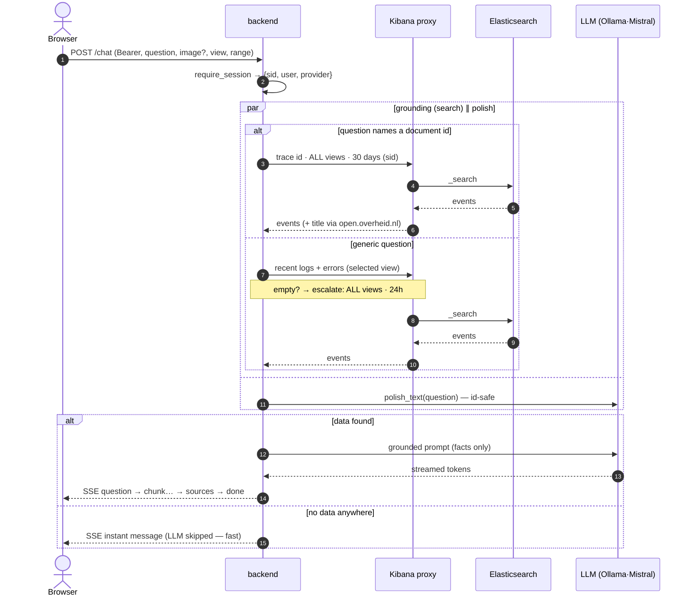
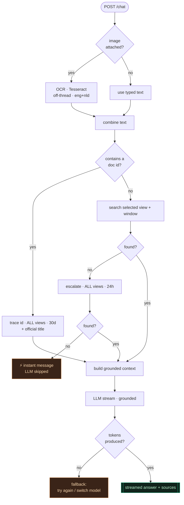
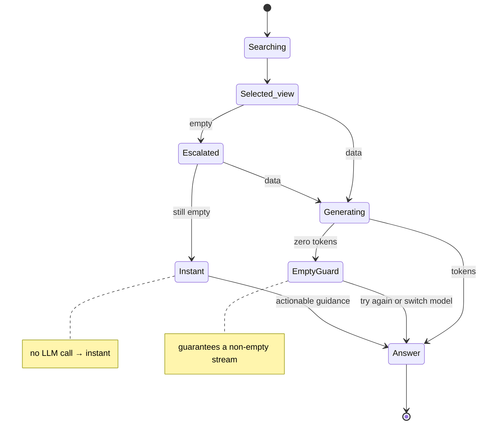
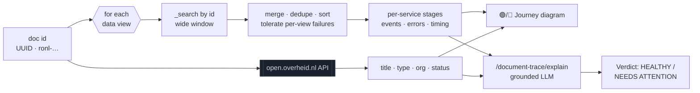
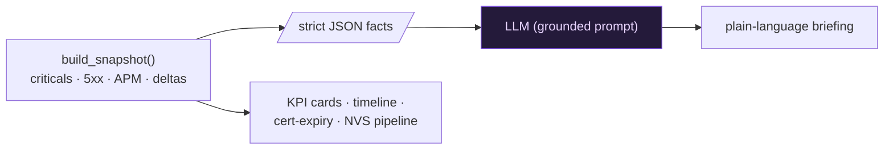
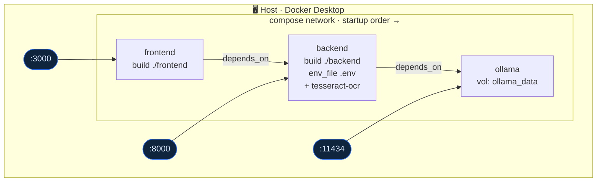

# 🏗️ Architecture

Back to [[Home]]. A senior-level reference for how KIBANA-OO fits together —
container topology, the Kibana authorization handshake, the grounded chat/LLM
data flow, and the resilience model.

> [!abstract] At a glance
> A React SPA → FastAPI backend → **Kibana console proxy** (never raw
> Elasticsearch) using a Keycloak **OIDC `sid` cookie**. An LLM
> ([[LLM providers|Ollama or Mistral]]) narrates **only facts computed from ES**.
> Everything ships as three Docker containers.

> [!tip]- Diagram colour legend
> 🟦 our services · ⬜ external systems · 🟪 LLM · 🟥 security/auth · 🟧 fallback/degraded path

---

## 1 · System context

How the containers and external systems connect, and the one rule that shapes
everything: **all data access is mediated by Kibana**.

> [!warning] Hard invariant
> The backend **never** talks to Elasticsearch directly — every query traverses
> Kibana's `/api/console/proxy` carrying the user's `sid`. This keeps Kibana's
> RBAC, spaces, and audit in force. The LLM only ever receives **facts already
> computed from ES** ([[Monitoring dashboard|grounding]]).

---

## 2 · Authentication — Keycloak OIDC handshake

`POST /login` trades credentials for a Kibana `sid` cookie, then issues an opaque
session token to the browser. **The `sid` never leaves the server.**

> [!info] Failure handling
> Kibana unreachable (VPN down / DNS) → a friendly **503** ("connect to the
> company network or VPN"), never a raw stack trace. See
> [[Runbook - No answer in chat]].

---

## 3 · Authorization + the grounded chat flow

Every protected call carries `Authorization: Bearer <token>`. `require_session`
resolves it to `{sid, username, llm_provider}`; admin routes additionally check
the `DASHBOARD_ADMINS` allowlist. The search and the grammar-polish run **in
parallel**, so correction adds ~no latency.

---

## 4 · Chat request — decision logic

See [[Chat pipeline]] for the code-level walkthrough.

---

## 5 · Resilience — the chat never dead-ends

Every branch terminates in a **useful answer**: real data, an instant guide, or
an honest "model returned empty" — never a blank bubble or a hung spinner.

---

## 6 · Document trace flow

A document id becomes a full journey + an AI verdict. The same engine backs the
chat doc-id path and the **Documents** tab. See [[Document tracer]].

---

## 7 · Admin dashboard — grounded triage

The dashboard computes a deterministic **fact snapshot**, then the LLM *narrates*
it. The model never produces numbers — only prose around facts. See
[[Monitoring dashboard]].

---

## 8 · Deployment topology (Docker Compose)

- **Startup order:** `ollama` → `backend` → `frontend` (`depends_on`).
- **Config** from `.env` (git-ignored) via `env_file`; secrets like
  `MISTRAL_API_KEY` never enter the image or git ([[LLM providers]]).
- `OLLAMA_BASE_URL` is overridden to the in-network `http://ollama:11434`.

---

## 9 · Quality attributes (the "SaaS" bar)

| Attribute | How it's met |
|---|---|
| 🔐 **Security** | No direct ES; Kibana RBAC preserved; secrets in git-ignored `.env`; Mistral key validated before save; admin allowlist. |
| 🎯 **Correctness** | LLM is **grounded** — narrates only ES-computed facts; strict system prompts forbid inventing numbers. |
| ⚡ **Performance** | Concurrent search ∥ polish; doc traces fan out in parallel; **empty results answer instantly** (no LLM). |
| 🛡️ **Reliability** | Per-view failure isolation; chat stream never ends empty; unreachable Kibana → friendly 503; OCR/portal/polish are best-effort. |
| 🔄 **Flexibility** | Per-session LLM switch (Ollama ⇄ Mistral) themed into every header. |
| 🔍 **Observability** | Structured request logs (`[user] [view] Question … doc_ids=…`); `/health` reports model + provider. |

---

## 10 · Backend modules (`backend/`)

| Module | Responsibility |
|---|---|
| `main.py` | FastAPI app; `/login`, `/chat`, `/health`, `/llm-provider`. See [[Chat pipeline]]. |
| `elastic.py` | Kibana proxy client, `keycloak_login`, search helpers, doc-id detection. |
| `llm.py` | Ollama + Mistral clients, streaming, `polish_text`, `provider_model`. See [[LLM providers]]. |
| `ocr.py` | Tesseract OCR for uploaded screenshots (offline, non-fatal). |
| `dashboard.py` · `monitoring.py` · `briefing.py` | Dashboard fact-layer + grounded triage. See [[Monitoring dashboard]]. |
| `documents.py` | Document activity feed + the tracer. See [[Document tracer]]. |
| `portal.py` | Official metadata from the [[open.overheid.nl API]]. |
| `config.py` · `cache.py` · `session.py` | Settings, TTL cache, token→session store. |

## Data views (whitelist)

`logs-*`, `ds-prod5-koop-plooi*`, `ds-prod5-koop-sp`. The real KOOP pipeline logs
live in `ds-prod5-koop-plooi*`; `logs-*` ("All logs") is often nearly empty —
this matters for [[Runbook - No answer in chat]] and [[KOOP Plooi log schema]].
