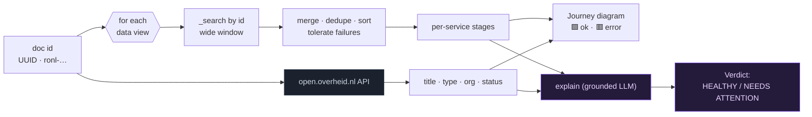

# Document tracer

Back to [[Home]]. In the **Documents** tab (`frontend/src/Documents.jsx`,
`backend/documents.py`, routes in `backend/dashboard.py`).

## What it does

Given a document id (UUID or `ronl-…`), it reconstructs the document's full
**journey** across services and shows:

- **Official title + metadata** (type, organization, Woo category, status,
  publication date, pages) resolved from the [[open.overheid.nl API]] — the logs
  never carry the title.
- A colour-coded **journey flow diagram**: numbered stage nodes, green = healthy,
  **red glow + ⚠ badge on errored stages**, gradient connectors, and a rich
  hover/focus tooltip per service (events, first→last time, duration, sample log).
- An **AI analysis** card (`/dashboard/document-trace/explain`) that narrates the
  journey and ends with `Verdict: HEALTHY` / `NEEDS ATTENTION`, badged with the
  [[LLM providers|provider · model]] that produced it. Non-blocking: a slow/failed
  LLM never breaks the trace.
- Links to **doculoket** (`doculoket.overheid.nl/#/aanleveren/<id>`) and the
  public portal.

## How a trace is assembled

> [!tip]- Colour legend
> 🟦 our code · ⬜ external API · 🟪 LLM · 🟩 healthy stage · 🟥 errored stage

## Backend shape

- `documents.trace_document(sid, id, data_view)` → title, `portal_meta`, stages,
  events, errors, links.
- `dashboard._get_trace` caches the trace briefly so the explain call reuses it.
- `briefing.explain_trace` builds grounded facts and calls the session's LLM.

## Same engine powers chat

A doc-id question in [[Chat pipeline|chat]] uses the same wide, all-views search
(`_collect_doc_events`) so audits work from the chat box too.

## Related

- [[open.overheid.nl API]] · [[KOOP Plooi log schema]] · [[Chat pipeline]]
