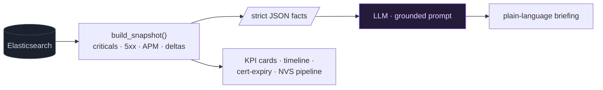

# Monitoring dashboard

Back to [[Home]]. Admin-only (`DASHBOARD_ADMINS`). `frontend/src/Dashboard.jsx`,
`backend/dashboard.py` + `monitoring.py` + `briefing.py`. Endpoints cached.

> 🧠 Hoe werkt de AI hier? Zie [[AI-architectuur]] — RAG + achtergrond-monitors,
> géén agents/sub-agents/MCP, plus de EU AI Act / AVG privacy-posture.

## Panels

- **Critical issues** = error logs + HTTP 5xx + APM errors, with a per-data-view
  breakdown and a delta vs the prior equal period. Rolling **Period**
  (15/30/60/360/1440 min) + **Data view** selectors.
- **Grounded AI triage** (`/dashboard/briefing`) — the LLM narrates the exact ES
  facts from the snapshot; it never invents numbers. See [[LLM providers]].
- **Certificate-expiry countdown cards** — TLS expiry read from Kibana monitoring
  data (Heartbeat/Synthetics, `tls.server.x509.not_after`), **not** by probing URLs.
- **Verwerkingsstraat — NVS** panel — documents processed via the new pipeline
  (NVS). OVS is not present in this data (earlier OVS matches were filename
  false-positives), so the panel is NVS-only.

## Fact flow (grounded triage)

> [!tip]- Colour legend
> 🟦 deterministic facts · 🟪 LLM narration

## Design principles

- Deterministic **fact layer** (`monitoring.build_snapshot`) → strict facts →
  the LLM only narrates. Same snapshot feeds the numbers and the briefing.
- Graceful degradation: a failing data view is isolated; the snapshot is marked
  `partial` rather than failing the whole page.

## Related

- [[Document tracer]] · [[KOOP Plooi log schema]] · [[Architecture]]
