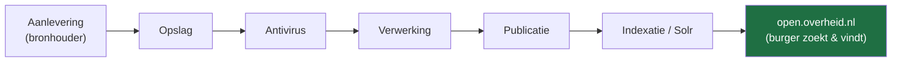
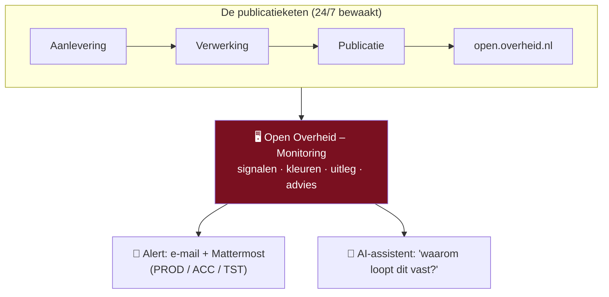
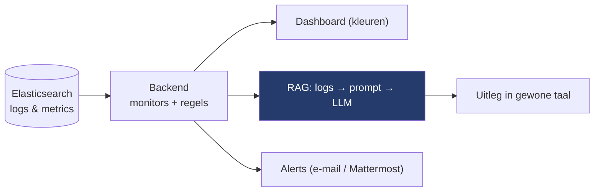
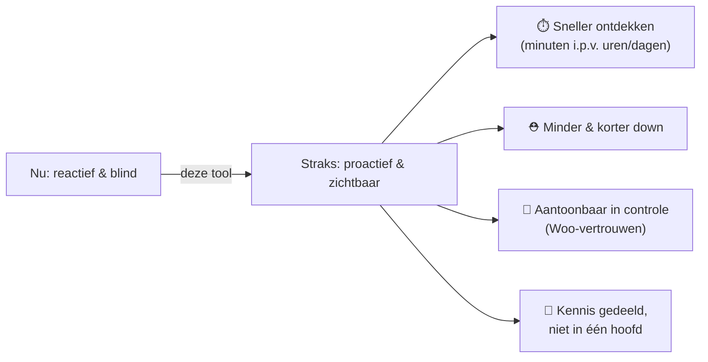
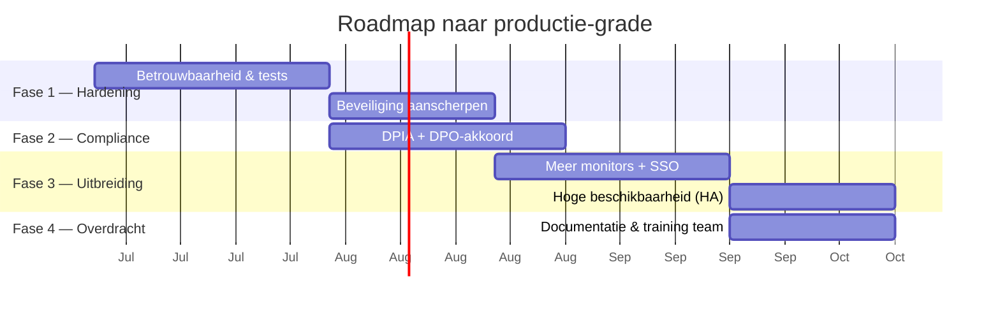

# Presentatie — Management

> **Doel van deze presentatie:** het management laten zien *waarom* we
> **Open Overheid – Monitoring** nodig hebben, wat het **nu al** doet, en het
> **mandaat + de tijd** krijgen om het professioneel door te ontwikkelen —
> *vóór* er een incident gebeurt dat de burger of de pers als eerste ziet.
>
> **Hoe te gebruiken:** elke `##` hieronder is één **slide**. Onder elke slide
> staan **spreek-punten** (wat je zegt) en waar nuttig een **Mermaid-diagram**
> (rendert direct in Obsidian → *Weergave*). Op plekken met 📸 zet je een
> **schermafbeelding** uit de live-app.
>
> Verwante notities: [[Home]], [[AI-architectuur]], [[Woo platform]],
> [[Monitoring dashboard]], [[Documentgezondheid]], [[Alerting (meldingen)]].

---

## 0. Zo breng je het (30 seconden voorbereiding)

- **Toon, vertel niet alleen.** Open de live-app naast de dia's. Eén echte
  RED→GROEN-tegel overtuigt meer dan tien bullets.
- **Rode draad in één zin:** *"We publiceren overheids­informatie wettelijk
  verplicht. Nu merken we storingen vaak te laat. Deze tool ziet ze meteen —
  in gewone taal — zodat we ze oplossen vóór de burger het merkt."*
- **De vraag staat op de laatste dia.** Wees concreet: je vraagt **tijd +
  mandaat**, geen blanco cheque.
- **Toon:** eerlijk over wat nog moet (DPIA, hardening). Eerlijkheid = vertrouwen.

---

## 1. Titel — Open Overheid · Monitoring

**Van "we hopen dat het werkt" naar "we wéten dat het werkt."**

Spreek-punten:
- Eén dashboard dat de hele Woo-publicatieketen bewaakt (open.overheid.nl).
- Gebouwd, draait, en bewijst zich al — vandaag, niet "ooit".
- Vandaag vraag ik ruimte om het naar productie-kwaliteit te tillen.

📸 *Schermafbeelding: de inlog-/dashboardpagina (de merk-uitstraling).*

---

## 2. Het probleem — we zijn nu grotendeels blind

De **Wet open overheid (Woo)** verplicht ons om overheids­informatie
beschikbaar te stellen via open.overheid.nl. Die publicatie loopt door een
**keten** van systemen. Als één schakel breekt, stopt publicatie — en dat
merken we vandaag vaak **te laat, handmatig, of via een klacht van buiten**.



Spreek-punten:
- Elke pijl is een plek waar het **stil kan vallen**: een aanleverfout, een
  document dat vastloopt, een volle dead-letter-queue, een verlopen certificaat,
  een service die down is.
- Nu: iemand moet het **toevallig zien** in Kibana/Elasticsearch — technisch,
  tijdrovend, en kennis zit bij **één persoon**.
- Gevolg: we ontdekken storingen soms **uren of dagen** later.

---

## 3. Wat er op het spel staat

| Risico | Concreet gevolg |
|---|---|
| ⚖️ **Juridisch** | Woo-plicht niet nagekomen — documenten niet (tijdig) openbaar |
| 👥 **Burger & pers** | Mensen vinden info niet; een journalist merkt de storing vóór ons |
| 🏛️ **Reputatie** | "De overheid heeft haar publicatie niet op orde" |
| 🧠 **Kennisrisico** | Monitoring zit in het hoofd van één beheerder — bus-factor 1 |
| ⏱️ **Tijd/kosten** | Laat ontdekken = langer down, meer herstelwerk, meer stress |

Spreek-punt: *"Dit gaat niet over een mooi dashboard. Het gaat over een
wettelijke plicht die we nu niet betrouwbaar kunnen garanderen."*

---

## 4. De oplossing — één plek, in gewone taal

Open Overheid – Monitoring bewaakt de **hele keten** proactief en vertaalt
technische logs naar **begrijpelijke taal met een advies "wat te doen"**.



Spreek-punten:
- **Groen/geel/rood** per onderdeel — je ziet in één oogopslag of het goed gaat.
- **Proactief**: de tool waarschuwt óns, we hoeven niet te zoeken.
- **Toegankelijk**: je hoeft geen Kibana-expert te zijn.

---

## 5. Wat het NU al doet (geen belofte — het draait)

| Functie | Wat het bewaakt | Notitie |
|---|---|---|
| 🟢 **Beschikbaarheid** | Zijn PROD/ACC/TST-sites up? | [[Beschikbaarheid (uptime)]] |
| 🩺 **Service health** | Werken de microservices? | [[Service health]] |
| 📄 **Documentgezondheid** | Lopen documenten vast in de straat? | [[Documentgezondheid]] |
| 📥 **Aanleverfouten** | Afgekeurde aanleveringen | [[Aanleverfouten]] |
| 🐰 **DLQ-intelligentie** | Vastgelopen berichten in queues | [[DLQ intelligentie]] |
| 🔐 **Certificaten & TLS** | Verlopen/zwakke certificaten | [[Certificaten en TLS]] |
| 🧪 **Regressietest** | Werkt open.overheid.nl na een release? | [[Regressietest]] |
| 🔔 **Alerting** | E-mail + **Mattermost** bij RED | [[Alerting (meldingen)]], [[Webhooks (Mattermost)]] |
| 💬 **AI-assistent** | Legt logs uit in gewone taal (RAG) | [[Chat pipeline]] |
| 🔑 **Autorisatie** | Wie mag wat (per functie + goedkeuring) | [[Autorisatie]] |

Spreek-punt: *"Dit is geen prototype-lijstje — elk van deze draait vandaag en
is in het Nederlands gedocumenteerd voor de beheerder."*

📸 *Schermafbeelding: het dashboard met de statustegels.*

---

## 6. Hoe het werkt — simpel en robuust

Bewust **eenvoudig** gehouden: geen black-box, geen autonome AI die zelf
handelt. De AI **legt alleen uit**; mensen beslissen.



Spreek-punten:
- **RAG** = de AI vat opgehaalde logs samen. Eén call, geen tools, geen
  autonoom handelen → voorspelbaar en veilig. Zie [[AI-architectuur]].
- **Gebouwd met een *agentic harness* (Claude Code)** — dat is *bouw*­gereedschap.
  De **draaiende app zelf is niet agentic**. Dat onderscheid houdt het
  compliance-verhaal schoon.

---

## 7. Echt voorbeeld ① — van vals alarm naar vertrouwen

**Situatie:** de tool meldde ooit **6.528 "vastgelopen" documenten** — kritiek
rood. Paniek? Nee: onderzoek liet zien dat het **geen** vastgelopen documenten
waren, maar vervuiling van APM-foutregels die als document-id's werden geteld.

**Wat we deden:** de bron van de ruis uitgesloten, een "settle"-drempel en
verlooptijd toegevoegd, en de teller opnieuw gemeten → **6.528 → 6** échte
gevallen.

Spreek-punt (dit is góud voor management): *"Een monitoring­tool die je niet
kunt vertrouwen is erger dan geen tool. We hebben bewust geïnvesteerd in
betrouwbaarheid — liever 6 échte problemen dan 6.528 valse alarmen."*

---

## 8. Echt voorbeeld ② — stille storingen die we nú vangen

- 🔐 **Certificaat verloopt over 10 dagen** → tijdig een waarschuwing, geen
  verrassing op zaterdagnacht. ([[Certificaten en TLS]])
- 🔴 **ACC-site reageert niet** → binnen de pollronde rood + alert, in plaats
  van "iemand merkt het morgen". ([[Beschikbaarheid (uptime)]])
- 🐰 **Berichten stapelen in een dead-letter-queue** → oorzaak, leeftijd en
  aanbevolen actie, alleen-lezen. ([[DLQ intelligentie]])

Spreek-punt: *"Dit zijn precies de dingen die anders pas opvallen als het al
misgegaan is."*

📸 *Schermafbeelding: een certificaat- of uptime-kaart in WARN/RED.*

---

## 9. Echt voorbeeld ③ — het juiste team, meteen (net gebouwd)

We kunnen nu **per omgeving (PROD / ACC / TST)** een Mattermost-kanaal instellen
en met **één klik** wisselen welke actief is — dus de juiste mensen krijgen de
juiste melding, zonder technische aanpassing. ([[Webhooks (Mattermost)]])

Spreek-punt: *"Dit is deze week toegevoegd. Dat laat het tempo zien: met de
juiste ruimte groeit dit snel en gecontroleerd."*

📸 *Schermafbeelding: Beheer → Webhooks met een actieve webhook.*

---

## 10. De waarde — wat het oplevert



Spreek-punt: *"De winst is niet 'een dashboard'. De winst is **tijd** en
**zekerheid** — en die twee zijn bij een wettelijke plicht het waardevolst."*

---

## 11. Waarom NU — vóór het te laat is

- Elke maand zonder dit = maanden waarin een storing **onopgemerkt** kan blijven.
- De kennis zit nu bij **één persoon** — dat risico groeit, niet krimpt.
- Wachten is niet "gratis": het is **onzichtbaar risico** dat zich opstapelt.
- Het fundament staat er al — **nu doorpakken is goedkoop**; later vanaf nul
  beginnen is duur.

Spreek-punt: *"De goedkoopste tijd om dit te doen was bij de bouw. De op één na
goedkoopste is nu."*

---

## 12. Slim gebouwd — veel waarde, weinig kosten

- Gebouwd met een **AI-coding-harness (Claude Code)** → in korte tijd een brede,
  gedocumenteerde applicatie, tegen een fractie van de gebruikelijke kosten.
- **Maar:** snel bouwen ≠ productie-klaar. Om dit **betrouwbaar, veilig en
  overdraagbaar** te maken is gerichte **tijd** nodig (hardening, testen,
  formele compliance, overdracht).

Spreek-punt: *"We hebben de dure eerste 80% al — bijna gratis. Ik vraag ruimte
voor de belangrijke laatste 20% die het productie-waardig maakt."*

---

## 13. Compliance — eerlijk (en dát geeft vertrouwen)

> **Kernboodschap:** ik claim **geen** "100% compliant". Ik laat zien wat er **wél**
> is ingebouwd, wat er **nog** formeel moet, en het **plan** ernaartoe. Bij de
> overheid wint eerlijkheid + een helder pad het van mooie beloftes.

**Waarom dit systeem laag-risico is (in één zin):** de AI **beslist niets** — hij
**legt alleen uit**; een mens beslist. Het systeem is **alleen-lezen** en raakt de
publicatieketen niet aan.

| Kader | Wat het is | Status |
|---|---|---|
| **EU AI Act** (Vo. 2024/1689) | Europese AI-wet, risico-gebaseerd | **Beperkt risico** — geen besluit over personen, geen biometrie, mens-in-de-lus. Enige plicht: **transparantie** (gebruiker weet dat het AI is) → ✅ ingebouwd |
| **AVG / UAVG** | Privacy | ✅ **PII-redactie**, alleen-lezen, data-minimalisatie, grondslag = wettelijke taak (Woo). ⚠️ Verwerkersovereenkomst óf **lokaal model** |
| **BIO** | Baseline Informatiebeveiliging Overheid (o.b.v. ISO 27001/NEN) | ✅ TLS-bewaking, OIDC-SSO, autorisatie, secrets buiten code, security-headers, rate-limiting. ⚠️ Formele BIO-toetsing + **pentest** |
| **DPIA + FG** | Gegevensbeschermings­effect­beoordeling + akkoord Functionaris Gegevensbescherming | ⚠️ **Nog uitvoeren** — dít is de belangrijkste formele stap |
| **Algoritmeregister** | `algoritmes.overheid.nl` — publiek register van overheids-algoritmes | ⚠️ **Registreren** → past perfect bij "open overheid" en geeft publiek vertrouwen |

Spreek-punt: *"De complexe AI zat in de **bouw**. Het draaiende systeem is bewust
**simpel, alleen-lezen en transparant**. De laatste stap naar productie is niet
techniek maar **formele borging**: DPIA, FG-akkoord, pentest. Dáár vraag ik tijd
en mandaat voor."*

> 📋 **Voor de FG/CISO ligt er een kant-en-klare afvinklijst:**
> [[FG-DPO checklist (AVG, EU AI Act, BIO)]] — AVG, EU AI Act, BIO, DPIA,
> Algoritmeregister, met per punt de status (✅ ingebouwd / ⚠️ te doen / ❓ FG
> beslist). *"We hebben het door de FG laten toetsen"* is zelf al een vertrouwenspunt.

> 🔑 **Omgang met wachtwoorden/geheimen** — vaak de eerste vraag van security:
> **geen enkel geheim staat in de broncode of in git** (aantoonbaar: nooit gecommit,
> niet in het image, geen bestand in de container), gebruikers loggen in via
> **Keycloak** (de app slaat géén gebruikerswachtwoorden op), en de machine-accounts
> gaan naar **alleen-lezen** (least privilege) met een **versleuteld** geheimenbestand.
> Volledige analyse + compromise-runbook: [[Credentials en beveiliging (pilot)]].
> *Spreek-punt:* **"Een gelekt geheim mag geen ramp zijn — daarom maken we ze
> alleen-lezen. Dát is echte beveiliging, niet alleen beter verstoppen."**

---

## 13.1 — Diep induiken: de 5 onderwerpen die vertrouwen geven

Ga bij déze onderwerpen de diepte in — ze nemen precies de angsten weg die een
manager (en een FG) heeft:

1. **"De AI beslist niets"** — mens-in-de-lus, alleen uitleg. *(Neemt de grootste
   AI-angst weg.)*
2. **"De data blijft binnen"** — **lokaal model (Ollama, on-prem)** kan; alleen-lezen;
   PII wordt geredigeerd. *(Privacy/AVG.)*
3. **"Eerlijke compliance-status + plan"** — de tabel hierboven: wat af is, wat niet,
   DPIA-first. *(Betrouwbaarheid.)*
4. **"Geen black-box"** — het is **RAG** (ophalen → samenvatten), één call, géén
   autonome agents in productie. *(Beheersbaarheid.)*
5. **"Gedocumenteerd & overdraagbaar"** — deze hele vault + [[AI-architectuur]]; geen
   kennis in één hoofd. *(Continuïteit, geen bus-factor.)*

---

## 13.2 — "Gebouwd met Claude (harness)" — waarom dat júist vertrouwen geeft

Zeg het zelf, eerlijk en met trots:

> *"Ik heb dit als domeinexpert zélf gebouwd, met **Claude als agentic coding-harness**
> — professioneel AI-ontwikkelgereedschap, dezelfde soort tooling die
> softwareteams gebruiken. Die harness zat in de **bouwfase**. Het **opgeleverde
> systeem is niet agentic**: het is een eenvoudige, voorspelbare RAG-app."*

Waarom dit vertrouwen wekt in plaats van vragen op te roepen:
- **Snelheid + lage kosten:** een werkend, breed systeem in korte tijd, tegen een
  fractie van normale bouwkosten.
- **Transparant & gedocumenteerd:** alles staat in deze vault — niets zit verborgen.
- **De juiste knip:** agentic complexiteit = **build-time**; productie = **simpel**.
  Dat is precies wat je voor de overheid wilt.
- **Eerlijk over de rest:** *"AI hielp me de dure eerste 80% bouwen; de laatste 20%
  (hardening + compliance) vraagt formele tijd en review."*

*(Ja — "harness" is de juiste term: het is het omhulsel om het AI-model dat er
gereedschap + een stuurlus omheen zet. Zie [[AI-architectuur]] → "agentic harness".)*

---

## 13.3 — Voor de tech-managers: 6 simpel-technische kernpunten

Voor de collega's mét techniek-achtergrond — kort, concreet, klopt:

1. **Stack:** React-frontend + **FastAPI**-backend + **Elasticsearch/Kibana**
   (via Kibana's interne search-API). Geen exotische techniek.
2. **AI = RAG:** logs ophalen → prompt → LLM vat samen. **Eén** call, **geen** tools,
   **geen** autonome acties. Voorspelbaar en te auditen.
3. **Model-keuze = data-keuze:** **lokaal** (Ollama, on-prem, data verlaat het pand
   niet) óf **gehost** (Mistral, EU). Omschakelbaar → bewuste data-residency.
4. **Toegang:** **Keycloak OIDC-SSO** + rechten-matrix per gebruiker × per functie +
   goedkeuringsgate voor nieuwe gebruikers.
5. **Alleen-lezen:** de app **schrijft niets** naar de publicatieketen — hij
   observeert en legt uit. Kan per definitie niets breken.
6. **Beveiliging:** TLS-/certificaatbewaking, security-headers, rate-limiting,
   secrets buiten de code (`.env`), PII-redactie, audit-logging.

> Aanbod aan de tech-managers: *"Ik geef graag een technische deep-dive en verwijs
> naar [[AI-architectuur]] als bewijs — inclusief de eerlijke privacy/EU AI
> Act-paragraaf."*

---

## 13.4 — Echt bewijs uit de logs (Kibana · met datum en tijd)

> Geen beloftes — **échte logregels** uit Kibana (`ds-prod5-koop-plooi*`),
> **alleen-lezen** opgehaald op **2026-07-20**. Elke compliance-claim is zo met
> **datum en tijd** te controleren (IP gedeeltelijk gemaskeerd — we passen zelf toe
> wat we prediken).

| Compliance-situatie | Écht bewijs uit de logs (datum · tijd) | Wat het aantoont |
|---|---|---|
| **AVG — persoonsgegevens in logs** | `2026-07-20 09:13:59` · `remote_addr: 10.6.140.***` (een IP-adres) | Logs bevátten persoonsgegevens (een IP = PII). → **PII-redactie** (`LLM_REDACT_PII`) verwijdert dit **vóór** de tekst naar de AI gaat. |
| **BIO — transportbeveiliging (TLS)** | `2026-07-20 09:13:59` · `ssl_protocol: TLSv1.3` · `ssl_cipher: TLS_AES_256_GCM_SHA384` | Verkeer loopt over **moderne TLS 1.3** — precies wat de certificaat-/TLS-bewaking bewaakt ([[Certificaten en TLS]]). |
| **BIO — toegangscontrole / least privilege** | `2026-07-20 09:13:57` · `status 401` op `GET /zoekresultaten` | **Ongeautoriseerde toegang wordt geweigerd** (401) — toegangscontrole werkt aantoonbaar. |
| **EU AI Act — mens-in-de-lus, alleen uitleg** | `2026-07-20 09:11:41` · `status 500` op `GET /documenten/a6cf2636…/file` | Zo'n fout wordt door de AI **uitgelegd**, maar er wordt **geen actie** ondernomen — een mens beslist. |
| **AVG/AI Act — alleen-lezen** | álle regels hierboven — opgehaald via `/internal/search/es` (een **read**-query) | De app **schrijft nooit** naar de keten; hij observeert en vat samen. Kan per definitie niets breken. |
| **Transparantie (EU AI Act art. 50)** | elk AI-antwoord in de app is gelabeld als **AI-gegenereerd** | De gebruiker weet dat het **AI** is. |
| **Auditbaarheid / monitoring** | de 500-fout van `09:11:41` werd **gedetecteerd** op de kaart [[HTTP-fouten en latency (PROD)]] | Storingen zijn **traceerbaar met tijdstip** — bruikbaar als audittrail. |

Spreek-punt: *"Dit zijn geen beloftes — dit zijn échte logregels van **2026-07-20**.
Elke compliance-claim is met **datum en tijd** controleerbaar. Dát is het verschil
tussen 'wij denken dat het veilig is' en 'wij kunnen het aantonen'."*

> De datums/tijden zijn een momentopname; ververs ze vóór de presentatie met een
> actuele regel uit Kibana zodat het bewijs 'vers' is.

---

## 13.5 — Inloggen via Keycloak (SP): waarom dit veilig én compliant is

> **Kernboodschap:** *"Ik beheer zelf **geen wachtwoorden**. Inloggen gaat via
> **Keycloak** in het **SP-realm** (Standaard Platform) — het centrale
> identiteitssysteem van de organisatie. De app ziet je wachtwoord **nooit**."*

Waarom dit juist de **veiligste én meest compliant** manier is:

- **Geen wachtwoordbeheer in de app** — authenticatie is **gedelegeerd** aan de
  standaard-IdP (Keycloak/SP). Geen wachtwoorden opgeslagen, verzonden of gezien.
  *(De grootste bron van datalekken — een eigen wachtwoorddatabase — bestaat hier
  simpelweg niet.)*
- **Centraal toegangsbeheer** — accounts aanmaken/intrekken, **MFA**,
  wachtwoordbeleid en sessiebeheer worden **centraal** door SP/Keycloak afgedwongen.
  Iemand uit dienst? Eén centrale intrekking sluit ook déze app.
- **Standaard-protocol** — **OpenID Connect (OIDC)** op OAuth2: de industrie- én
  overheidsstandaard voor federatief inloggen. Geen zelfbedachte constructie.
- **Twee lagen (defense in depth):** **authenticatie** = Keycloak (SP);
  **autorisatie** = de app zelf (rechten-matrix per gebruiker × functie +
  goedkeuringsgate — [[Autorisatie]]). *Ingelogd zijn ≠ overal bij mogen.*
- **Versleuteld** — de volledige inlogflow loopt over **TLS 1.3** (zie §13.4).

**Compliance-koppeling:**
- **BIO** — centrale authenticatie zonder lokale wachtwoordopslag; gebruik van de
  door de organisatie **goedgekeurde IdP**; MFA afdwingbaar.
- **AVG** — **data-minimalisatie**: de app krijgt alleen de identiteits-claims die
  hij nodig heeft (bv. e-mail/naam), **geen** wachtwoord; toegang centraal beheerd.

**Simpel-technisch (voor de tech-managers) — OIDC Authorization Code Flow:**
1. De app stuurt je door naar **Keycloak (SP-realm)**.
2. Je logt in bij **Keycloak**, niet bij de app.
3. Keycloak stuurt een **autorisatie-code** terug; de app wisselt die in voor een
   **sessie** (`sid`-cookie).
4. **`state` + `nonce`** beschermen tegen CSRF/replay; de **code-flow** zet **geen**
   token in de URL.

**Echt bewijs (SP-realm · 2026-07-20):**

```text
https://sso-gn2.cicd.s15m.nl/realms/SP/protocol/openid-connect/auth
   ?response_type=code
   &redirect_uri=https://kibana-prod.cicd.s15m.nl/api/security/oidc/callback
   &state=…  &nonce=…  &client_id=cicd4-elastic-prod  &scope=openid profile
```

> Dit is de **standaard OIDC-inlogflow** in het **SP-realm**: `response_type=code`
> (Authorization Code Flow), met `state` + `nonce`, client `cicd4-elastic-prod`.
> Keycloak-activiteit waargenomen op `2026-07-20 08:42:56`.

Spreek-punt: *"Je logt niet in bíj mijn app — je logt in bij **Keycloak (SP)**, het
centrale systeem dat de organisatie al vertrouwt en beheert. Mijn app krijgt daarna
alleen een veilige sessie. Precies zoals je het wilt: geen losse wachtwoorden,
centraal beheer, een standaard-protocol."*

---

## 14. Roadmap — wat "professioneel doorontwikkelen" betekent



Spreek-punt: fasen zijn **incrementeel** — elke fase levert op zichzelf al
waarde. Geen big-bang, geen "alles of niets".

> *De data zijn indicatief — pas ze aan op de afgesproken startdatum.*

---

## 15. ⭐ De vraag aan het management (concreet)

Ik vraag **geen** blanco cheque. Ik vraag:

1. **Mandaat** — erkenning dat proactieve monitoring van de Woo-keten een
   officiële taak is (geen hobby-project).
2. **Tijd** — *[vul in: bv. X dagen/week gedurende Y maanden]* om Fase 1 (+2)
   uit te voeren.
3. **Een DPO-/security-contact** om DPIA en akkoord af te ronden.
4. *(Optioneel)* **een tweede persoon** voor kennisdeling (bus-factor > 1).

Spreek-punt: *"Met dit mandaat lever ik binnen [termijn] een gehard,
compliance-aantoonbaar systeem op dat de hele afdeling kan gebruiken."*

---

## 16. Eén zin om te onthouden

> **"We hebben een wettelijke plicht om overheids­informatie te publiceren.
> Deze tool maakt zichtbaar of dat lukt — proactief, in gewone taal — zodat we
> problemen oplossen vóór de burger ze merkt. Het fundament staat er al; ik
> vraag de tijd om het productie-waardig te maken."**

---

## Bijlage A — Verwachte bezwaren & antwoorden

| Bezwaar                                      | Antwoord                                                                                                                                                 |
| -------------------------------------------- | -------------------------------------------------------------------------------------------------------------------------------------------------------- |
| *"Hebben we dit niet al in Kibana/Grafana?"* | Die tonen **rauwe** data voor experts. Dit **duidt** de data (kleuren + advies) en **waarschuwt** proactief — voor beheerders, niet alleen specialisten. |
| *"Is AI niet riskant/black-box?"*            | De AI **legt alleen uit**, handelt niet. RAG, één call, geen tools. Zie [[AI-architectuur]].                                                             |
| *"Kost dit niet veel?"*                      | Het meeste is er al, gebouwd tegen lage kosten. De vraag is **tijd** voor de afronding, niet een groot budget.                                           |
| *"Is het veilig / AVG-proof?"*               | Privacy-by-design toegepast; DPIA is de laatste formele stap — juist waarvoor ik ruimte vraag.                                                           |
| *"Wat als de bouwer wegvalt?"*               | Precies het risico dat we nú verkleinen: documentatie in de vault + Fase 4 (overdracht/training).                                                        |

## Bijlage B — Checklist vóór de presentatie

- [ ] Live-app open, ingelogd, op het dashboard.
- [ ] 1 echte RED/WARN-kaart om te tonen (of een recent voorbeeld).
- [ ] Schermafbeeldingen op de 📸-dia's gezet.
- [ ] Startdatum in de roadmap (dia 14) ingevuld.
- [ ] De concrete cijfers in "de vraag" (dia 15) ingevuld.
- [ ] Deze notitie in *Weergave*-modus (Mermaid rendert dan).
