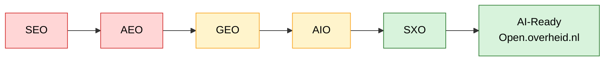
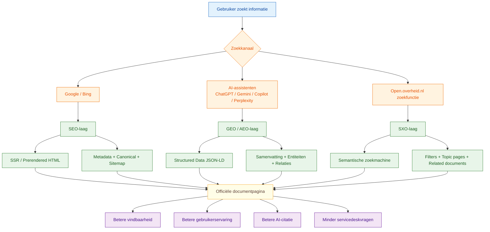

# Roadmap: Open.overheid.nl future-proof maken voor SEO, AEO, GEO, AIO en SXO

**Doelgroep:** management, product owner, functioneel beheer, development, SEO/UX  
**Scope:** open.overheid.nl als publieke vindplaats voor overheidsdocumenten  
**Datum:** 2026-07-16  
**Versie:** 2.0 (geconsolideerd — vervangt de losse *v1* en *v2*/"Extended"-notities)  

---

## 1. Managementsamenvatting

Open.overheid.nl is al een belangrijke centrale plek voor overheidsdocumenten. De manier waarop mensen informatie zoeken verandert echter snel. Gebruikers zoeken niet meer alleen via Google, maar ook via Bing/Copilot, ChatGPT, Gemini, Perplexity en andere AI-zoekmachines.

Daarom moet open.overheid.nl niet alleen goed werken voor mensen, maar ook goed leesbaar zijn voor zoekmachines en AI-systemen.

De belangrijkste verbetering is:

> Maak iedere documentpagina technisch goed indexeerbaar, inhoudelijk begrijpelijk, semantisch rijk en betrouwbaar citeerbaar.

Dat betekent concreet:

- documenten moeten direct zichtbaar zijn in HTML, niet alleen na JavaScript;
- iedere pagina moet unieke metadata hebben;
- canonical URLs moeten correct zijn;
- structured data moet aanwezig zijn;
- documentrelaties moeten duidelijk zijn;
- zoekresultaten moeten gebruikers beter helpen;
- AI-systemen moeten officiële informatie correct kunnen herkennen en citeren.

---

## 1a. Volwassenheids-scorecard (SEO / AEO / GEO / AIO / SXO)

> Indicatieve nulmeting per zoek-discipline en per platform (**geen** officiële
> audit). Geeft het management in één oogopslag *waar we staan* en *waar we
> naartoe willen*.

| Domein | Huidig | Doel | Prioriteit |
|---|---:|---:|---|
| **SEO** — klassieke zoekmachines | 6.5/10 | 9.8/10 | MUST |
| **AEO** — answer engines (directe antwoorden) | 4.0/10 | 9.5/10 | MUST |
| **GEO** — generative engines (AI-antwoorden) | 3.5/10 | 9.5/10 | MUST |
| **AIO** — AI-optimalisatie (citeerbaarheid) | 5.0/10 | 9.0/10 | SHOULD |
| **SXO** — search experience (UX) | 6.0/10 | 9.5/10 | SHOULD |

### Score per zoek-/AI-platform

| Platform | Nu | Na roadmap |
|---|---:|---:|
| Google | 7 | 10 |
| Bing | 6 | 10 |
| DuckDuckGo | 6 | 9 |
| ChatGPT | 4 | 9 |
| Gemini | 4 | 9 |
| Microsoft Copilot | 4 | 9 |
| Claude | 4 | 9 |
| Perplexity | 5 | 10 |

### Welke signalen tellen per AI-model

| Model | SEO | Structured Data | Canonical | Entity's | Samenvatting |
|---|:--:|:--:|:--:|:--:|:--:|
| ChatGPT | ✔ | ✔ | ✔ | ✔ | ✔ |
| Gemini | ✔ | ✔✔ | ✔ | ✔✔ | ✔ |
| Copilot | ✔✔ | ✔ | ✔ | ✔ | ✔ |
| Claude | ✔ | ✔ | ✔ | ✔ | ✔ |
| Perplexity | ✔✔ | ✔✔ | ✔ | ✔✔ | ✔✔ |

Legenda: **✔** = belangrijk · **✔✔** = zeer belangrijk.

### De reis in één beeld



---

## 2. Waarom dit belangrijk is

### Huidige situatie

Een gebruiker zoekt bijvoorbeeld:

> site:open.overheid.nl "18abbc66-46b2-4187-8e0d-d81e2756907c"

Google toont soms een titel die niet overeenkomt met de titel op de pagina. Dit kan komen door:

- verouderde indexinformatie;
- onvoldoende duidelijke metadata;
- JavaScript-rendering;
- ontbrekende of onduidelijke canonical;
- dubbele of vergelijkbare documentpagina’s;
- onvoldoende gestructureerde documentinformatie.

Voor gebruikers voelt dit verwarrend. Voor management betekent dit risico op minder vertrouwen, minder vindbaarheid en meer vragen richting servicedesk/functioneel beheer.

---

## 3. Begrippen kort uitgelegd

| Begrip | Betekenis | Voor open.overheid.nl |
|---|---|---|
| SEO | Search Engine Optimization | Beter vindbaar in Google/Bing |
| AEO | Answer Engine Optimization | Antwoorden direct goed zichtbaar maken |
| GEO | Generative Engine Optimization | AI-systemen kunnen officiële informatie begrijpen en citeren |
| AIO | AI Optimization | Content structureren zodat AI-modellen ermee kunnen werken |
| SXO | Search Experience Optimization | Gebruikers vinden sneller wat ze zoeken |

---

## 4. Visie

Open.overheid.nl moet doorgroeien van een documentportaal naar een **AI-ready Government Knowledge Platform**.

Niet alleen:

> “Hier staan documenten.”

Maar:

> “Hier staat betrouwbare, officiële, begrijpelijke en herbruikbare overheidsinformatie die vindbaar is voor burgers, professionals, journalisten, onderzoekers, zoekmachines en AI-systemen.”

---

## 5. Concrete voorbeeldsituatie

### Voorbeelddocument

Stel er is een Kamerbrief:

- Titel: `Antwoorden op Kamervragen over digitale toegankelijkheid`
- Documentsoort: `Kamerbrief`
- Ministerie: `Ministerie van Volksgezondheid, Welzijn en Sport`
- Publicatiedatum: `2026-06-18`
- Document-ID: `18abbc66-46b2-4187-8e0d-d81e2756907c`
- Onderwerpen: `digitale toegankelijkheid`, `zorg`, `overheid`, `websites`

### Minder goede situatie

```html
<!doctype html>
<html lang="nl">
<head>
  <title>Open overheid</title>
  <meta name="description" content="Open overheid">
</head>
<body>
  <div id="root"></div>
  <script src="/static/js/main.js"></script>
</body>
</html>
```

Probleem:

- Google ziet eerst vooral een lege pagina.
- De titel is generiek.
- De description is generiek.
- Het document staat pas na JavaScript-rendering op de pagina.
- AI-systemen zien weinig context.
- De kans op verkeerde of verouderde titels in zoekresultaten wordt groter.

### Betere situatie

```html
<!doctype html>
<html lang="nl">
<head>
  <title>Antwoorden op Kamervragen over digitale toegankelijkheid | Open Overheid</title>

  <meta name="description" content="Kamerbrief van het Ministerie van Volksgezondheid, Welzijn en Sport, gepubliceerd op 18 juni 2026 over digitale toegankelijkheid.">

  <link rel="canonical" href="https://open.overheid.nl/documenten/antwoorden-kamervragen-digitale-toegankelijkheid-18abbc66">

  <meta property="og:title" content="Antwoorden op Kamervragen over digitale toegankelijkheid">
  <meta property="og:description" content="Officiële publicatie van het Ministerie van Volksgezondheid, Welzijn en Sport.">
  <meta property="og:type" content="article">

  <script type="application/ld+json">
  {
    "@context": "https://schema.org",
    "@type": "Article",
    "headline": "Antwoorden op Kamervragen over digitale toegankelijkheid",
    "datePublished": "2026-06-18",
    "inLanguage": "nl",
    "publisher": {
      "@type": "GovernmentOrganization",
      "name": "Ministerie van Volksgezondheid, Welzijn en Sport"
    },
    "mainEntityOfPage": {
      "@type": "WebPage",
      "@id": "https://open.overheid.nl/documenten/antwoorden-kamervragen-digitale-toegankelijkheid-18abbc66"
    },
    "keywords": [
      "digitale toegankelijkheid",
      "zorg",
      "overheid",
      "websites"
    ]
  }
  </script>
</head>

<body>
  <main>
    <article>
      <h1>Antwoorden op Kamervragen over digitale toegankelijkheid</h1>
      <p><strong>Ministerie:</strong> Ministerie van Volksgezondheid, Welzijn en Sport</p>
      <p><strong>Publicatiedatum:</strong> 18 juni 2026</p>
      <p><strong>Documentsoort:</strong> Kamerbrief</p>

      <section>
        <h2>Samenvatting</h2>
        <p>Deze Kamerbrief bevat antwoorden op vragen over digitale toegankelijkheid van overheidswebsites.</p>
      </section>

      <section>
        <h2>Document downloaden</h2>
        <a href="/documenten/18abbc66/download.pdf">Download PDF</a>
      </section>
    </article>
  </main>
</body>
</html>
```

Resultaat:

- Google ziet direct de juiste inhoud.
- AI-systemen begrijpen beter wat het document is.
- De pagina is beter citeerbaar.
- De gebruiker krijgt betere zoekresultaten.
- Minder kans op titelverwarring.

---

## 6. MoSCoW-roadmap

## MUST HAVE

Deze punten zijn essentieel. Zonder deze basis blijft vindbaarheid kwetsbaar.

| Nr. | Aanbeveling | Concrete actie | Voorbeeld | Waarde |
|---|---|---|---|---|
| M1 | Server-side rendering of prerendering | Documentinhoud direct in HTML aanbieden | `<h1>Documenttitel</h1>` staat al in page source | Betere indexatie |
| M2 | Unieke title per document | Dynamische title tag per document | `Kamerbrief over X | Open Overheid` | Minder verwarring in Google |
| M3 | Unieke meta description | Korte beschrijving per document | `Kamerbrief van VWS, gepubliceerd op...` | Betere klikbaarheid |
| M4 | Correcte canonical URL | Eén officiële URL per document | `<link rel="canonical" href="...">` | Minder duplicate content |
| M5 | Structured data JSON-LD | Schema.org toevoegen | `Article`, `GovernmentOrganization`, `WebPage`, `BreadcrumbList` | AI/search begrijpt context |
| M6 | XML-sitemaps | Dagelijks bijgewerkte sitemap | `/sitemap-documents-2026-06.xml` | Snellere ontdekking |
| M7 | Robots.txt controleren | Belangrijke content niet blokkeren | Allow documentpagina’s en PDF’s | Betere crawlbaarheid |
| M8 | Schone URL’s | URL’s leesbaar maken | `/documenten/kamerbrief-digitale-toegankelijkheid-18abbc66` | Begrijpelijker en deelbaar |
| M9 | Breadcrumbs | Duidelijke hiërarchie tonen | Home > Documenten > VWS > Kamerbrief | Betere UX en SEO |
| M10 | Statuscodes correct gebruiken | 200, 301, 404, 410 correct toepassen | Ingetrokken document krijgt duidelijke status | Betrouwbaarheid |
| M11 | PDF + HTML-versie | Document ook als HTML tonen | PDF download plus HTML tekst | Beter leesbaar voor zoekmachines |
| M12 | Monitoring op indexeerbaarheid | Dashboard voor SEO-health | canonical missing, title duplicate, noindex | Beheerbaar maken |

---

## SHOULD HAVE

Deze punten maken het platform duidelijk beter voor gebruikers en AI-systemen.

| Nr. | Aanbeveling | Concrete actie | Waarde |
|---|---|---|---|
| S1 | Semantische zoekfunctie | Zoek op betekenis, niet alleen exacte woorden | Minder frustratie |
| S2 | Natuurlijke taal zoeken | “Welke VWS-documenten over AI zijn in 2026 gepubliceerd?” | Moderne zoekervaring |
| S3 | Onderwerppagina’s | Pagina’s voor thema’s zoals AI, zorg, klimaat | Betere navigatie |
| S4 | Organisatiepagina’s | Ministeriepagina met documenten, dossiers en contact | Context |
| S5 | Gerelateerde documenten | Automatisch tonen op basis van onderwerp/metadata | Gebruiker vindt meer |
| S6 | Korte samenvatting per document | Redactioneel of automatisch gecontroleerd | Sneller begrip |
| S7 | FAQ-blokken bij thema’s | Veelgestelde vragen per onderwerp | AEO-waarde |
| S8 | Betere filters | Ministerie, type, datum, onderwerp, status | Sneller zoeken |
| S9 | API-documentatie verbeteren | Duidelijke voorbeelden voor hergebruik | Minder vragen |
| S10 | Search Console/Bing monitoring | Structurele analyse van indexatie | Proactief beheer |

---

## COULD HAVE

Deze punten zijn waardevol, maar minder urgent.

| Nr. | Aanbeveling | Concrete actie | Waarde |
|---|---|---|---|
| C1 | AI-samenvatting | Automatische samenvatting met bronverwijzing | Sneller lezen |
| C2 | AI-keywords | Automatisch extra trefwoorden genereren | Betere vindbaarheid |
| C3 | Knowledge Graph | Relaties tussen documenten, wetten, organisaties | Diepere context |
| C4 | Timeline-weergave | Ontwikkeling per dossier tonen | Management/journalistiek handig |
| C5 | Persoonlijke notificaties | Abonneren op onderwerp/ministerie | Hogere gebruikerswaarde |
| C6 | Chatfunctie op eigen data | Vraag-antwoord op officiële content | Moderne toegang |
| C7 | “Citeer dit document” | Standaard citaatformaat | Handig voor onderzoekers |
| C8 | Bulk export | Export naar CSV/JSON per zoekopdracht | Hergebruik |
| C9 | Open data endpoints | Dataset-achtige toegang | Onderzoekers/developers |
| C10 | AI-citation tracking | Monitoren of AI-systemen open.overheid.nl citeren | Strategisch inzicht |

---

## WON'T HAVE / NOT NOW

Deze punten zijn nu niet verstandig als eerste stap.

| Nr. | Idee | Waarom niet nu |
|---|---|---|
| W1 | Volledige zoekfunctie vervangen door chatbot | Te groot risico op verkeerde interpretatie |
| W2 | AI die juridische conclusies trekt | Niet wenselijk zonder duidelijke governance |
| W3 | Persoonlijke ranking per gebruiker | Privacy en uitlegbaarheid complex |
| W4 | Voice assistant | Lage prioriteit |
| W5 | Betaalde premium functies | Niet passend bij publieke dienstverlening |

---

## 7. Mermaid diagram: gewenste architectuur



---

## 8. Mermaid diagram: probleem vs gewenste situatie

```mermaid
flowchart LR
    subgraph OLD[Huidige kwetsbare situatie]
        O1[Generieke HTML shell] --> O2[JavaScript moet content laden]
        O2 --> O3[Zoekmachine ziet soms te weinig context]
        O3 --> O4[Verkeerde of oude titel in zoekresultaat]
        O4 --> O5[Gebruiker raakt in verwarring]
    end

    subgraph NEW[Gewenste professionele situatie]
        N1[Documentinhoud direct in HTML] --> N2[Unieke metadata]
        N2 --> N3[Canonical + structured data]
        N3 --> N4[Google en AI begrijpen document]
        N4 --> N5[Gebruiker vindt juiste document sneller]
    end

    O5 --> X[Verbeterprogramma SEO/AEO/GEO/SXO]
    X --> N1

    classDef old fill:#FFEBEE,stroke:#C62828,color:#B71C1C
    classDef new fill:#E8F5E9,stroke:#2E7D32,color:#1B5E20
    classDef bridge fill:#E3F2FD,stroke:#1565C0,color:#0D47A1

    class O1,O2,O3,O4,O5 old
    class N1,N2,N3,N4,N5 new
    class X bridge
```



---

## 9. Concrete implementatievoorbeelden

### 9.1 Title tag

**Niet goed**

```html
<title>Open overheid</title>
```

**Goed**

```html
<title>Antwoorden op Kamervragen over digitale toegankelijkheid | Open Overheid</title>
```

### 9.2 Meta description

**Niet goed**

```html
<meta name="description" content="Open overheid">
```

**Goed**

```html
<meta name="description" content="Kamerbrief van het Ministerie van Volksgezondheid, Welzijn en Sport, gepubliceerd op 18 juni 2026 over digitale toegankelijkheid.">
```

### 9.3 Canonical

```html
<link rel="canonical" href="https://open.overheid.nl/documenten/antwoorden-kamervragen-digitale-toegankelijkheid-18abbc66">
```

### 9.4 Breadcrumb structured data

```json
{
  "@context": "https://schema.org",
  "@type": "BreadcrumbList",
  "itemListElement": [
    {
      "@type": "ListItem",
      "position": 1,
      "name": "Home",
      "item": "https://open.overheid.nl/"
    },
    {
      "@type": "ListItem",
      "position": 2,
      "name": "Documenten",
      "item": "https://open.overheid.nl/documenten"
    },
    {
      "@type": "ListItem",
      "position": 3,
      "name": "Ministerie van Volksgezondheid, Welzijn en Sport",
      "item": "https://open.overheid.nl/organisaties/ministerie-vws"
    }
  ]
}
```

### 9.5 SearchAction structured data

```json
{
  "@context": "https://schema.org",
  "@type": "WebSite",
  "url": "https://open.overheid.nl/",
  "potentialAction": {
    "@type": "SearchAction",
    "target": "https://open.overheid.nl/zoeken?zoeken={search_term_string}",
    "query-input": "required name=search_term_string"
  }
}
```

---

## 10. Aanbevolen metadata per document

| Veld | Verplicht? | Voorbeeld |
|---|---:|---|
| Titel | Ja | Antwoorden op Kamervragen over digitale toegankelijkheid |
| Documentsoort | Ja | Kamerbrief |
| Ministerie/organisatie | Ja | Ministerie van VWS |
| Publicatiedatum | Ja | 2026-06-18 |
| Beschikbaar sinds | Ja | 2026-06-19 |
| Document-ID | Ja | 18abbc66-46b2-4187-8e0d-d81e2756907c |
| Canonical URL | Ja | `/documenten/kamerbrief-digitale-toegankelijkheid-18abbc66` |
| Taal | Ja | nl |
| Status | Ja | Actueel / ingetrokken / vervangen |
| Onderwerpen | Ja | digitale toegankelijkheid, zorg |
| Samenvatting | Should | korte neutrale samenvatting |
| Gerelateerde documenten | Should | eerdere Kamerbrief, bijlage |
| Bronbestand | Ja | PDF / XML / HTML |
| Laatste wijziging | Should | 2026-06-20 |

---

## 11. Acceptatiecriteria voor development

Een documentpagina is klaar als:

- [ ] De documenttitel staat in de HTML-source.
- [ ] De documentinhoud of samenvatting staat in de HTML-source.
- [ ] De `<title>` is uniek.
- [ ] De meta description is uniek.
- [ ] De canonical URL verwijst naar de juiste officiële URL.
- [ ] Er is geen onbedoelde `noindex`.
- [ ] De pagina geeft HTTP 200 als het document actief is.
- [ ] Verwijderde documenten geven een duidelijke status.
- [ ] Structured data is geldig volgens Rich Results Test.
- [ ] De URL staat in de XML-sitemap.
- [ ] De pagina is testbaar via Google URL Inspection.
- [ ] De PDF-download is bereikbaar.
- [ ] Breadcrumbs werken.
- [ ] De pagina is toegankelijk volgens WCAG-eisen.
- [ ] Core Web Vitals zijn voldoende.

---

## 12. Functioneel beheer: checklist ochtendcontrole

| Controle | Tool | Actie bij afwijking |
|---|---|---|
| Zijn documentpagina’s bereikbaar? | Browser / monitoring | Melding aan DEV/SP |
| Krijgt pagina HTTP 200? | Monitoring / curl | Incident of bug aanmaken |
| Klopt de titel in browser? | Browser | SEO-bug registreren |
| Klopt canonical? | Page source | DEV laten controleren |
| Staat content in HTML-source? | View source | SSR/prerender issue melden |
| Zijn sitemaps bereikbaar? | Browser | DEV/SP |
| Nieuwe documenten vindbaar? | Google Search Console | Indexatie issue |
| 404/500 fouten? | Kibana/Grafana | Incidentanalyse |
| Robots.txt correct? | Browser | SEO/DEV |
| Structured data geldig? | Rich Results Test | DEV-ticket |

---

## 13. Voorbeeldticket voor DEV-team

**Titel:** Verbeter indexeerbaarheid documentpagina’s met unieke metadata, canonical en structured data

**Beschrijving:**  
Bij documentpagina’s op open.overheid.nl moet de belangrijkste documentinformatie direct beschikbaar zijn in de HTML-source. Momenteel lijkt een deel van de content afhankelijk van JavaScript-rendering. Dit kan leiden tot minder goede indexatie, verkeerde titels in zoekresultaten en onduidelijke citatie door AI-zoekmachines.

**Gewenste oplossing:**

- Voeg server-side rendering of prerendering toe voor documentpagina’s.
- Zorg voor unieke `<title>` per document.
- Zorg voor unieke meta description per document.
- Voeg correcte canonical URL toe.
- Voeg JSON-LD structured data toe.
- Voeg documentpagina toe aan XML-sitemap.
- Controleer dat er geen onbedoelde `noindex` aanwezig is.

**Voorbeeld expected HTML:**

```html
<title>Antwoorden op Kamervragen over digitale toegankelijkheid | Open Overheid</title>
<meta name="description" content="Kamerbrief van het Ministerie van VWS, gepubliceerd op 18 juni 2026.">
<link rel="canonical" href="https://open.overheid.nl/documenten/antwoorden-kamervragen-digitale-toegankelijkheid-18abbc66">
<h1>Antwoorden op Kamervragen over digitale toegankelijkheid</h1>
```

**Acceptatiecriteria:**

- [ ] Titel zichtbaar in HTML-source.
- [ ] Canonical aanwezig en correct.
- [ ] Metadata uniek per document.
- [ ] JSON-LD aanwezig en valide.
- [ ] URL opgenomen in sitemap.
- [ ] Google URL Inspection toont juiste content.
- [ ] Geen regressie op bestaande zoekfunctie.

---

## 14. Voorbeeld management-roadmap

| Fase | Periode | Focus | Resultaat |
|---|---|---|---|
| Fase 1 | 0-3 maanden | Technische SEO-basis | Minder indexatieproblemen |
| Fase 2 | 3-6 maanden | Structured data + sitemaps | Betere vindbaarheid |
| Fase 3 | 6-9 maanden | Semantische zoekfunctie | Betere gebruikerservaring |
| Fase 4 | 9-12 maanden | Topic pages + related docs | Meer context |
| Fase 5 | 12+ maanden | AI-ready knowledge platform | Betere AI-citatie en hergebruik |

---

## 15. KPI’s voor management

| KPI | Startmeting | Doel |
|---|---:|---:|
| Pagina’s met unieke title | onbekend | 100% |
| Pagina’s met canonical | onbekend | 100% |
| Pagina’s met structured data | onbekend | 90%+ |
| Documenten in XML-sitemap | onbekend | 100% |
| 404/500 fouten op documentpagina’s | onbekend | sterk omlaag |
| Gemiddelde zoektijd gebruiker | onbekend | omlaag |
| Zoekopdrachten zonder resultaat | onbekend | omlaag |
| Klikratio vanuit Google | onbekend | omhoog |
| Servicedeskvragen over vindbaarheid | onbekend | omlaag |
| AI-citaties naar officiële bron | onbekend | omhoog |

---

## 16. Risico’s en beheersmaatregelen

| Risico | Impact | Maatregel |
|---|---|---|
| AI geeft verkeerde interpretatie | Hoog | Alleen broninformatie aanbieden, geen juridische conclusies |
| Duplicate content | Middel | Canonical en redirects goed inrichten |
| Verouderde documenten blijven zichtbaar | Middel | Statusveld tonen: actueel/vervangen/ingetrokken |
| Crawlers zien lege pagina | Hoog | SSR/prerendering |
| Metadata inconsistent | Hoog | Centrale metadata-template |
| Performance wordt slechter | Middel | Core Web Vitals monitoring |
| Privacy/security issues | Hoog | Geen persoonsgegevens toevoegen aan structured data tenzij toegestaan |
| Te veel AI-functionaliteit ineens | Middel | Gefaseerd starten met basis |

---

## 17. Aanbevolen governance

| Rol | Verantwoordelijkheid |
|---|---|
| Product Owner | Prioriteren roadmap |
| Functioneel Beheer | Signaleren, testen, acceptatiecriteria bewaken |
| DEV-team | Technische implementatie |
| UX-team | Zoekervaring en navigatie verbeteren |
| SEO-specialist | Search Console, metadata, indexing |
| Architect | SSR, API, structured data, knowledge graph |
| Security/privacy | Toets op privacy en risico’s |
| Communicatie/content | Samenvattingen en begrijpelijke teksten |

---

## 18. Simpele uitleg voor management

Een document op open.overheid.nl moet net zo duidelijk zijn voor Google en AI als voor een mens.

Als een mens de pagina opent, ziet hij:

- titel;
- ministerie;
- datum;
- documentsoort;
- inhoud;
- downloadlink.

Een zoekmachine of AI-systeem moet exact dezelfde informatie ook direct kunnen lezen.

Als dat niet zo is, ontstaat risico op:

- verkeerde zoekresultaten;
- oude titels;
- minder vindbaarheid;
- meer meldingen;
- minder vertrouwen;
- minder hergebruik van officiële overheidsinformatie.

---

## 19. Eindadvies

Start niet met grote AI-functionaliteit. Start met de basis:

1. Maak documentpagina’s technisch perfect indexeerbaar.
2. Voeg correcte metadata en canonical toe.
3. Voeg structured data toe.
4. Verbeter sitemaps en monitoring.
5. Bouw daarna semantische zoekfunctie en topic pages.
6. Pas daarna AI-samenvattingen of chatbotfunctionaliteit toe.

De beste strategie is:

> Eerst betrouwbaar vindbaar maken, daarna slimmer zoeken, daarna AI-functionaliteit toevoegen.

---

## 20. Bronnen en referenties

Deze roadmap is gebaseerd op algemeen geldende best practices en officiële documentatie, onder andere:

- Google Search Central – JavaScript SEO basics: https://developers.google.com/search/docs/crawling-indexing/javascript/javascript-seo-basics
- Google Search Central – Structured data introduction: https://developers.google.com/search/docs/appearance/structured-data/intro-structured-data
- Google Search Central – Structured data guidelines: https://developers.google.com/search/docs/appearance/structured-data/sd-policies
- Schema.org – GovernmentOrganization: https://schema.org/GovernmentOrganization
- Schema.org – FAQPage: https://schema.org/FAQPage
- Schema.org – Organization: https://schema.org/Organization
- GOV.UK Publishing documentation – Schema.org structured data examples: https://docs.publishing.service.gov.uk/manual/schemas.html

---

## 21. Korte boodschap voor besluitvorming

**Advies:** neem SEO/AEO/GEO/SXO op als structureel onderdeel van de productroadmap van open.overheid.nl.

**Waarom:** officiële overheidsinformatie moet vindbaar, begrijpelijk, betrouwbaar en citeerbaar zijn in moderne zoekmachines en AI-systemen.

**Eerste stap:** technische SEO-baseline uitvoeren op documentpagina’s en daarna gefaseerd verbeteren.

