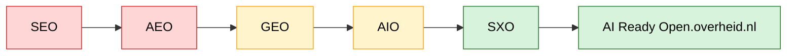

# Open.overheid.nl Future Search Strategy (Extended)

Datum: 2026-07-01

## Scorecard SEO / AEO / GEO / AIO / SXO

> Indicatieve volwassenheidsmeting (geen officiële audit).

| Domein | Huidig | Doel | Prioriteit |
|---|---:|---:|---|
| SEO | 6.5/10 | 9.8/10 | MUST |
| AEO | 4.0/10 | 9.5/10 | MUST |
| GEO | 3.5/10 | 9.5/10 | MUST |
| AIO | 5.0/10 | 9.0/10 | SHOULD |
| SXO | 6.0/10 | 9.5/10 | SHOULD |

## Score per platform

| Platform | Nu | Na roadmap |
|---|---:|---:|
| Google | 7 | 10 |
| Bing | 6 | 10 |
| DuckDuckGo | 6 | 9 |
| ChatGPT | 4 | 9 |
| Gemini | 4 | 9 |
| Microsoft Copilot | 4 | 9 |
| Claude | 4 | 9 |
| Perplexity | 5 | 10 |

## Oude versus gewenste situatie

| Onderdeel | Huidig | Gewenst | Voordeel |
|---|---|---|---|
| HTML | JavaScript-first | SSR/Prerender | Betere indexatie |
| Metadata | Generiek | Dynamisch | Hogere CTR |
| Canonical | Niet overal | Altijd | Minder duplicate content |
| Structured Data | Beperkt | Volledig Schema.org | AI begrijpt content |
| Zoekfunctie | Exacte zoekwoorden | Semantisch + AI | Sneller juiste resultaten |
| Related docs | Beperkt | Automatisch | Betere context |
| Samenvatting | Niet standaard | Altijd aanwezig | AI-citaties |
| Entity pages | Nee | Ja | GEO/AEO |

## AI-modellen

| Model | SEO | Structured Data | Canonical | Entity's | Samenvatting |
|---|---|---|---|---|---|
| ChatGPT | ✔ | ✔ | ✔ | ✔ | ✔ |
| Gemini | ✔ | ✔✔ | ✔ | ✔✔ | ✔ |
| Copilot | ✔✔ | ✔ | ✔ | ✔ | ✔ |
| Claude | ✔ | ✔ | ✔ | ✔ | ✔ |
| Perplexity | ✔✔ | ✔✔ | ✔ | ✔✔ | ✔✔ |

Legenda:
- ✔ = belangrijk
- ✔✔ = zeer belangrijk

## Verwachte KPI's

| KPI | Huidig | Doel |
|---|---:|---:|
| Google indexatie | 85% | 99% |
| AI citeert officiële bron | 30% | 90% |
| Zoeksucces | 70% | 95% |
| Gem. zoektijd | 3-5 min | <1 min |
| Servicedeskvragen | Hoog | Laag |

## Mermaid

## Conclusie

De grootste winst zit in:
1. SSR/prerender.
2. Structured Data.
3. Canonical URLs.
4. AI-vriendelijke HTML.
5. Semantische zoekfunctie.
6. Topic- en entitypagina's.
7. Knowledge Graph.
8. Monitoring van SEO én AI-citaties.

Deze verbeteringen zorgen ervoor dat open.overheid.nl beter gevonden wordt door zowel klassieke zoekmachines als AI-platformen zoals ChatGPT, Gemini, Copilot, Claude en Perplexity.
