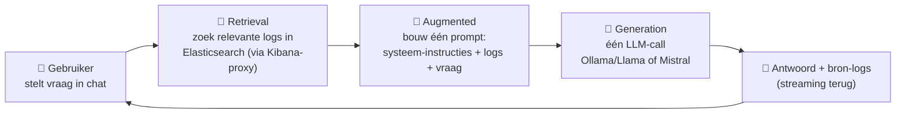
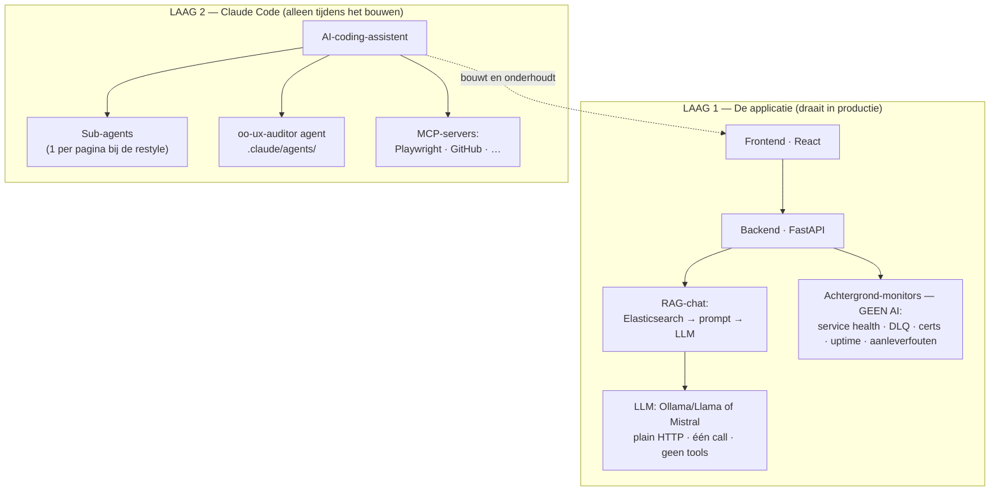
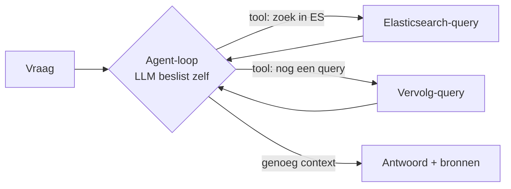

# AI-architectuur

> 🇳🇱 Deze pagina legt **zo helder mogelijk** uit hoe de AI in **Open Overheid -
> Monitoring** werkt — bedoeld om aan het team uit te leggen. Technische termen
> (RAG, agent, MCP, endpoint, log, tool-calling) houden we in het Engels.

## ⭐ Kernboodschap (in één zin)

> **De applicatie zelf gebruikt GEEN agents, GEEN sub-agents en GEEN MCP.**
> Het is een **RAG-app** (zoekt logs op en laat een LLM die samenvatten) **plus
> een set achtergrond-monitors**. De agents/sub-agents/MCP die je voorbij zag komen
> horen bij **Claude Code — de AI-assistent die de app heeft *gebouwd*** — niet bij
> de app die in productie draait.

Het belangrijkste inzicht: er zijn **twee lagen**, en die worden vaak door elkaar
gehaald.

| | **Laag 1 — De applicatie** (productie, jullie beheer) | **Laag 2 — Claude Code** (bouwgereedschap) |
|---|:---:|:---:|
| Agents? | ❌ Nee | ✅ Ja |
| Sub-agents? | ❌ Nee | ✅ Ja (1 per pagina bij de restyle) |
| MCP? | ❌ Nee | ✅ Ja (Playwright, GitHub, …) |

---

## 1. Wat de app WEL is — RAG (Retrieval-Augmented Generation)

De AI in de app volgt het eenvoudigste en meest robuuste patroon: **RAG**. Bij een
chatvraag gebeurt dit (`backend/main.py` → `elastic.py` → `llm.py`):

**Eén keer zoeken, één LLM-call, één antwoord.** De LLM is als een slimme
bibliothecaris: hij haalt de juiste documenten op en schrijft een samenvatting —
mét de bron-logs erbij. Hij **handelt nooit zelfstandig**.

Bevestigd in de code:
- ❌ Geen tool-calling / function-calling (`tools=`, `tool_call` komen niet voor in `llm.py`).
- ❌ Geen multi-step "agent-loop" waarin de AI zelf zijn volgende stap kiest.
- ❌ Geen sub-agents, geen MCP. De LLM wordt over **plain HTTP** aangeroepen (`/api/chat`).

---

## 2. Wat de app NIET gebruikt — en wat die termen betekenen

Zodat je het kunt navertellen:

- **Agent** = een LLM in een **loop** die zelf **tools** kan kiezen en aanroepen
  (zoeken, code draaien, een API bevragen), het resultaat bekijkt en zelf zijn
  volgende stap bepaalt — meerdere beurten, autonoom. → **Doet onze app niet.**
- **Sub-agent** = een agent die **andere, verse agents** opstart om deeltaken
  parallel te doen. → **Alleen Claude Code deed dit, om de UI sneller te bouwen.**
- **MCP (Model Context Protocol)** = een standaard "USB-poort" waarmee een
  AI-assistent op externe tools/data kan aansluiten (browser, GitHub, database).
  → **Alleen Claude Code gebruikt MCP** (bv. Playwright om jullie pagina's te
  screenshotten). **Onze app biedt geen MCP aan en gebruikt geen MCP.**

---

## 3. De twee lagen, naast elkaar

> Let op: alles in **LAAG 2** raakt de draaiende app niet aan. Het zijn hulpmiddelen
> op de laptop van de ontwikkelaar. Zet je Claude Code uit, dan blijft de app
> precies hetzelfde werken.

---

## 4. Waar zit de AI in de app? (precies 3 plekken)

Alle drie zijn **single-shot** (één LLM-call, geen agent):

| Plek | Bestand | Wat de LLM doet |
|------|---------|-----------------|
| **Chat** | `backend/main.py` (`/chat`) | logs samenvatten / vraag beantwoorden, met bronnen |
| **Briefings & digests** | `backend/briefing.py` | korte samenvatting van de status |
| **Smart Context-paneel** | `backend/context_engine.py` | begrijpelijke uitleg bij een dashboard-card |

De LLM-client zelf staat in **`backend/llm.py`** (Ollama én Mistral, omschakelbaar
via de provider-switch in de UI).

---

## 5. De rest is GEEN AI — gewoon achtergrond-monitors

De meeste features hebben **niets** met AI te maken. Het zijn **background pollers**:
geplande scriptjes die elke N seconden een endpoint aanroepen en simpele regels
toepassen (bv. `5xx = down`).

| Monitor | Bestand | Hoe |
|---------|---------|-----|
| Service health | `service_health.py` | HTTP-probe per microservice |
| RabbitMQ DLQ | `rabbitmq_dlq.py` · `dlq_intel.py` | Management API, read-only |
| Certificaten (TLS) | `cert_monitor.py` · `certificates.py` | vervaldatum checken |
| Beschikbaarheid (uptime) | `uptime.py` | publieke sites pingen |
| Aanleverfouten | `aanlever.py` | afgekeurde documenten detecteren |

Saai, betrouwbaar, **geen model nodig**. Precies zoals monitoring hoort te zijn.

---

## 6. Upgrade-pad — hoe je het WÉL "agentic" zou maken

Wil je later van de chat een **echte agent** maken (de AI laat zelf vervolg-queries
op Elasticsearch doen tot hij genoeg weet), dan ziet de loop er zo uit:

Het verschil met nu: de **pijl terug** naar de LLM (de loop) en **tool-calling**.
Dat geeft slimmere antwoorden, maar kost meer: trager, duurder, en lastiger te
voorspellen/debuggen. Voor monitoring is het huidige **RAG-patroon meestal de
betere keuze** — begin alleen aan agents als simpele RAG echt tekortschiet.

---

## 7. Compliance & privacy (EU AI Act + AVG)

> ⚖️ **Belangrijk — lees dit eerst.** Dit is een **engineering-inschatting**, géén
> juridisch oordeel en géén certificering. Een uitspraak als *"100% compliant"* kan
> alléén worden gedaan na een **DPIA** en akkoord van de **Functionaris
> Gegevensbescherming (FG/DPO)**. Hieronder staat wat de app *technisch* doet en
> welke keuzes bijdragen aan compliance — eerlijk, inclusief de aandachtspunten.

### EU AI Act — risico-classificatie

De app is een **intern monitoring-/observability-hulpmiddel**. Het valt **niet** onder
de high-risk categorieën van **Annex III** (geen biometrie, geen beslissingen over
personen, geen kredietscoring, geen werving/selectie, enz.). Inschatting:
**minimal / limited risk**.

De relevante plicht is **transparantie (Art. 50)**: gebruikers moeten weten dat ze
met AI praten. **Dat is al ingevuld** — de chat toont:

> *"Je communiceert met een AI-systeem. Antwoorden worden gegenereerd door een Llama-
> of Mistral-taalmodel en kunnen onnauwkeurigheden bevatten. Verifieer kritieke
> bevindingen altijd in Kibana."* (`frontend/src/App.jsx`)

### Privacy-by-design — maatregelen die KLOPPEN ✅

- **Local-first:** de **default provider is Ollama** (`llm_provider = "ollama"`), die
  **on-prem** draait. In deze stand verlaat **geen logdata** de omgeving.
- **Volledig achter authenticatie:** Keycloak/SP-login + **per-feature autorisatie**
  (deny-by-default, super-admin + grant-matrix). Zie [[Autorisatie]].
- **Read-only & veilig:** de monitors doen alleen-lezen checks op een **vaste
  URL-lijst** (geen user-input → geen SSRF), geen credentials in de requests.
- **Geen secrets in git** (`.env` is git-ignored); API-keys staan niet in de repo.
- **AI-disclosure aanwezig** (transparantie, zie hierboven).

### Aandachtspunten — eerlijk benoemd ⚠️

- **Er wórden persoonsgegevens verwerkt.** Minimaal: **usernames** (login, sessies,
  audit-logs `actor`). Daarnaast kúnnen **logs/documenten** persoonsgegevens bevatten.
  → De claim *"gebruikt nooit persoonsgegevens"* is **niet juist**.
- **Geen PII-redactie vóór de LLM.** De opgehaalde logs gaan **as-is** in de prompt.
- **Mistral = cloud (derde partij).** Kies je Mistral, dan gaat de prompt-context
  (incl. mogelijke persoonsgegevens) naar `api.mistral.ai` (Frankrijk/EU). Dat maakt
  Mistral een **verwerker** → er is een **verwerkersovereenkomst (DPA)** nodig.

### Aanbevolen formele stappen (zo wordt compliance écht aantoonbaar)

1. **DPIA** (gegevensbeschermingseffectbeoordeling) uitvoeren en laten tekenen door de **FG/DPO**.
2. **Grondslag** vastleggen (AVG Art. 6) en **doelbinding** documenteren.
3. **Data-minimalisatie & bewaartermijnen** bepalen (audit-logs, incident-stores).
4. **Mistral:** óf een **DPA** afsluiten, **óf** in productie **alleen Ollama (on-prem)**
   toestaan → dan blijft alle AI-verwerking lokaal en is dit aandachtspunt weg.
5. Optioneel: **PII-redactie/pseudonimisering** toevoegen vóór de prompt (data-minimalisatie).

### De eerlijke samenvatting

> *De app is **met privacy in gedachten ontworpen** (local-first AI, volledige
> authenticatie, read-only monitors, AI-transparantie) en valt qua **AI Act**
> waarschijnlijk onder **minimal/limited risk** met de transparantieplicht al
> ingevuld. Hij verwerkt **wél** persoonsgegevens (o.a. usernames), dus volledige
> **AVG-compliance vereist een DPIA + FG/DPO-akkoord** — dat is een organisatorische
> stap, geen code-claim.*

---

## 8. Voor het team (de zin om te onthouden)

> *"Onze app is een **RAG-applicatie**: hij haalt logs uit Elasticsearch en laat een
> LLM (lokaal Llama of Mistral) die samenvatten, met bronnen. Daarnaast draaien er
> **achtergrond-monitors** (geen AI) voor health/DLQ/certs/uptime. De app gebruikt
> **geen agents, sub-agents of MCP** — die hoorden bij **Claude Code, de
> AI-coding-assistent** die de app heeft gebouwd. Dat is bouwgereedschap, geen
> onderdeel van het draaiende systeem."*

---

## Bronnen in de code

- `backend/llm.py` — LLM-client (Ollama + Mistral, plain HTTP, geen tools)
- `backend/main.py` — `/chat` endpoint (de RAG-flow)
- `backend/elastic.py` — de retrieval (zoeken via Kibana-proxy)
- `backend/context_engine.py` — Smart Context-tekst
- `backend/briefing.py` — briefings/digests
- `.claude/agents/oo-ux-auditor.md` — **bouw**-agent (Laag 2, niet de app)

## In-app: Beheer → Compliance & Beveiliging

Deze inschatting is nu ook in de app zichtbaar (super-admin) onder **Beheer →
Compliance & Beveiliging**: de EU AI Act-risicoklasse (**beperkt risico**), de
transparantie-status, en de uitkomst van de **security-check** (auth/authz,
secrets, injectie/SSRF, datalek naar cloud-LLM, TLS) met ernst per bevinding +
aanbevolen acties. Het blijft een **engineering-inschatting**, geen certificering —
de kaart zegt dit expliciet. EU AI Act-transparantieplicht (Art. 50) geldt vanaf
**2 aug 2026**.

## Beveiligingsmaatregelen (toegepast)

Naar aanleiding van de security-review zijn deze hardening-maatregelen doorgevoerd
(additief; frozen cert/Mistral-code onaangeroerd):

- **Super-admin** staat nu in `.env` (`SUPER_ADMINS`, comma-gescheiden) i.p.v.
  hardcoded in de source. Zet dit in productie — leeg = géén super-admin.
- **Rate-limiting** op `/login` (per-IP, 12/min → 429) tegen brute-force.
- **Sessie-TTL** (12u) + **idle-timeout** (4u); verlopen tokens worden geweigerd.
- **Securityheaders** via nginx (X-Frame-Options DENY, X-Content-Type-Options nosniff,
  Referrer-Policy, CSP `frame-ancestors 'none'`) + API-response-headers.
- **CORS** beperkt tot eigen origin + methodes; **/docs** staat standaard uit
  (`EXPOSE_API_DOCS=false`); **timing-safe** token-vergelijking; login-fouten
  gesanitiseerd (geen interne details naar de client).

Zichtbaar in **Beheer → Compliance & Beveiliging**. Openstaand (bewust later):
PII-redactie vóór de Mistral-context (nu gemitigeerd doordat Ollama lokaal draait).
