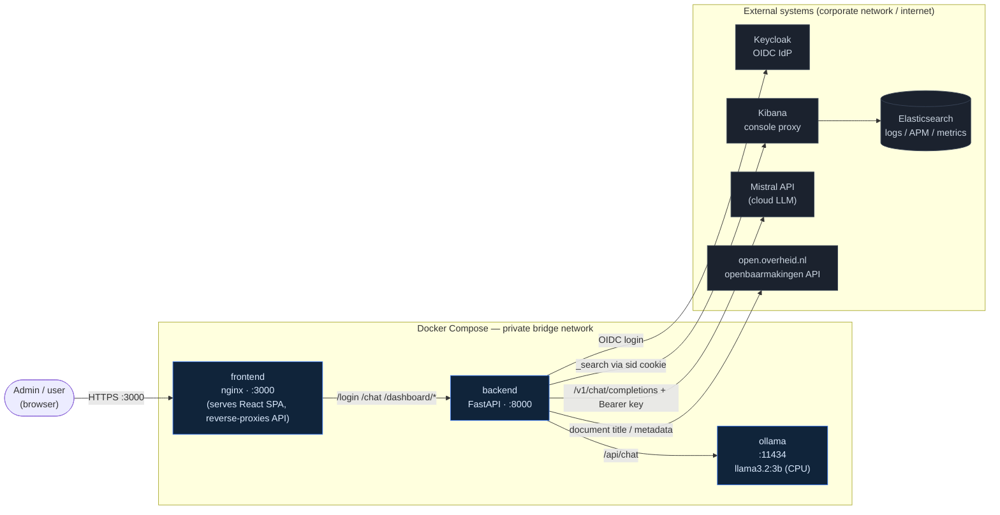
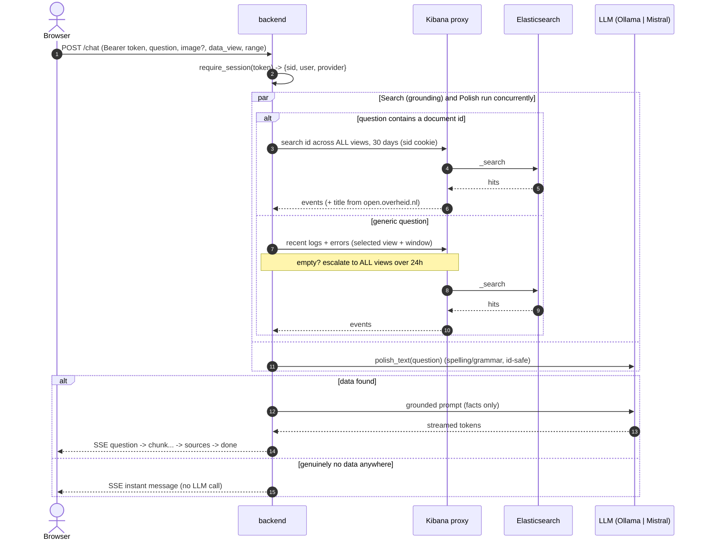
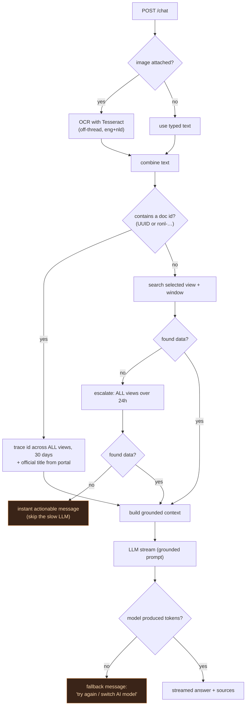
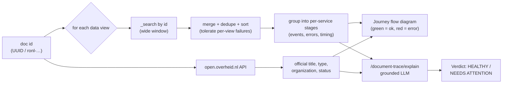
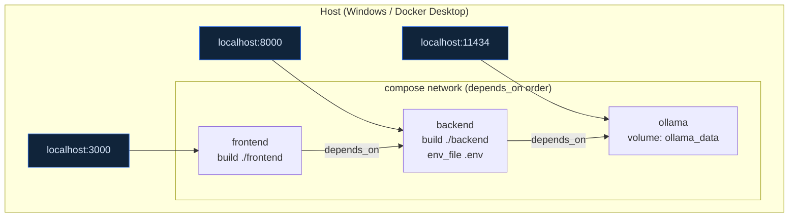

# Architecture

Back to [[Home]]. A comprehensive view of how the pieces fit together — Docker
topology, the Kibana authorization handshake, and the chat/LLM data flow.

> [!tip] Mermaid diagrams
> These render natively in Obsidian (and on GitHub). Use the graph view to see
> how the notes link.

---

## 1. System context (containers + external systems)



**Key invariant:** the backend **never** queries Elasticsearch directly — every
search goes through **Kibana's console proxy** carrying the user's Keycloak `sid`
cookie. The LLM only ever sees **facts already computed from ES** (grounding).

---

## 2. Authentication — Keycloak OIDC handshake

`POST /login` exchanges credentials for a Kibana `sid` cookie, then mints an
opaque session token for the browser. The `sid` never leaves the server.

```mermaid
sequenceDiagram
    autonumber
    actor U as Browser
    participant BE as backend
    participant KB as Kibana
    participant KC as Keycloak

    U->>BE: POST /login {username, password}
    BE->>KB: POST /internal/security/login (start OIDC)
    KB-->>BE: 200 { location: Keycloak auth URL }
    BE->>KC: GET auth form
    KC-->>BE: HTML login form (action URL)
    BE->>KC: POST credentials to action URL
    alt invalid credentials
        KC-->>BE: 200 form with error
        BE-->>U: 401 Invalid username or password
    else success
        KC-->>BE: 302 redirect (callback URL)
        BE->>KB: GET callback
        KB-->>BE: Set-Cookie: sid=...
        BE->>BE: create_session(user, sid) -> token
        BE-->>U: 200 { token, username }
    end
    Note over U,BE: token kept in sessionStorage;<br/>sid stays server-side in the session store
```

If Kibana is unreachable (VPN down / DNS), the backend returns a friendly **503**
("connect to the company network or VPN") instead of a raw error.

---

## 3. Authorization + the chat data flow

Every protected call carries `Authorization: Bearer <token>`. `require_session`
resolves it to `{sid, username, llm_provider}`; admin routes additionally check
the `DASHBOARD_ADMINS` allowlist.



The answer is **streamed** over Server-Sent Events. The stream is guaranteed to
**never end empty** — if the model returns zero tokens, the backend emits a
clear "try again / switch model" message. See [[Runbook - No answer in chat]].

---

## 4. Chat request — decision logic



See [[Chat pipeline]] for the code-level walkthrough.

---

## 5. Document trace flow

A document id is resolved into a full journey + an AI verdict. Same engine backs
the chat doc-id path and the **Documents** tab. See [[Document tracer]].



---

## 6. Deployment topology (Docker Compose)



- **Startup order:** `ollama` → `backend` → `frontend` (compose `depends_on`).
- **Backend image** installs `tesseract-ocr` (+ Dutch) at build for [[Chat pipeline|OCR]].
- **Config** comes from `.env` (git-ignored) via `env_file`; secrets such as
  `MISTRAL_API_KEY` never enter the image or git. See [[LLM providers]].
- `OLLAMA_BASE_URL` is overridden in compose to the in-network `http://ollama:11434`.

---

## 7. Backend modules (`backend/`)

| Module | Responsibility |
|---|---|
| `main.py` | FastAPI app; `/login`, `/chat`, `/health`, `/llm-provider`. See [[Chat pipeline]]. |
| `elastic.py` | Kibana proxy client, `keycloak_login`, search helpers, doc-id detection. |
| `llm.py` | Ollama + Mistral clients, streaming, `polish_text`, `provider_model`. See [[LLM providers]]. |
| `ocr.py` | Tesseract OCR for uploaded screenshots (offline, non-fatal). |
| `dashboard.py` · `monitoring.py` · `briefing.py` | Admin dashboard fact-layer + grounded triage. See [[Monitoring dashboard]]. |
| `documents.py` | Document activity feed + the tracer. See [[Document tracer]]. |
| `portal.py` | Official metadata from the [[open.overheid.nl API]]. |
| `config.py` · `cache.py` · `session.py` | Settings, TTL cache, token→session store. |

---

## 8. Security & resilience model

- **No direct ES access** — only via Kibana's authenticated console proxy.
- **Secrets** live in `.env` (git-ignored); the Mistral key is validated before
  it is ever saved (`set-mistral-key.ps1`).
- **Admin gating** via `DASHBOARD_ADMINS` allowlist (Keycloak group claims = phase-2).
- **Grounding** — the LLM narrates only facts computed from ES; it never invents
  numbers (enforced by strict system prompts in `briefing.py` / `llm.py`).
- **Graceful degradation** — per-view query failures are isolated; the chat never
  blanks; unreachable Kibana → friendly 503; portal/OCR/polish are best-effort.

## Data views (whitelist)

`logs-*`, `ds-prod5-koop-plooi*`, `ds-prod5-koop-sp`. The real KOOP pipeline logs
live in `ds-prod5-koop-plooi*`; `logs-*` ("All logs") is often nearly empty —
this matters for [[Runbook - No answer in chat]] and [[KOOP Plooi log schema]].
