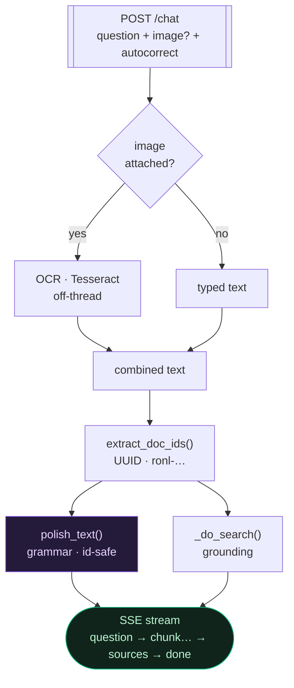

# Chat pipeline

Back to [[Home]]. Endpoint: `POST /chat` in `backend/main.py`.

## What happens to a question

> [!tip]- Colour legend
> 🟪 LLM step · 🟦 our code · 🟧 fallback / degraded

`polish_text()` and `_do_search()` run **concurrently**, so auto-correct adds
~no wall-clock time.

## Two search paths (`_do_search`)

### 1. Document-scoped (the question names a doc id)
- Trace each id across a **wide window (30 days)** and **every data view**
  (`_collect_doc_events`), tolerating per-view failures.
- Enrich with the official title/metadata from the [[open.overheid.nl API]].
- This is what powers audits like *"why was this published twice?"*. See [[Document tracer]].

### 2. Generic question
- Search the **selected** view + window first.
- If empty → **escalate**: broaden to **all data views over 24h**
  (`chat_widen_minutes`). Widening only the index was not enough — the time
  window matters too. See [[Runbook - No answer in chat]].
- Still empty → return an **instant, actionable message** (no slow LLM call).

## Intent-routing: health-digest vs. echte zoekopdracht (bugfix)

Vóór een vraag de zoekpaden ingaat, classificeert de backend de **intentie**. Dit
was een bron van fouten: een specifieke zoekopdracht die toevallig de woorden
*"issue"/"error"* bevatte (bv. *"Find the attendee mailing list issue or error for
today"*) werd gekaapt naar de generieke **cluster-health-digest** en zocht het
échte onderwerp nooit op. Nu routeert de bilinguale (NL + EN) classifier zo:

| Signaal | Voorbeelden | Route |
|---|---|---|
| **STERK health-signaal** | failing · stuck · unhealthy · "what's going wrong" · NL *kritiek · storing · vastgelopen · welke services* | → instant **health-digest** (snelle statusopsomming, geen trage LLM-zoektocht) |
| **Specifieke SEARCH/lookup** | find · search · show me · locate · trace · NL *vind · zoek · toon* | → een **echte log-search** die de gestelde vraag beantwoordt (en eerlijk *"geen log-events gevonden"* zegt als het onderwerp er niet is) |
| **Kaal** error/issue/problem | zonder verdere context | telt **alleen** als health mét een breed-bereik-cue: *right now · any · system · nu* |

Gevolg: specifieke zoekvragen belanden niet langer per ongeluk in de digest; ze
worden echt opgezocht. Zie ook [[Runbook - No answer in chat]].

## Robustness guarantees

- **The stream never ends empty.** If the model yields zero tokens, the backend
  sends a clear message ("try again, or switch the AI model") instead of a blank
  bubble. (This was the real cause of the misleading "No matching data".)
- Per-query failures are tolerated (`_fetch_generic`) so one bad index can't
  blank the context.
- OCR, portal lookups and polish are all **best-effort / non-fatal**.

## Image upload (OCR)

- `ocr.py` uses **Tesseract** (English + Dutch), with grayscale + upscale
  preprocessing so UI text and IDs read cleanly. Offline, provider-agnostic.
- Extracted text flows through the normal pipeline → a screenshot containing a
  doc id is **auto-traced**.

## Auto-correct

- `llm.polish_text` — fixes spelling/grammar, **preserves IDs/codes/numbers**,
  runs concurrently with the search (≈no added latency), streams the cleaned
  text back first (SSE `question` event) so the UI updates the bubble.

## Related

- [[LLM providers]] · [[Document tracer]] · [[Runbook - No answer in chat]] · [[KOOP Plooi log schema]]
