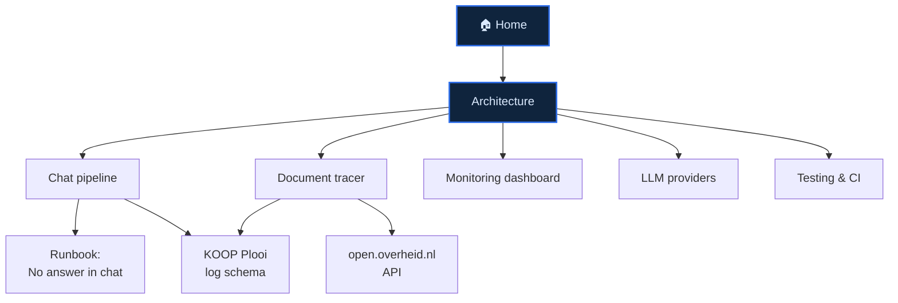

# KIBANA-OO 🏠

AI-assisted monitoring + chat over Elasticsearch/Kibana for the **KOOP / Plooi**
Dutch open-data platform (Kibana space `koop-plooi-prod`).

> [!info] How to use this vault
> Open this folder (`docs/KIBANA-OO/`) as an Obsidian vault. Everything is
> cross-linked — start here and follow the wiki-links. The graph view
> (Ctrl/Cmd-G) shows how the pieces connect.

## Map of content

- [[Woo platform]] — **plain-language** map of the whole KOOP/Woo platform we monitor (start here for the big picture)
- [[ROO - Applicatieketen]] — the register & reference index: "where to find" Woo info not hosted on the platform
- [[Woo Gateway]] — the secure front door: delivery APIs (OAS), API Gateway, IAM/CAM auth
- [[Architecture]] — the three services and how a request flows
- [[Chat pipeline]] — how a question becomes an answer (doc-id trace, OCR, auto-correct, escalation)
- [[Document tracer]] — trace one document's journey + AI explain
- [[Document lifecycle (pipeline)]] — the canonical pipeline: how far a doc got, is it healthy, is it stuck (1-1 with the dashboard)
- [[Monitoring dashboard]] — daily critical-issue dashboard
- [[LLM providers]] — Ollama vs Mistral, the switcher, installing a key
- [[KOOP Plooi log schema]] — the real (non-ECS) field names
- [[open.overheid.nl API]] — resolving a document's official title/metadata
- [[Testing and CI]] — how to run the tests
- [[Runbook - No answer in chat]] — troubleshooting "No matching data"

## What it does, in one paragraph

A React/Vite frontend talks to a FastAPI backend, which queries Kibana's
**console proxy** (never Elasticsearch directly) using a Keycloak OIDC `sid`
cookie. An LLM ([[LLM providers|Ollama or Mistral]]) turns log/metric facts into
plain-language answers and triage. Admins get a [[Monitoring dashboard]] and a
[[Document tracer]]. See [[Architecture]] for the moving parts.

## Conventions

- Conventional commits, feature branches → PR → merge to `main`.
- Backend tested in a `python:3.13` Docker container — see [[Testing and CI]].
- Secrets (`.env`) are **never** committed.
