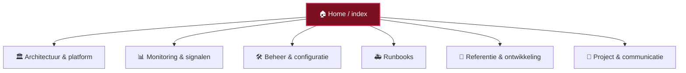

# 🏠 Home — inhoudsopgave van de vault

AI-ondersteunde monitoring + chat over Elasticsearch/Kibana voor het
**KOOP / Plooi** open-data­platform (open.overheid.nl).

> [!info] Hoe gebruik je deze vault
> Open deze map (`docs/KIBANA-OO/`) als Obsidian-vault. Alles is met
> wiki-links verbonden — begin hier en volg de links. De grafiek­weergave
> (Ctrl/Cmd-G) toont hoe de stukken samenhangen. Zet Obsidian op **Weergave** om
> Mermaid-diagrammen te zien.

> [!tip] Zo is de vault ingedeeld
> De notities zijn gegroepeerd in **6 thema's** — dit zijn ook **genummerde mappen
> (01–06)** in de verkenner, dus de indeling hieronder komt 1-op-1 overeen met de
> mappenstructuur. Zoek je iets? Ga naar het thema hieronder. Elke tabel toont het
> **onderwerp** en de datums **aangemaakt** / **bijgewerkt**, zodat je snel het
> juiste en meest actuele document vindt. (`Home.md` blijft in de hoofdmap.)

---

## 🏛️ Architectuur & platform
*Wat monitoren we en hoe zit het in elkaar?*

| Notitie | Onderwerp | Aangemaakt | Bijgewerkt |
|---|---|---|---|
| [[Woo platform]] | Kaart van het hele KOOP/Woo-platform (begin hier voor het grote geheel) | 2026-06-10 | 2026-06-10 |
| [[ROO - Applicatieketen]] | Register & naslag: "waar vind ik" Woo-info buiten het platform | 2026-06-10 | 2026-06-10 |
| [[Woo Gateway]] | De beveiligde voordeur: aanlever-API's (OAS), API-gateway, IAM/CAM | 2026-06-10 | 2026-06-10 |
| [[Architecture]] | De drie services en hoe een request stroomt | 2026-06-09 | 2026-06-09 |
| [[AI-architectuur]] | RAG vs agents/MCP, de *harness*, én de compliance-posture (EU AI Act/AVG) | 2026-06-27 | 2026-07-01 |
| [[KOOP Plooi log schema]] | De echte (non-ECS) veldnamen in de logs | 2026-06-09 | 2026-06-09 |
| [[open.overheid.nl API]] | De officiële titel/metadata van een document ophalen | 2026-06-09 | 2026-06-09 |

## 📊 Monitoring & signalen
*De dashboards en kaarten die de keten 24/7 bewaken.*

| Notitie | Onderwerp | Aangemaakt | Bijgewerkt |
|---|---|---|---|
| [[Monitoring dashboard]] | Het dagelijkse kritieke-issue-dashboard | 2026-06-09 | 2026-06-27 |
| [[Dashboard - statusoverzicht]] | De overzichtsrij (statustegels) + inklapbare zones | 2026-06-17 | 2026-06-29 |
| [[Beschikbaarheid (uptime)]] | Zijn de sites (PROD/ACC/TST) up? Kleuren, uptime%, alerts | 2026-06-17 | 2026-06-17 |
| [[Service health]] | Werken de backend-microservices? Per service up/down/unreachable | 2026-06-19 | 2026-06-19 |
| [[Documentgezondheid]] | Verdict in gewone taal + proactieve signalen (vastgelopen/foutpiek/volume) | 2026-06-27 | 2026-06-27 |
| [[Document lifecycle (pipeline)]] | De canonieke pipeline: hoe ver kwam een doc, gezond of vast? | 2026-06-10 | 2026-06-17 |
| [[Document tracer]] | De reis van één document volgen + AI-uitleg | 2026-06-09 | 2026-06-09 |
| [[Pipeline outcomes]] | De uitkomsten/statussen van de verwerkingsstraat | 2026-06-17 | 2026-06-17 |
| [[Aanleverfouten]] | Afgekeurde aanleveringen opsporen en herleiden | 2026-06-17 | 2026-06-17 |
| [[DLQ intelligentie]] | Waarom staan berichten vast in een dead-letter queue? | 2026-06-18 | 2026-06-18 |
| [[Verwerkingsstraat queues]] | De queues in de verwerkingsstraat | 2026-06-17 | 2026-06-17 |
| [[Certificaten en TLS]] | Verlopende/zwakke certificaten bewaken | 2026-06-17 | 2026-06-18 |
| [[Regressietest]] | Werkt open.overheid.nl nog na een release? | 2026-06-29 | 2026-06-29 |
| [[Observability]] | Stroomt de data nog binnen en zijn er fouten? | 2026-07-01 | 2026-07-01 |
| [[Monitoring targets]] | Monitoring-targets & connections (Prometheus/Jaeger) beheren | 2026-06-27 | 2026-07-01 |
| [[SMB share health]] | Is een Windows/CIFS-netwerkschijf (SMB, poort 445) bereikbaar, leesbaar en snel? | 2026-07-04 | 2026-07-04 |
| [[HTTP-fouten en latency (PROD)]] | PROD-voordeur: 5xx, gateway-fouten (502/503/504), time-outs, latency, pod-restarts | 2026-07-16 | 2026-07-16 |
| [[Grafana en infrastructuur]] | Één-klik-links naar de Grafana-infradashboards | 2026-06-17 | 2026-06-17 |

## 🛠️ Beheer & configuratie
*Instellen, melden en toegang regelen (Beheer-pagina's).*

| Notitie | Onderwerp | Aangemaakt | Bijgewerkt |
|---|---|---|---|
| [[Alerting (meldingen)]] | E-mail/Mattermost-meldingen bij RED: per kaart, ontvangers, cooldown, historie | 2026-06-18 | 2026-07-01 |
| [[Webhooks (Mattermost)]] | Meerdere Mattermost-webhooks (ACC/TST/PROD); kies met één klik de actieve | 2026-07-02 | 2026-07-02 |
| [[Notifications and digest]] | De digest en notificatie-kanalen | 2026-06-11 | 2026-06-11 |
| [[Autorisatie]] | Wie mag wat (functie-matrix) + goedkeuring van nieuwe gebruikers | 2026-06-27 | 2026-07-01 |
| [[Credentials en beveiliging (pilot)]] | Geheimen veilig beheren: audit, least privilege, versleutelde `.env`, compromise-runbook | 2026-07-21 | 2026-07-21 |
| [[Navigatie]] | De gedeelde menubalk, Beheer-subpagina's, rechten | 2026-06-17 | 2026-07-01 |
| [[LLM providers]] | Ollama vs Mistral, de switcher, een sleutel installeren | 2026-06-09 | 2026-06-28 |
| [[Chat pipeline]] | Hoe een vraag een antwoord wordt (doc-id-trace, OCR, escalatie) | 2026-06-09 | 2026-07-01 |
| [[Smart context paneel]] | Hover een kaart → paneel met uitleg, status, AI-analyse en TODO's | 2026-06-17 | 2026-06-17 |
| [[UX design system]] | Het OO-GX ontwerp­systeem (kleuren, typografie, componenten) | 2026-06-26 | 2026-07-01 |

## 🚑 Runbooks
*Wat te doen als er iets misgaat.*

| Notitie | Onderwerp | Aangemaakt | Bijgewerkt |
|---|---|---|---|
| [[Runbook - wat te doen]] | Algemeen stappenplan bij een RED-status/incident | 2026-06-17 | 2026-06-27 |
| [[Runbook - No answer in chat]] | Probleemoplossing "No matching data" in de chat | 2026-06-09 | 2026-07-01 |
| [[RCA - Login incident (Kibana OIDC + Docker VPN)]] | Waarom inloggen faalde (VPN/Docker, WSOD, Kibana-auth verhuisd) + de fix | 2026-07-04 | 2026-07-04 |

## 🧪 Referentie & ontwikkeling
*Naslag voor wie eraan bouwt.*

| Notitie | Onderwerp | Aangemaakt | Bijgewerkt |
|---|---|---|---|
| [[Testing and CI]] | Hoe je de tests draait (python:3.13-container) | 2026-06-09 | 2026-06-09 |

## 📣 Project & communicatie
*Pitch, plannen en actielijsten.*

| Notitie | Onderwerp | Aangemaakt | Bijgewerkt |
|---|---|---|---|
| [[Presentatie - Management]] | Dia-voor-dia pitch voor het management (met Mermaid-diagrammen + echte log-bewijzen voor compliance) | 2026-07-04 | 2026-07-20 |
| [[FG-DPO checklist (AVG, EU AI Act, BIO)]] | Compliance-checklist voor de FG/CISO om naar productie te gaan (AVG, EU AI Act, BIO, DPIA, Algoritmeregister) | 2026-07-16 | 2026-07-16 |
| [[Backlog - TODO Anton]] | Persoonlijke actielijst | 2026-06-17 | 2026-06-18 |
| [[SEO AEO GEO roadmap]] | Vindbaarheid van open.overheid.nl voor zoekmachines én AI (SEO/AEO/GEO/AIO/SXO): scorecard, MoSCoW-roadmap, implementatie & KPI's | 2026-07-01 | 2026-07-16 |

---

## Wat het in één alinea doet

Een React/Vite-frontend praat met een FastAPI-backend, die Kibana's
**console-proxy** bevraagt (nooit Elasticsearch direct) met een Keycloak-OIDC
`sid`-cookie. Een LLM ([[LLM providers|Ollama of Mistral]]) maakt van
log-/metric-feiten begrijpelijke antwoorden en triage. Beheerders krijgen een
[[Monitoring dashboard]] en een [[Document tracer]]. Zie [[Architecture]] voor de
bouwstenen, en [[AI-architectuur]] voor de RAG-vs-harness-uitleg.

## Conventies

- **Vault-indeling:** 6 thema's (zie de inhoudsopgave hierboven). Nieuwe notitie?
  Zet 'm in het passende thema en voeg 'm toe aan de bijbehorende tabel, met
  onderwerp + datums.
- **Datums:** *Aangemaakt* = eerste commit, *Bijgewerkt* = laatste commit
  (`YYYY-MM-DD`).
- **Taal:** documentatie in het **Nederlands**; vaktermen (RAG, endpoint, log,
  tool-calling) in het Engels. Notitie-titels blijven zoals de bestandsnaam, zodat
  `[[wiki-links]]` blijven werken.
- **Code:** conventional commits, feature-branch → PR → merge naar `main`.
  Backend getest in een `python:3.13`-container — zie [[Testing and CI]].
  Secrets (`.env`) worden **nooit** gecommit.
