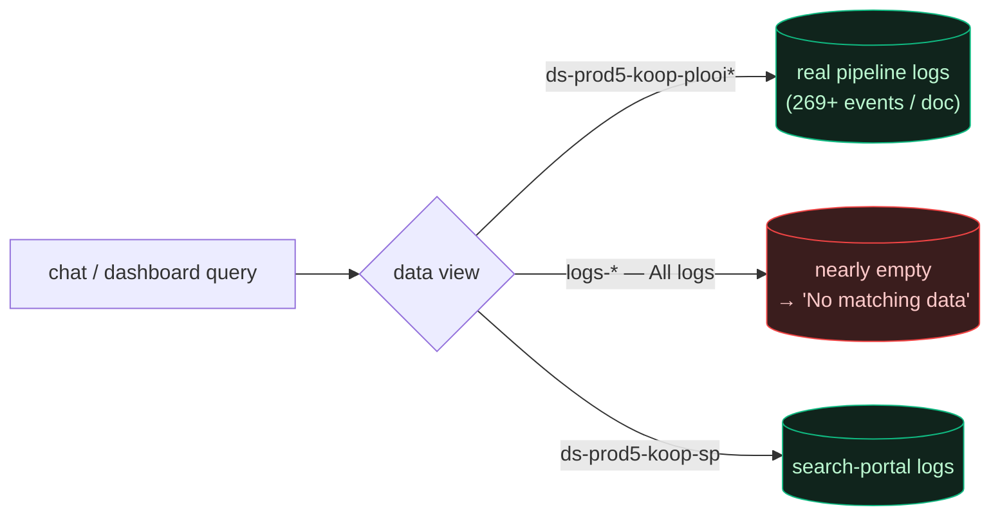

# KOOP Plooi log schema

Back to [[Home]]. The single most important "gotcha" for this project.

## The logs are NOT ECS

KOOP Plooi logs are **logback / Logstash JSON**, not Elastic Common Schema:

- `level` — UPPERCASE (`INFO`, `WARN`, `ERROR`) at the **top level** (not `log.level`).
- `message` — the free-text line.
- `logger_name`, `kubernetes.*` — infra fields (excluded from document extraction).
- The **document id** is often embedded *inside the message* (e.g. a `ronl-…`
  path, or a UUID), not in a dedicated field.

Queries therefore check **both** `level` and `log.level`, and free-text search is
unreliable for structured questions.

## Services seen in the pipeline

`msvc-doculoket`, `msvc-documentopslag`, `msvc-indexatie`, `msvc-publicatiebeheer`,
`msvc-export`, `service.StorageAccess`, `search`, `solr`, `gateway-service`,
`zoekportaal`, `controller`, `app`.

## Where the data lives

> [!tip]- Colour legend
> 🟩 has data · 🟥 usually empty

- Real pipeline logs: **`ds-prod5-koop-plooi*`**.
- `logs-*` ("All logs") is often **nearly empty** — selecting it is the usual
  cause of an empty chat result. See [[Runbook - No answer in chat]].

## Document title is not in the logs

The official title must be fetched from the [[open.overheid.nl API]].

## Related

- [[Document tracer]] · [[Chat pipeline]] · [[open.overheid.nl API]]
