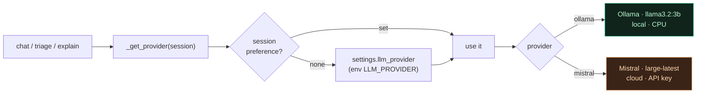

# LLM providers

Back to [[Home]]. `backend/llm.py`, `frontend/src/ProviderSwitcher.jsx`.

## Two providers, per-session switch

| Provider | Model (default) | Where it runs |
|---|---|---|
| **Ollama** | `llama3.2:3b` | Local container, CPU. Free, always available, slower on CPU. |
| **Mistral** | `mistral-large-latest` | Cloud (OpenAI-compatible API). Needs a valid `MISTRAL_API_KEY`. Faster, smarter. |

- The active provider is chosen per session and synced to the backend
  (`POST /llm-provider?provider=`). `llm._get_provider(session)` reads the session
  preference, else `settings.llm_provider` (env `LLM_PROVIDER`, default `ollama`).
- `llm.provider_model(session)` returns the `(provider, model)` shown in the UI.

> [!tip]- Colour legend
> 🟩 local (Ollama) · 🟧 cloud (Mistral)



## The header switcher (every page)

A colour-coded pill in **every** header (Chat / Dashboard / Documents). The whole
header is themed via `data-provider` on `:root`:

- **Ollama → emerald**, **Mistral → amber**. Accent bar + pill + brand mark.

## Installing / rotating a Mistral key

Use the guarded installer (it tests the key against the live API and only saves
it if it returns HTTP 200):

```powershell
.\set-mistral-key.ps1
```

- Refuses to save on 401/403/429 and explains why.
- Writes `MISTRAL_API_KEY` into `.env` (git-ignored) and recreates the backend.
- A 401 means the key is wrong/revoked — not a billing throttle.

## Robustness

- Provider errors surface as friendly messages (`llm._llm_error_message`).
- The chat stream **never ends empty** even if a provider returns nothing — see
  [[Chat pipeline]] and [[Runbook - No answer in chat]].

## Related

- [[Chat pipeline]] · [[Monitoring dashboard]] · [[Architecture]]
