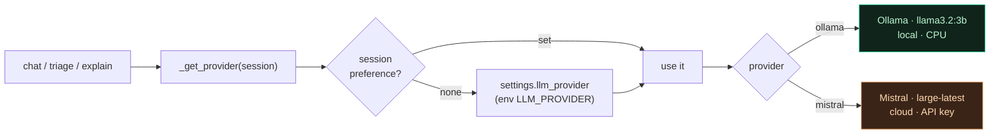

# LLM providers

Back to [[Home]]. `backend/llm.py`, `frontend/src/ProviderSwitcher.jsx`.

## Two providers, per-session switch

| Provider | Model (default) | Where it runs |
|---|---|---|
| **Ollama** | `llama3.2:3b` | Local container, CPU. Free, always available, slower on CPU. |
| **Mistral** | `mistral-large-latest` | Cloud (OpenAI-compatible API). Needs a valid `MISTRAL_API_KEY`. Faster, smarter. |

- The active provider is chosen per session and synced to the backend
  (`POST /llm-provider?provider=`). `llm._get_provider(session)` reads the session
  preference, else `settings.llm_provider` (env `LLM_PROVIDER`, default `ollama`).
- `llm.provider_model(session)` returns the `(provider, model)` shown in the UI.

> [!tip]- Colour legend
> 🟩 local (Ollama) · 🟧 cloud (Mistral)



## Waar je het model kiest — Beheer → Instellingen

> [!note] Verplaatst (één bron van waarheid)
> De model-keuze zat eerst óók als pill in elke header. Die **redundante pill is
> verwijderd**; het model beheer je nu op één plek: **Beheer → Instellingen →
> 🤖 AI-assistent** (`frontend/src/Settings.jsx`). Dit is admin-only, want het is
> een globale instelling. De header blijft via `data-provider` op `:root` getint
> (Ollama → emerald, Mistral → amber).

De Instellingen-pagina toont een **intelligente statusstrip** boven de keuze:
actief model, **privacy-postuur** (lokaal = geen data verlaat het netwerk · cloud =
prompts gaan naar buiten) en een context-advies (bij Mistral een waarschuwing voor
gevoelige data). De keuze zelf (de Ollama/Mistral-kaarten) is **ongewijzigd** —
Rule 2b blijft gerespecteerd.

## Standaard chat-zoekbereik (Beheer → Instellingen)

Naast het model stelt de admin hier het **standaard zoekbereik** in waarmee elke
nieuwe chat opent — **Standaard dataweergave** (Elasticsearch index) +
**Standaard tijdsbereik**. Gebruikers kunnen dit per vraag nog overschrijven via de
Dataweergave-/Tijdsbereik-keuzes onder het berichtenvak (hybride: admin zet de
default, gebruiker houdt controle). Opgeslagen per sessie
(`kibana_oo_default_dataview` / `kibana_oo_default_timerange`); presets gedeeld via
`frontend/src/scope.js`.

## Installing / rotating a Mistral key

Use the guarded installer (it tests the key against the live API and only saves
it if it returns HTTP 200):

```powershell
.\set-mistral-key.ps1
```

- Refuses to save on 401/403/429 and explains why.
- Writes `MISTRAL_API_KEY` into `.env` (git-ignored) and recreates the backend.
- A 401 means the key is wrong/revoked — not a billing throttle.

## Snelheid: Ollama (lokaal) vs Mistral (cloud)

**Mistral is snel** (~1–3 s): gehoste API op datacenter-GPU's. **Ollama is traag op
een CPU-host**: het model draait lokaal op de CPU (geen GPU).

> [!warning] Mistral is BEVROREN 🔒
> Wijzig nooit Mistral-instellingen/-code (RULES.md, Rule 2b). Mistral werkt
> perfect; optimaliseer alleen de lokale Ollama-kant.

Gemeten op deze CPU-host (12 GiB RAM, weinig vrij): `llama3.1:8b` **time-out > 180 s**;
`llama3.2:3b` laadt koud in ~129 s en haalt daarna ~6 tok/s. De grootste boosdoener
is het **herladen** van het model tussen chats (RAM-druk → model wordt uit het
geheugen gezet → elke chat betaalt opnieuw de laadtijd = de "Analyzing logs…"-hang).

**Daarom (config-only, Ollama-only):**
- `OLLAMA_MODEL=llama3.2:3b` — het kleine model dat op CPU wél antwoordt (8B time-out).
- `OLLAMA_KEEP_ALIVE=-1` (op de ollama-container in `docker-compose.yml`) — houd het
  model **resident** zodat chats niet elke keer ~2 min herladen.
- Topsnelheid: geef de ollama-container een **GPU** (GPU-blok in `docker-compose.yml`
  uit-commentariëren) — dan kan ook `llama3.1:8b`.

## Robustness

- Provider errors surface as friendly messages (`llm._llm_error_message`).
- The chat stream **never ends empty** even if a provider returns nothing — see
  [[Chat pipeline]] and [[Runbook - No answer in chat]].

## Related

- [[Chat pipeline]] · [[Monitoring dashboard]] · [[Architecture]]
