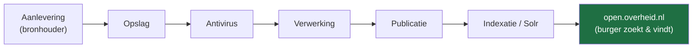
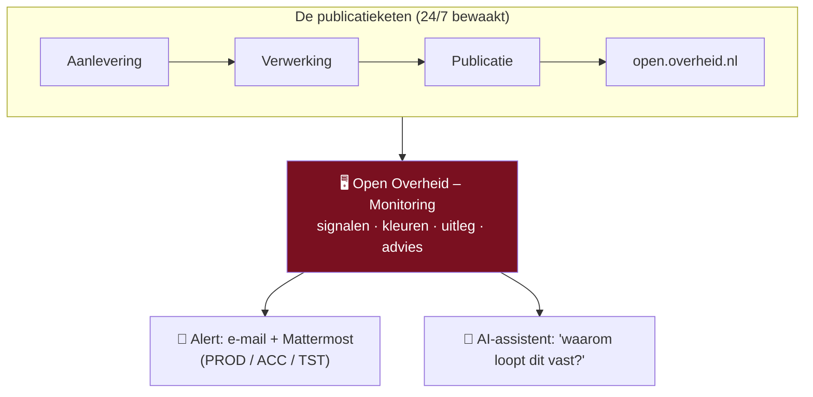
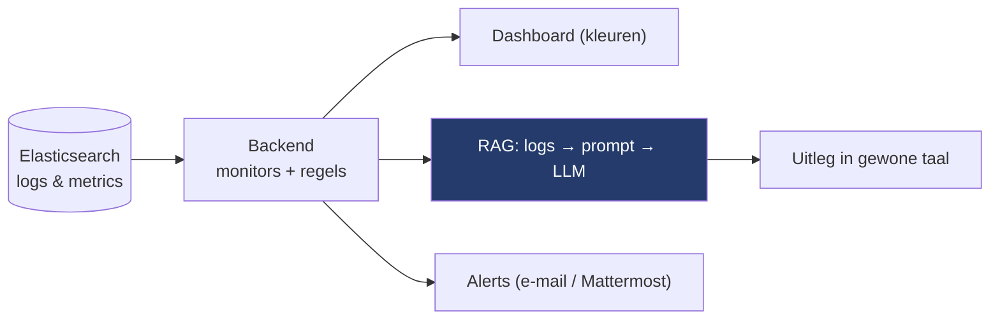
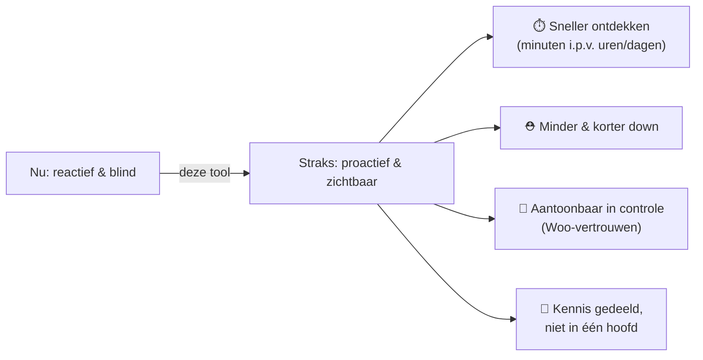
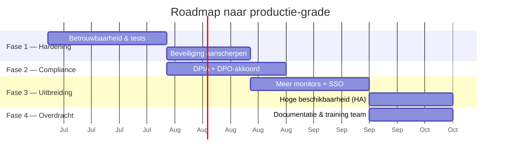

# Presentatie — Management

> **Doel van deze presentatie:** het management laten zien *waarom* we
> **Open Overheid – Monitoring** nodig hebben, wat het **nu al** doet, en het
> **mandaat + de tijd** krijgen om het professioneel door te ontwikkelen —
> *vóór* er een incident gebeurt dat de burger of de pers als eerste ziet.
>
> **Hoe te gebruiken:** elke `##` hieronder is één **slide**. Onder elke slide
> staan **spreek-punten** (wat je zegt) en waar nuttig een **Mermaid-diagram**
> (rendert direct in Obsidian → *Weergave*). Op plekken met 📸 zet je een
> **schermafbeelding** uit de live-app.
>
> Verwante notities: [[Home]], [[AI-architectuur]], [[Woo platform]],
> [[Monitoring dashboard]], [[Documentgezondheid]], [[Alerting (meldingen)]].

---

## 0. Zo breng je het (30 seconden voorbereiding)

- **Toon, vertel niet alleen.** Open de live-app naast de dia's. Eén echte
  RED→GROEN-tegel overtuigt meer dan tien bullets.
- **Rode draad in één zin:** *"We publiceren overheids­informatie wettelijk
  verplicht. Nu merken we storingen vaak te laat. Deze tool ziet ze meteen —
  in gewone taal — zodat we ze oplossen vóór de burger het merkt."*
- **De vraag staat op de laatste dia.** Wees concreet: je vraagt **tijd +
  mandaat**, geen blanco cheque.
- **Toon:** eerlijk over wat nog moet (DPIA, hardening). Eerlijkheid = vertrouwen.

---

## 1. Titel — Open Overheid · Monitoring

**Van "we hopen dat het werkt" naar "we wéten dat het werkt."**

Spreek-punten:
- Eén dashboard dat de hele Woo-publicatieketen bewaakt (open.overheid.nl).
- Gebouwd, draait, en bewijst zich al — vandaag, niet "ooit".
- Vandaag vraag ik ruimte om het naar productie-kwaliteit te tillen.

📸 *Schermafbeelding: de inlog-/dashboardpagina (de merk-uitstraling).*

---

## 2. Het probleem — we zijn nu grotendeels blind

De **Wet open overheid (Woo)** verplicht ons om overheids­informatie
beschikbaar te stellen via open.overheid.nl. Die publicatie loopt door een
**keten** van systemen. Als één schakel breekt, stopt publicatie — en dat
merken we vandaag vaak **te laat, handmatig, of via een klacht van buiten**.

Spreek-punten:
- Elke pijl is een plek waar het **stil kan vallen**: een aanleverfout, een
  document dat vastloopt, een volle dead-letter-queue, een verlopen certificaat,
  een service die down is.
- Nu: iemand moet het **toevallig zien** in Kibana/Elasticsearch — technisch,
  tijdrovend, en kennis zit bij **één persoon**.
- Gevolg: we ontdekken storingen soms **uren of dagen** later.

---

## 3. Wat er op het spel staat

| Risico | Concreet gevolg |
|---|---|
| ⚖️ **Juridisch** | Woo-plicht niet nagekomen — documenten niet (tijdig) openbaar |
| 👥 **Burger & pers** | Mensen vinden info niet; een journalist merkt de storing vóór ons |
| 🏛️ **Reputatie** | "De overheid heeft haar publicatie niet op orde" |
| 🧠 **Kennisrisico** | Monitoring zit in het hoofd van één beheerder — bus-factor 1 |
| ⏱️ **Tijd/kosten** | Laat ontdekken = langer down, meer herstelwerk, meer stress |

Spreek-punt: *"Dit gaat niet over een mooi dashboard. Het gaat over een
wettelijke plicht die we nu niet betrouwbaar kunnen garanderen."*

---

## 4. De oplossing — één plek, in gewone taal

Open Overheid – Monitoring bewaakt de **hele keten** proactief en vertaalt
technische logs naar **begrijpelijke taal met een advies "wat te doen"**.

Spreek-punten:
- **Groen/geel/rood** per onderdeel — je ziet in één oogopslag of het goed gaat.
- **Proactief**: de tool waarschuwt óns, we hoeven niet te zoeken.
- **Toegankelijk**: je hoeft geen Kibana-expert te zijn.

---

## 5. Wat het NU al doet (geen belofte — het draait)

| Functie | Wat het bewaakt | Notitie |
|---|---|---|
| 🟢 **Beschikbaarheid** | Zijn PROD/ACC/TST-sites up? | [[Beschikbaarheid (uptime)]] |
| 🩺 **Service health** | Werken de microservices? | [[Service health]] |
| 📄 **Documentgezondheid** | Lopen documenten vast in de straat? | [[Documentgezondheid]] |
| 📥 **Aanleverfouten** | Afgekeurde aanleveringen | [[Aanleverfouten]] |
| 🐰 **DLQ-intelligentie** | Vastgelopen berichten in queues | [[DLQ intelligentie]] |
| 🔐 **Certificaten & TLS** | Verlopen/zwakke certificaten | [[Certificaten en TLS]] |
| 🧪 **Regressietest** | Werkt open.overheid.nl na een release? | [[Regressietest]] |
| 🔔 **Alerting** | E-mail + **Mattermost** bij RED | [[Alerting (meldingen)]], [[Webhooks (Mattermost)]] |
| 💬 **AI-assistent** | Legt logs uit in gewone taal (RAG) | [[Chat pipeline]] |
| 🔑 **Autorisatie** | Wie mag wat (per functie + goedkeuring) | [[Autorisatie]] |

Spreek-punt: *"Dit is geen prototype-lijstje — elk van deze draait vandaag en
is in het Nederlands gedocumenteerd voor de beheerder."*

📸 *Schermafbeelding: het dashboard met de statustegels.*

---

## 6. Hoe het werkt — simpel en robuust

Bewust **eenvoudig** gehouden: geen black-box, geen autonome AI die zelf
handelt. De AI **legt alleen uit**; mensen beslissen.

Spreek-punten:
- **RAG** = de AI vat opgehaalde logs samen. Eén call, geen tools, geen
  autonoom handelen → voorspelbaar en veilig. Zie [[AI-architectuur]].
- **Gebouwd met een *agentic harness* (Claude Code)** — dat is *bouw*­gereedschap.
  De **draaiende app zelf is niet agentic**. Dat onderscheid houdt het
  compliance-verhaal schoon.

---

## 7. Echt voorbeeld ① — van vals alarm naar vertrouwen

**Situatie:** de tool meldde ooit **6.528 "vastgelopen" documenten** — kritiek
rood. Paniek? Nee: onderzoek liet zien dat het **geen** vastgelopen documenten
waren, maar vervuiling van APM-foutregels die als document-id's werden geteld.

**Wat we deden:** de bron van de ruis uitgesloten, een "settle"-drempel en
verlooptijd toegevoegd, en de teller opnieuw gemeten → **6.528 → 6** échte
gevallen.

Spreek-punt (dit is góud voor management): *"Een monitoring­tool die je niet
kunt vertrouwen is erger dan geen tool. We hebben bewust geïnvesteerd in
betrouwbaarheid — liever 6 échte problemen dan 6.528 valse alarmen."*

---

## 8. Echt voorbeeld ② — stille storingen die we nú vangen

- 🔐 **Certificaat verloopt over 10 dagen** → tijdig een waarschuwing, geen
  verrassing op zaterdagnacht. ([[Certificaten en TLS]])
- 🔴 **ACC-site reageert niet** → binnen de pollronde rood + alert, in plaats
  van "iemand merkt het morgen". ([[Beschikbaarheid (uptime)]])
- 🐰 **Berichten stapelen in een dead-letter-queue** → oorzaak, leeftijd en
  aanbevolen actie, alleen-lezen. ([[DLQ intelligentie]])

Spreek-punt: *"Dit zijn precies de dingen die anders pas opvallen als het al
misgegaan is."*

📸 *Schermafbeelding: een certificaat- of uptime-kaart in WARN/RED.*

---

## 9. Echt voorbeeld ③ — het juiste team, meteen (net gebouwd)

We kunnen nu **per omgeving (PROD / ACC / TST)** een Mattermost-kanaal instellen
en met **één klik** wisselen welke actief is — dus de juiste mensen krijgen de
juiste melding, zonder technische aanpassing. ([[Webhooks (Mattermost)]])

Spreek-punt: *"Dit is deze week toegevoegd. Dat laat het tempo zien: met de
juiste ruimte groeit dit snel en gecontroleerd."*

📸 *Schermafbeelding: Beheer → Webhooks met een actieve webhook.*

---

## 10. De waarde — wat het oplevert

Spreek-punt: *"De winst is niet 'een dashboard'. De winst is **tijd** en
**zekerheid** — en die twee zijn bij een wettelijke plicht het waardevolst."*

---

## 11. Waarom NU — vóór het te laat is

- Elke maand zonder dit = maanden waarin een storing **onopgemerkt** kan blijven.
- De kennis zit nu bij **één persoon** — dat risico groeit, niet krimpt.
- Wachten is niet "gratis": het is **onzichtbaar risico** dat zich opstapelt.
- Het fundament staat er al — **nu doorpakken is goedkoop**; later vanaf nul
  beginnen is duur.

Spreek-punt: *"De goedkoopste tijd om dit te doen was bij de bouw. De op één na
goedkoopste is nu."*

---

## 12. Slim gebouwd — veel waarde, weinig kosten

- Gebouwd met een **AI-coding-harness (Claude Code)** → in korte tijd een brede,
  gedocumenteerde applicatie, tegen een fractie van de gebruikelijke kosten.
- **Maar:** snel bouwen ≠ productie-klaar. Om dit **betrouwbaar, veilig en
  overdraagbaar** te maken is gerichte **tijd** nodig (hardening, testen,
  formele compliance, overdracht).

Spreek-punt: *"We hebben de dure eerste 80% al — bijna gratis. Ik vraag ruimte
voor de belangrijke laatste 20% die het productie-waardig maakt."*

---

## 13. Compliance — eerlijk (en dat is de kracht)

- **EU AI Act:** valt in **beperkt risico** — de AI *ondersteunt*, beslist niet
  autonoom. Transparantie is ingebouwd. ([[AI-architectuur]])
- **AVG / privacy-by-design:** PII-redactie, alleen-lezen, rechten-matrix,
  logging.
- **Nog te doen (eerlijk benoemd):** een **DPIA** + **DPO-akkoord** om compliance
  *aantoonbaar* te maken. Dit is een reden om het **nu formeel** te maken, geen
  reden om te wachten.

Spreek-punt: *"Ik claim geen '100% compliant'. Ik laat zien dat we het serieus
en aantoonbaar aanpakken — en dat vraagt een klein stukje formele tijd."*

---

## 14. Roadmap — wat "professioneel doorontwikkelen" betekent

Spreek-punt: fasen zijn **incrementeel** — elke fase levert op zichzelf al
waarde. Geen big-bang, geen "alles of niets".

> *De data zijn indicatief — pas ze aan op de afgesproken startdatum.*

---

## 15. ⭐ De vraag aan het management (concreet)

Ik vraag **geen** blanco cheque. Ik vraag:

1. **Mandaat** — erkenning dat proactieve monitoring van de Woo-keten een
   officiële taak is (geen hobby-project).
2. **Tijd** — *[vul in: bv. X dagen/week gedurende Y maanden]* om Fase 1 (+2)
   uit te voeren.
3. **Een DPO-/security-contact** om DPIA en akkoord af te ronden.
4. *(Optioneel)* **een tweede persoon** voor kennisdeling (bus-factor > 1).

Spreek-punt: *"Met dit mandaat lever ik binnen [termijn] een gehard,
compliance-aantoonbaar systeem op dat de hele afdeling kan gebruiken."*

---

## 16. Eén zin om te onthouden

> **"We hebben een wettelijke plicht om overheids­informatie te publiceren.
> Deze tool maakt zichtbaar of dat lukt — proactief, in gewone taal — zodat we
> problemen oplossen vóór de burger ze merkt. Het fundament staat er al; ik
> vraag de tijd om het productie-waardig te maken."**

---

## Bijlage A — Verwachte bezwaren & antwoorden

| Bezwaar                                      | Antwoord                                                                                                                                                 |
| -------------------------------------------- | -------------------------------------------------------------------------------------------------------------------------------------------------------- |
| *"Hebben we dit niet al in Kibana/Grafana?"* | Die tonen **rauwe** data voor experts. Dit **duidt** de data (kleuren + advies) en **waarschuwt** proactief — voor beheerders, niet alleen specialisten. |
| *"Is AI niet riskant/black-box?"*            | De AI **legt alleen uit**, handelt niet. RAG, één call, geen tools. Zie [[AI-architectuur]].                                                             |
| *"Kost dit niet veel?"*                      | Het meeste is er al, gebouwd tegen lage kosten. De vraag is **tijd** voor de afronding, niet een groot budget.                                           |
| *"Is het veilig / AVG-proof?"*               | Privacy-by-design toegepast; DPIA is de laatste formele stap — juist waarvoor ik ruimte vraag.                                                           |
| *"Wat als de bouwer wegvalt?"*               | Precies het risico dat we nú verkleinen: documentatie in de vault + Fase 4 (overdracht/training).                                                        |

## Bijlage B — Checklist vóór de presentatie

- [ ] Live-app open, ingelogd, op het dashboard.
- [ ] 1 echte RED/WARN-kaart om te tonen (of een recent voorbeeld).
- [ ] Schermafbeeldingen op de 📸-dia's gezet.
- [ ] Startdatum in de roadmap (dia 14) ingevuld.
- [ ] De concrete cijfers in "de vraag" (dia 15) ingevuld.
- [ ] Deze notitie in *Weergave*-modus (Mermaid rendert dan).
