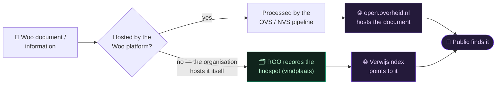
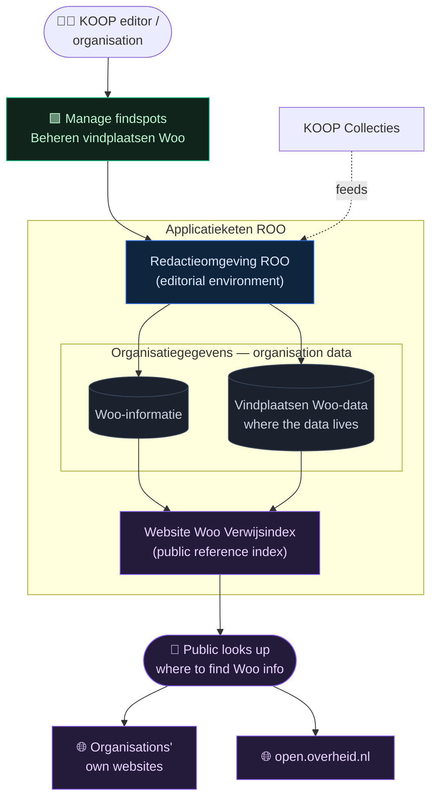
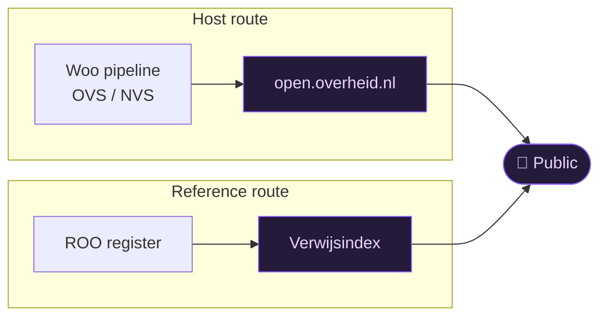

# 🗂️ ROO / Applicatieketen — "where to find it"

Back to [[Home]] · part of the [[Woo platform]].

> [!abstract] In one sentence
> Not every Woo document is *hosted* on the platform — many organisations publish
> on their **own** websites. **ROO** keeps a **register of government
> organisations** and a **reference index** (*Verwijsindex*) of **where** their
> Woo information can be found, so the public can still locate it.

> [!note] About the name
> **ROO** most likely stands for *Register Overheidsorganisaties* (Register of
> Government Organisations) — best-effort expansion. What it *does* is clear from
> the architecture even if the acronym isn't: it's the **organisation register +
> findspot index**.

---

## 1 · Two ways Woo information becomes findable

This is the key idea. There are **two routes**, and ROO owns the second one.

- **Route A — hosted:** the document flows through the [[Woo platform|processing
  pipeline]] and is published *on* open.overheid.nl. (This is what [[Document tracer|KIBANA-OO traces]].)
- **Route B — referenced:** the organisation keeps the document on its own
  website; ROO records the **findspot** and the **Verwijsindex** points the public
  to it. Nothing is copied — only the *location* is registered.

---

## 2 · Inside ROO

The building blocks from the architecture, and how they work together.

> [!tip]- Colour legend
> 🟦 editorial tool · ⬜ stored data · 🟪 public-facing · 🟩 human task

---

## 3 · The pieces, in plain words

**🟩 Beheren vindplaatsen Woo (manage findspots).** The *human task*: a KOOP
editor (or the organisation) keeps the list of "where our Woo information lives"
up to date. This is the business reason ROO exists.

**Redactieomgeving ROO (editorial environment).** The *tool* editors use to do
that — add/update organisations and their findspots. Think: a content-management
back-office.

**Organisatiegegevens (organisation data).** The *stored register*, in two parts:
- **Woo-informatie** — what Woo information each organisation has.
- **Vindplaatsen Woo-data** — the **findspots**: the actual locations/URLs where
  that information can be found.

**Website Woo Verwijsindex (reference index).** The *public-facing* output — a
website that lets anyone look up an organisation and jump to where its Woo
information actually lives (an external site, or open.overheid.nl).

**KOOP Collecties.** The shared collections (laws, regulations, official
publications) that feed context into ROO and the wider platform.

---

## 4 · Why it matters (the "so what")

- **Completeness.** Without ROO, only documents *hosted* by the platform would be
  findable. ROO makes **externally-hosted** Woo information findable too — so the
  public gets a complete picture.
- **Single starting point.** Citizens don't need to know *which* of hundreds of
  government bodies holds something — they look it up in the **Verwijsindex**.
- **Low cost / low risk.** ROO stores **locations, not copies** — no large
  documents to process, virus-scan or store. It complements, rather than
  duplicates, the heavy [[Woo platform|processing pipeline]].

---

## 5 · Glossary (ROO terms)

| Dutch term | Plain meaning |
|---|---|
| **ROO** | *Register Overheidsorganisaties* — register of government organisations (best-effort) |
| **Applicatieketen** | Application chain — a set of apps working together as one system |
| **Organisatiegegevens** | Organisation data (the register) |
| **Woo-informatie** | The Woo information each organisation holds |
| **Vindplaats(en)** | "Find-spot(s)" — the location(s)/URL(s) where information can be found |
| **Redactieomgeving** | Editorial environment — the back-office tool for editors |
| **Verwijsindex** | Reference index — points to *where* things are (not the things themselves) |
| **Beheren vindplaatsen Woo** | Managing the findspots (the human task) |
| **KOOP Collecties** | KOOP's shared collections (laws, AVVs, official publications) |

---

## 6 · How it relates to the rest

[[Document tracer|KIBANA-OO]] watches the **host route** (the NVS pipeline). ROO is
the **reference route** running alongside it — together they make Woo information
findable. See the full map in [[Woo platform]].

## Related

- [[Woo platform]] · [[Architecture]] · [[Document tracer]] · [[open.overheid.nl API]] · [[Home]]
