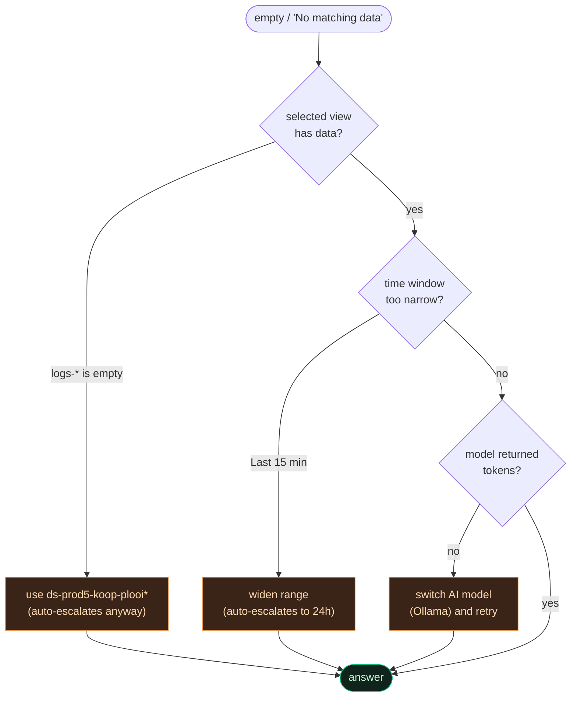

# Runbook — "No matching data found" / no answer

Back to [[Home]]. Diagnoses the most common chat complaint.

## Symptom

The chat replies *"No matching data found for this time range."* (italic) or the
bubble stays blank, often after a long wait.

## Decode the message

That italic line is the **frontend's empty-content fallback** — it appears only
when the LLM streamed **zero tokens**. It does **not** necessarily mean ES had no
data. Three independent causes:

> [!tip]- Colour legend
> 🟦 check · 🟩 resolved · 🟧 workaround



### 1. Wrong data view (empty index)
`logs-*` is often nearly empty; the real logs live in **`ds-prod5-koop-plooi*`**
(see [[KOOP Plooi log schema]]).
→ **Fixed:** generic questions auto-escalate to **all data views over 24h**.
→ **Tip:** select `KOOP Plooi (prod5)` explicitly for best results.

### 2. Narrow time window
"Last 15 min" may have no recent activity even in the right index.
→ **Fixed:** the escalation widens the window to 24h (`chat_widen_minutes`).

### 3. The LLM returned empty
A transient provider issue (or an over-strict refusal) can make the model emit
nothing. This is what caused the misleading "No matching data".
→ **Fixed:** the stream **never ends empty** — the user gets
"The AI model returned an empty response… try again, or switch the AI model."
→ **Workaround:** flip the [[LLM providers|header switcher]] to **Ollama** and retry.

### 4. (Opgelost) Chat bleef hangen op "Analyzing logs…" — CRLF/SSE

> [!success] Opgelost in juni 2026 — uitleg voor de beheerder (NL)
> **Symptoom:** de chat bleef láng hangen op *"Analyzing logs…"* en toonde daarna
> *"The connection ended before an answer arrived"* — bij **elke vraag** en bij
> **beide AI-modellen** (Mistral én Ollama). In de backend-logs gaf Mistral netjes
> `200 OK`, dus het model antwoordde wél.
>
> **Oorzaak:** het antwoord wordt "stukje voor stukje" gestuurd via **SSE**
> (Server-Sent Events). De server (`sse-starlette`) scheidt die stukjes met
> **CRLF** (`\r\n\r\n`), maar de browser-code zocht naar `\n\n`. Die kwamen nooit
> overeen, dus de browser kon geen enkel stukje herkennen: tijdens het genereren
> bleef het scherm leeg, en aan het eind werd alles als één "klaar"-signaal gelezen
> → leeg antwoord. De lange wachttijd was simpelweg de tijd die het model nodig had
> om het hele antwoord te maken.
>
> **Oplossing:** de browser normaliseert nu `\r\n` → `\n` vóór het opsplitsen.
> Het antwoord verschijnt weer **woord voor woord, direct en snel**.
>
> **Wat te doen als het ooit terugkomt:** controleer of `sse-starlette` is
> bijgewerkt naar een versie die het SSE-formaat verandert, en of de
> stream-parser in `frontend/src/App.jsx` (`consumeSSE`) nog steeds CRLF
> normaliseert. Test met een gewone vraag: het antwoord hoort binnen 1–2 seconden
> te beginnen te stromen.

### 5. Robuustheid — de chat kan niet meer "blijven hangen" (NL)

> [!success] Beheerder-uitleg — timeouts + automatische terugval
> **Wat is er geregeld?** Als het gekozen AI-model traag of onbereikbaar is, mag
> de chat **nooit minutenlang blijven hangen**. Daarvoor zijn er drie grenzen:
>
> | Grens (`.env`) | Standaard | Wat het doet |
> |---|---|---|
> | `llm_connect_timeout` | **8 s** | Verbinding maken met het model. Onbereikbaar? Dan faalt het in **seconden**, niet minuten. |
> | `llm_first_token_timeout` | **30 s** | Wachten op het **eerste woord** van het antwoord. Komt dat niet → model wordt losgelaten. |
> | `llm_read_timeout` | **600 s** | Tijd tússen woorden zodra het antwoord stroomt (een lang antwoord mag dus gewoon doorlopen). |
>
> **Wat gebeurt er bij een probleem?** De backend valt automatisch terug, in deze
> volgorde, zodat de gebruiker **altijd** iets nuttigs krijgt:
> 1. opnieuw proberen (niet-streamend) met hetzelfde model;
> 2. **terugval naar het lokale model** (Ollama) — met de melding *"Mistral was
>    unavailable — answered with the local model."*;
> 3. als ook dat niet lukt: een **feitelijke samenvatting** uit de gevonden logs.
>
> **Voorbeeld:** Mistral (cloud) ligt er even uit. De gebruiker stelt een vraag;
> na ~30 s zonder eerste woord laat de backend Mistral los en beantwoordt de vraag
> met het lokale model. De gebruiker ziet binnen een halve minuut een antwoord met
> de notitie dat het lokale model is gebruikt — **geen oneindige "Analyzing logs…"**.

## Quick checks (operator)

```bash
# Is the request reaching ES, and what view?
docker compose logs --tail=40 backend | grep "Question:"

# Is the backend healthy?
curl -s http://localhost:3000/health
```

## For a specific document

Paste/type its **id** (UUID or `ronl-…`) — the chat traces it across **every**
view over 30 days regardless of the selected view/window. See [[Document tracer]]
and [[Chat pipeline]].

## Related

- [[Chat pipeline]] · [[LLM providers]] · [[KOOP Plooi log schema]]
