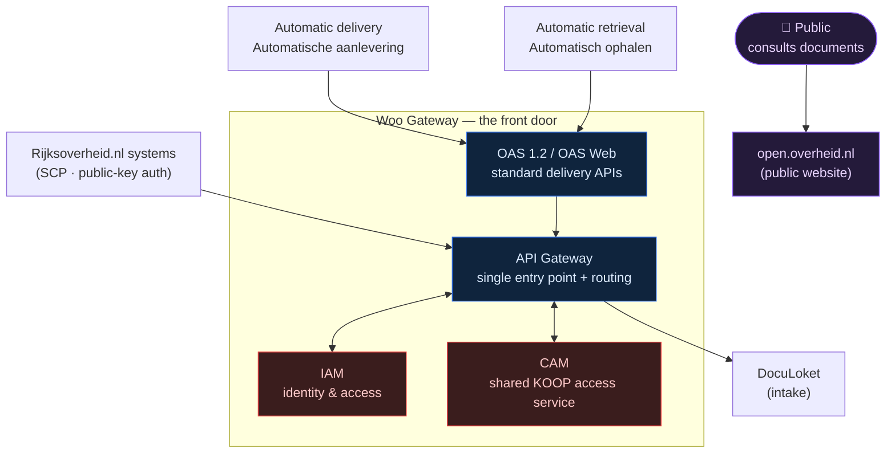
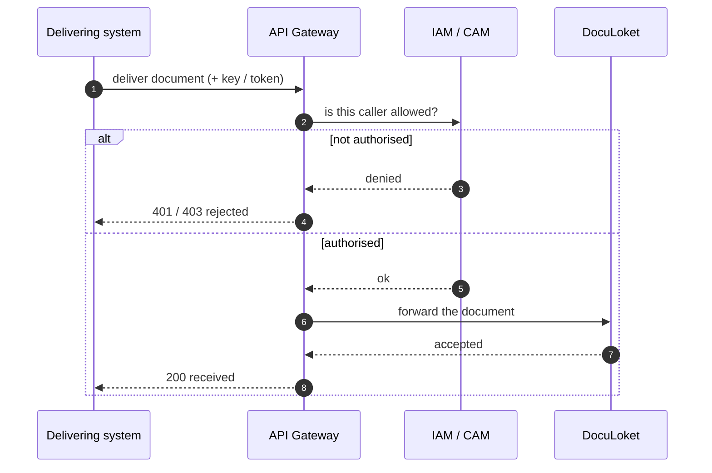
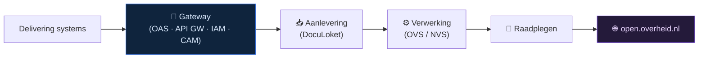

# 🚪 Woo Gateway — the front door

Back to [[Home]] · part of the [[Woo platform]].

> [!abstract] In one sentence
> The **Gateway** is the platform's **secure reception desk**: every document
> delivery and every public lookup passes through it, it **checks who's allowed
> in**, and it **routes** the traffic to the right place. Nothing reaches the
> intake or the processing pipeline without going through here first.

> [!note] About the names (best-effort)
> - **OAS** — *OpenAPI Specification*: the published "contract" for the delivery
>   API (so other systems know exactly how to hand documents over). "OAS 1.2" and
>   "OAS Web" are two flavours of that delivery door.
> - **IAM** — *Identity & Access Management*: login, tokens and permissions.
> - **CAM** — a **shared KOOP access/authentication service** (a *generic*
>   service reused across KOOP). Exact expansion uncertain; its role — shared
>   access/auth — is clear from the architecture.

---

## 1 · How a delivery comes in

Delivering systems knock on a **standard door** (OAS), the **API Gateway** is the
single point that takes every call, the call is **checked** against **IAM/CAM**,
and only then is it **forwarded to [[Woo platform|DocuLoket]]** for intake.

---

## 2 · An authenticated delivery, step by step

---

## 3 · The pieces, in plain words

**OAS 1.2 / OAS Web (the delivery doors).** A **published API contract** — like a
clearly labelled mail slot with instructions, so any approved system knows exactly
how to hand a document over. "Web" is the browser-friendly variant.

**API Gateway (the single entry point).** Every request goes through *one* door.
That makes it the natural place to **route** traffic, enforce rules, and keep an
eye on everything — instead of dozens of unguarded back doors.

**IAM (identity & access).** Decides **who** may do **what** — issues/validates
tokens and checks permissions. (In [[Architecture|KIBANA-OO]] the equivalent is
Keycloak OIDC + the `sid` cookie.)

**CAM (shared KOOP access service).** A **generic, reused** KOOP service the
Gateway leans on for access/authentication — so each platform doesn't reinvent it.

**SCP with public-key authentication.** A separate, hardened **file-transfer**
channel (secure copy) used with Rijksoverheid.nl systems — authenticated with
**public keys** instead of passwords.

**open.overheid.nl.** The **public** side reached *through* the gateway layer for
the [[Woo platform|Raadplegen]] (consult) function — where citizens read documents.

---

## 4 · Why have a gateway at all? (the "so what")

- **One guarded door, not many.** A single entry point means **one** place to
  authenticate, authorise, rate-limit, log and monitor — far safer than each
  service exposing its own endpoint.
- **Separation of concerns.** Delivery systems only need to know the **OAS
  contract**; they don't touch the pipeline directly.
- **Defence in depth.** IAM/CAM + public-key SCP mean a document only reaches
  intake after the **caller is proven trustworthy**.

> [!tip] Same pattern, smaller scale
> KIBANA-OO uses the exact same idea: the browser talks to **one** backend, which
> authenticates via **Keycloak** and reaches data only through the **Kibana
> console proxy** — never the database directly. See [[Architecture]] §2–3.

---

## 5 · Glossary (Gateway terms)

| Dutch / term | Plain meaning |
|---|---|
| **Gateway** | Single secure entry point for all traffic |
| **Generieke Woo functionaliteit** | Generic/shared Woo functionality (reused building blocks) |
| **OAS** | *OpenAPI Specification* — the published delivery-API contract |
| **API Gateway** | Routes and secures every API call through one door |
| **IAM** | *Identity & Access Management* — login, tokens, permissions |
| **CAM** | Shared KOOP access/authentication service (best-effort) |
| **SCP op basis van public-key authenticatie** | Secure file copy (SCP) authenticated with public keys |
| **Aanlevering** | Delivery / intake of documents |
| **Raadplegen** | Consult / search (the public side) |

---

## 6 · Where it sits in the platform

The Gateway is **step 0** of the [[Woo platform|whole journey]] — everything
downstream ([[Document tracer|the pipeline KIBANA-OO traces]]) only happens after
a delivery clears this front door.

## Related

- [[Woo platform]] · [[ROO - Applicatieketen]] · [[Architecture]] · [[Document tracer]] · [[Home]]
