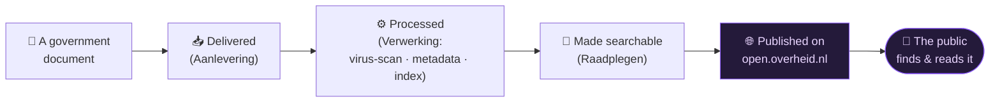
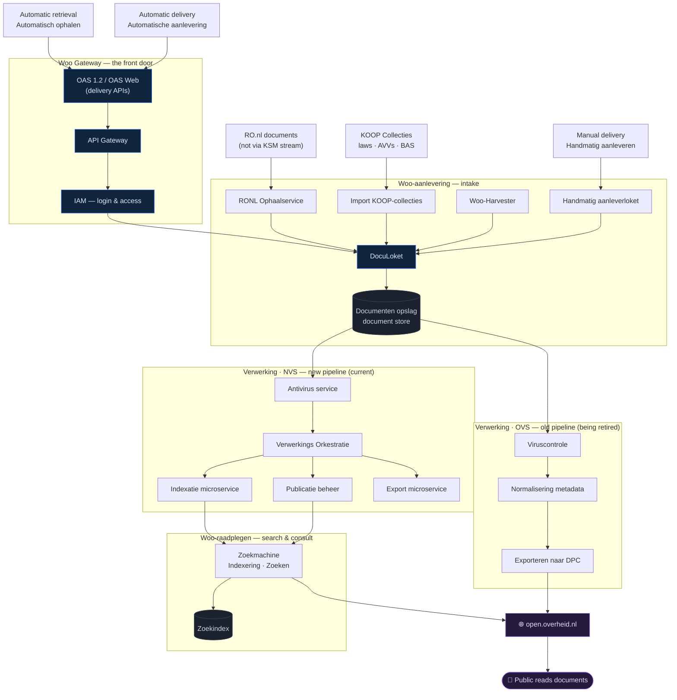

# 🏛️ The Woo platform — in plain language

Back to [[Home]]. This explains the **whole KOOP "Woo" platform** that
[[Architecture|KIBANA-OO]] monitors — converted from the official architecture
drawing into something a non-technical reader can follow.

> [!abstract] What is "Woo"?
> **Woo** = *Wet open overheid* (the Dutch **Open Government Act**). The platform's
> job is simple to state: **take government documents, process them safely, and
> publish them so the public can find and read them** on
> [open.overheid.nl](https://open.overheid.nl). Everything below is machinery in
> service of that one sentence.

---

## 1 · The big picture (5 steps)

Read this first — it's the whole platform in one line.

That's it. The rest of this page just opens up each step.

---

## 2 · The detailed flow

Same journey, but showing the real building blocks and the zones they live in.

> [!tip]- Colour legend
> 🟦 front door / intake · ⬜ storage · 🟧 old pipeline (OVS) · 🟩 new pipeline (NVS) · 🟪 public

---

## 3 · The zones, explained simply

**🚪 Woo Gateway — the front door.** Where deliveries arrive. It checks *who* is
allowed in (**IAM** = login & access) and offers standard delivery doors
(**OAS** APIs). Think of it as the reception desk + security guard. Full
breakdown: [[Woo Gateway]].

**📥 Woo-aanlevering (intake).** Collects documents from every channel:
automatically *pulled in* (**Harvester**, **RONL Ophaalservice**), *imported* in
bulk (**Import KOOP-collecties** — laws and regulations), or *handed in by a
person* (**Handmatig aanleverloket**). Everything funnels through **DocuLoket**
and lands in the **document store** (*Documenten opslag*).

**⚙️ Woo-verwerking (processing).** The factory floor. A document is scanned for
viruses, its **metadata** is tidied up, it's **indexed** (so it can be found),
and **exported**. There are **two factory lines**:

> [!warning] OVS vs NVS — two pipelines
> - **OVS** = *oude verwerkingsstraat* — the **old** processing line, being phased out.
> - **NVS** = *nieuwe verwerkingsstraat* — the **new** line, built from small
>   **microservices** (antivirus, orchestration, indexing, export, publication).
>   A document goes through **one** of them. **KIBANA-OO monitors the NVS.**

**🔎 Woo-raadplegen (search & consult).** The **Zoekmachine** (search engine)
builds a **search index** so the public can search and find documents.

**🌐 open.overheid.nl.** The public website where citizens actually read the
documents. The end of the journey.

**📚 Applicatieketen ROO.** A supporting system that keeps the *organisation data*
and a **reference index** (*Verwijsindex*) of where Woo information can be found —
the "we don't host it, but we know where it lives" register. It runs *alongside*
the pipeline: see the full breakdown in [[ROO - Applicatieketen]].

---

## 4 · Glossary (Dutch → plain English)

> [!note] Best-effort translations of the platform's terms.

| Dutch term | Plain meaning |
|---|---|
| **Woo** | *Wet open overheid* — the Open Government Act |
| **Aanlevering** | Delivery / intake of documents |
| **Verwerking** | Processing |
| **Verwerkingsstraat** (OVS/NVS) | Processing "line"/pipeline — *oude* (old) / *nieuwe* (new) |
| **Raadplegen** | Consult / search |
| **DocuLoket** | The document intake desk |
| **Handmatig aanleverloket** | Manual delivery desk (a person uploads) |
| **Woo-Harvester** | Service that *pulls in* documents automatically |
| **RONL Ophaalservice** | Retrieval service for Rijksoverheid.nl documents |
| **Import KOOP-collecties** | Bulk import of laws/regulations (AVVs, BAS) |
| **Documenten opslag** | Document storage |
| **Viruscontrole** | Virus scan |
| **Normalisering metadata** | Tidying/standardising the document's metadata |
| **Publicatie beheer** | Publication management |
| **Indexatie / Indexering** | Indexing (making it searchable) |
| **Orkestratie** | Orchestration (coordinating the steps) |
| **Export(eren) naar DPC** | Export to the DPC (central publication store) |
| **Zoekmachine / Zoeken / Zoekindex** | Search engine / search / search index |
| **IAM** | Identity & Access Management (login & permissions) |
| **OAS** | Open API Specification — the delivery API |
| **SCP op basis van public-key authenticatie** | Secure file copy (SCP) authenticated with public keys |
| **Vindplaatsen** | "Find-spots" — where Woo data can be located |
| **Verwijsindex** | Reference index (points to where things are) |

---

## 5 · How KIBANA-OO fits in

The services in our [[Document tracer|document journey]] are exactly the **NVS**
boxes on this map:

| On this diagram (NVS) | In our logs ([[KOOP Plooi log schema]]) |
|---|---|
| DocuLoket | `msvc-doculoket` |
| Documenten opslag | `msvc-documentopslag` |
| Publicatie beheer | `msvc-publicatiebeheer` |
| Indexatie microservice | `msvc-indexatie` |
| Export microservice | `msvc-export` |
| Zoekmachine / Zoeken | `solr`, `search`, `zoekportaal` |

So when [[Chat pipeline|the chat]] or the [[Document tracer]] follows a document
"published twice", it is literally walking the **NVS path** on this drawing — and
the [[Monitoring dashboard]] watches the whole line's health.

## Related

- [[Architecture]] · [[Document tracer]] · [[KOOP Plooi log schema]] · [[Monitoring dashboard]] · [[open.overheid.nl API]]
