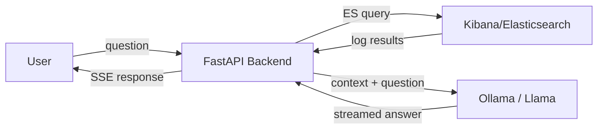

# EU AI Act Compliance Assessment — KIBANA-OO

> [!info] Document Purpose
> This document assesses KIBANA-OO against the **EU AI Act (Regulation 2024/1689)**, identifies compliance gaps, and tracks remediation actions. It serves as the required technical documentation under Art. 11 and deployer obligations under Art. 26.

## 1. System Description

| Field | Value |
|---|---|
| **System name** | KIBANA-OO |
| **Version** | 0.4.0 |
| **Type** | AI-powered log analysis assistant |
| **AI model** | Llama 3.1:8b / Llama 3.2:3b (via Ollama) |
| **GPAI provider** | Meta Platforms (Llama) |
| **Deployer** | KOOP (internal tool) |
| **Inference location** | Local (Docker container, no cloud API) |
| **Intended users** | Infrastructure engineers, platform admins |
| **Intended purpose** | Natural language querying of Elasticsearch/Kibana logs for incident triage and error analysis |

### 1.1 How It Works

1. User authenticates via **Keycloak OIDC**
2. User submits a natural language question
3. Backend queries Elasticsearch via Kibana proxy (returns raw log entries)
4. Log context + question sent to **local Llama model**
5. LLM generates a grounded answer (streaming via SSE)
6. Frontend displays answer + source log excerpts

### 1.2 Data Processed

| Data category | Examples | Sensitivity |
|---|---|---|
| Infrastructure logs | Application messages, error traces, timestamps | Medium |
| HTTP metadata | Status codes, response times, request paths | Low-Medium |
| Service metadata | `service.name`, `host.name` | Low |
| User questions | Free-form natural language queries | Low |
| Authentication tokens | Keycloak session cookies | High (transient) |

> [!warning] PII Exposure Risk
> Production logs **may contain PII** (IP addresses, email addresses, user IDs) depending on upstream logging configuration. No PII scrubbing is applied before LLM processing.

---

## 2. Risk Classification

### 2.1 Assessment

> [!success] Classification: **Limited Risk**

The system is **not high-risk** under Annex III because it is:

- [ ] **Not** used for biometric identification or categorisation (Annex III, 1)
- [ ] **Not** managing critical infrastructure (Annex III, 2) — it *observes* infrastructure, does not *control* it
- [ ] **Not** used for education, employment, or worker management decisions (Annex III, 3-4)
- [ ] **Not** used for credit scoring or access to essential services (Annex III, 5)
- [ ] **Not** used for law enforcement, migration, or justice (Annex III, 6-8)

The system **is** an AI system that:

- [x] Interacts directly with natural persons (Art. 50(1))
- [x] Generates text content (Art. 50(2))

Therefore **Art. 50 transparency obligations** apply.

### 2.2 Excluded Categories (Art. 5 — Prohibited Practices)

| Prohibited practice | Applicable? |
|---|---|
| Subliminal manipulation | No |
| Exploitation of vulnerabilities | No |
| Social scoring | No |
| Real-time remote biometric identification | No |
| Emotion inference in workplace/education | No |
| Untargeted facial image scraping | No |
| Biometric categorisation (sensitive attributes) | No |

**None apply.** The system does not fall under Art. 5 prohibitions.

---

## 3. Applicable Obligations

### 3.1 Art. 50 — Transparency for Limited-Risk Systems

| Requirement | Article | Status | Details |
|---|---|---|---|
| Inform users they are interacting with AI | Art. 50(1) | ![[#gap-1]] | No explicit AI disclosure at interaction start |
| Mark AI-generated text content | Art. 50(2) | ![[#gap-2]] | LLM responses not labeled as AI-generated |

### 3.2 Art. 26 — Deployer Obligations

| Requirement | Article | Status | Details |
|---|---|---|---|
| Use AI system per provider's instructions | Art. 26(1) | Pass | Llama used within intended general-purpose scope |
| Assign human oversight | Art. 26(2) | Pass | Users verify findings in Kibana; stop button available |
| Monitor for risks during operation | Art. 26(5) | Partial | Basic logging exists but no structured risk monitoring |
| Keep automatically generated logs | Art. 26(6) | Partial | Username + question logged; no AI input/output logging |
| Inform workers of AI system use | Art. 26(7) | ![[#gap-3]] | No formal worker notification |
| DPIA where required | Art. 26(9) | ![[#gap-4]] | No Data Protection Impact Assessment conducted |

### 3.3 Art. 53 — GPAI Provider Obligations

> [!note] Not directly applicable
> Meta, as the provider of Llama, bears Art. 53 obligations (technical documentation, copyright policy, EU AI Office notification). As **deployer**, KOOP is not responsible for these — but should verify Meta's compliance before production use.

---

## 4. Compliance Gaps

### Gap 1: AI Interaction Disclosure ^gap-1

> [!danger] Status: **Non-compliant** — Art. 50(1)

**Requirement:** Persons interacting with an AI system shall be informed that they are interacting with an AI system, unless this is obvious from the circumstances.

**Current state:** The footer contains a disclaimer ("answers are generated from live log data"), but there is no explicit AI disclosure **before or at the start of interaction**.

**Remediation:**
- Add a visible banner or system message at chat start: *"You are interacting with an AI assistant powered by Llama. Responses are generated by an AI model based on your log data."*
- Display AI identity in the chat header or as the first system message

**Priority:** High
**Effort:** Low (frontend change)
**Deadline:** Before production deployment

---

### Gap 2: AI-Generated Content Labelling ^gap-2

> [!danger] Status: **Non-compliant** — Art. 50(2)

**Requirement:** Providers of AI systems that generate synthetic text shall ensure outputs are marked as artificially generated or manipulated.

**Current state:** LLM responses are displayed as plain text/markdown with no AI-generated label.

**Remediation:**
- Add a visible `AI-generated` badge/tag to each assistant message
- Consider adding machine-readable metadata (e.g., `data-ai-generated="true"`)

**Priority:** High
**Effort:** Low (frontend change)
**Deadline:** Before production deployment

---

### Gap 3: Worker Notification ^gap-3

> [!danger] Status: **Non-compliant** — Art. 26(7)

**Requirement:** Before putting into service an AI system at the workplace, deployers who are employers shall inform workers' representatives and affected workers that they will be subject to the use of the AI system.

**Current state:** No formal notification to workers or worker representatives.

**Remediation:**
- Draft and distribute a notification to affected teams/workers
- Include: system purpose, data processed, how AI is used, who to contact with concerns
- Document the notification in this compliance file

**Priority:** High
**Effort:** Low (process/communication)
**Deadline:** Before production deployment

---

### Gap 4: Data Protection Impact Assessment ^gap-4

> [!warning] Status: **Recommended** — Art. 26(9), GDPR Art. 35

**Requirement:** Deployers shall use information from the AI provider to comply with their obligation to carry out a DPIA under GDPR Art. 35, where applicable.

**Current state:** No DPIA conducted. If logs contain personal data (likely — IPs, user IDs), GDPR processing obligations apply.

**Remediation:**
- Assess whether production logs contain personal data
- If yes, conduct a DPIA covering: lawful basis, necessity, proportionality, risks to data subjects
- Document the DPIA separately and link here

**Priority:** Medium
**Effort:** Medium (cross-functional: legal + engineering)
**Deadline:** Before processing personal data with the AI system

---

### Gap 5: Technical Documentation ^gap-5

> [!warning] Status: **Partial** — Art. 11 (best practice for limited-risk)

**Requirement:** While Art. 11 formally applies to high-risk systems, deployers should maintain adequate documentation for accountability.

**Current state:** This document partially addresses this. Missing:
- Formal risk assessment sign-off
- Known limitations and failure modes
- Data flow diagram with PII touchpoints
- Incident response procedure for AI failures

**Remediation:**
- Complete sections 5 and 6 of this document
- Review and sign off annually or on significant system changes

**Priority:** Medium
**Effort:** Medium

---

## 5. Known Limitations and Failure Modes

| Limitation | Impact | Mitigation |
|---|---|---|
| **Hallucination** | LLM may generate plausible but incorrect analysis | System prompt enforces grounding ("Do not make up information"); source logs shown for verification |
| **Context window limit** | Large log volumes may be truncated, missing relevant entries | Max 20 log entries passed; user advised to verify in Kibana |
| **No PII scrubbing** | Personal data in logs passed to LLM | LLM is local (no data exfiltration); PII scrubbing recommended as enhancement |
| **Model accuracy** | Smaller model (3.2:3b) may produce lower-quality analysis | Configurable model; 8B recommended for production |
| **Prompt injection** | Malicious log content could manipulate LLM behavior | Log content passed as context, not as instructions; system prompt is separate |
| **Availability** | Ollama container crash = no AI responses | Health endpoint monitors connectivity; error messages shown to user |

---

## 6. Existing Safeguards

> [!success] What's already in place

| Safeguard | Description | Relevant Article |
|---|---|---|
| **Local inference** | All AI processing stays on-premise; no data sent to external APIs | Art. 10 (data governance) |
| **Grounded prompting** | System prompt prevents hallucination, requires citing log evidence | Art. 14 (human oversight) |
| **Source attribution** | Raw log excerpts shown alongside AI answers | Art. 50 (transparency) |
| **Authentication** | Keycloak OIDC with session-based authorization | Art. 9 (risk management) |
| **Data view whitelist** | Prevents querying unauthorized Elasticsearch indices | Art. 9 (risk management) |
| **Stop generation** | User can abort LLM responses mid-stream | Art. 14 (human oversight) |
| **Verification disclaimer** | Footer: "Always verify critical findings in Kibana" | Art. 14 (human oversight) |
| **Transient sessions** | No persistent storage of user sessions or chat history | GDPR Art. 5(1)(e) (storage limitation) |
| **Activity logging** | Username + question (truncated) logged for audit | Art. 12 (record-keeping) |

---

## 7. Remediation Tracker

| # | Gap | Priority | Effort | Owner | Status | Target Date |
|---|---|---|---|---|---|---|
| 1 | [[#Gap 1 AI Interaction Disclosure\|AI disclosure]] | High | Low | Frontend | Done | 2026-06-08 |
| 2 | [[#Gap 2 AI-Generated Content Labelling\|Content labelling]] | High | Low | Frontend | Done | 2026-06-08 |
| 3 | [[#Gap 3 Worker Notification\|Worker notification]] | High | Low | Management | Open | Pre-production |
| 4 | [[#Gap 4 Data Protection Impact Assessment\|DPIA]] | Medium | Medium | Legal + Eng | Open | Pre-production |
| 5 | [[#Gap 5 Technical Documentation\|Documentation]] | Medium | Medium | Engineering | In Progress | Ongoing |
| 6 | PII scrubbing in log context | Medium | Medium | Backend | Open | Phase 2 |
| 7 | Structured AI input/output audit logging | Low | Low | Backend | Open | Phase 2 |

---

## 8. Applicable Regulation Timeline

| Date | Milestone | Relevance |
|---|---|---|
| 2024-08-01 | EU AI Act enters into force | — |
| 2025-02-02 | Art. 5 prohibitions apply | Not applicable (no prohibited practices) |
| 2025-08-02 | GPAI obligations apply (Art. 53) | Meta's responsibility as Llama provider |
| 2026-08-02 | **High-risk obligations apply** | Not applicable (limited-risk classification) |
| 2026-08-02 | **Art. 50 transparency obligations apply** | **Directly applicable — gaps 1 & 2 must be closed** |
| 2027-08-02 | Annex I high-risk systems obligations | Not applicable |

> [!warning] Deadline
> Art. 50 transparency obligations become enforceable on **2 August 2026**. Gaps 1 and 2 must be remediated before this date or before production deployment, whichever comes first.

---

## 9. Review Schedule

| Review type | Frequency | Next review |
|---|---|---|
| Risk classification | Annually or on significant change | 2027-06-08 |
| Compliance gaps | Quarterly | 2026-09-08 |
| Technical documentation | Annually | 2027-06-08 |
| Safeguards effectiveness | Semi-annually | 2026-12-08 |

---

## 10. References

- [EU AI Act full text (EUR-Lex)](https://eur-lex.europa.eu/eli/reg/2024/1689/oj)
- [EU AI Act risk classification guidance](https://artificialintelligenceact.eu/assessment/eu-ai-act-compliance-checker/)
- [[2026-06-08-monitoring-dashboard-design]] — Dashboard design spec (planned features)
- GDPR Regulation (EU) 2016/679 — applicable if personal data is processed

---

*Assessment performed: 2026-06-08*
*Next review: 2026-09-08*
*Document owner: Engineering*
