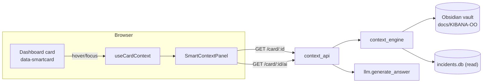
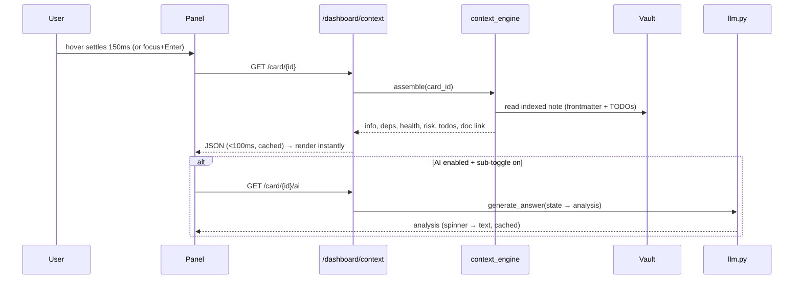

# SmartContextPanel — design spec

**Date:** 2026-06-17
**Status:** Approved (brainstorm) → implementation
**Branch:** `feat/smart-context-panel`
**Author:** Architecture (with Anton Partono)

## 1. Executive summary

A new, fully **additive and feature-flagged** capability for the KIBANA-OO admin
dashboard. When an admin hovers (or keyboard-focuses) any dashboard card — hero
stat, queue tile, certificate card, diagnostic panel — a **contextual
intelligence panel** slides in on the right. It explains *what the component is*,
its *dependencies and health*, and surfaces **open TO-DOs read live from the
existing Obsidian vault** (`docs/KIBANA-OO/`), plus an **optional, lazy AI
analysis** generated by the existing LLM.

Nothing existing changes behaviour. With the flag off (`SMART_CONTEXT_ENABLED=false`,
the default) the feature is inert: no new UI renders, the API returns disabled,
zero AI calls. Rollback = flip the flag.

### Right-sizing (what we are NOT building, and why)

The originating request listed enterprise items that **do not fit this stack** and
are explicitly out of scope, documented as future/N/A rather than silently dropped:

| Requested | Decision | Reason |
|---|---|---|
| Keycloak / OIDC / full Zero-Trust mesh | Out of scope | App uses session auth + a per-feature grant matrix (`permissions.py`). We reuse it. `auth.py` already notes OIDC as a future extension point. |
| Grafana / Prometheus / K8s / OpenShift panels | Out of scope | None are in this stack. The observed systems are ES/Kibana, RabbitMQ, the portal. |
| Full 7-language i18n (no hardcoded strings) | Out of scope (future phase) | The app has **no i18n framework**; it is ad-hoc EN UI + NL content. The panel ships a small local `nl`/`en` dictionary so *it* isn't hardcoded; app-wide i18n is a separate project. |
| Writeback of TODO checkboxes to vault | Out of scope (v1) | Concurrent-edit/corruption risk on git-managed `.md`. v1 is read-only + deep-links to the note. |

What we keep from the request because it genuinely fits: WCAG 2.2 AA, OWASP-aligned
input handling (path-traversal/SSRF/XSS), lazy AI, feature toggle, fast (<100 ms)
panel open, comprehensive Dutch beheerder-documentation.

## 2. Architecture

New files only. The single touch to existing files is **purely additive wiring**.

```
backend/
  context_engine.py        # NEW — vault index, card→component registry, assembler, AI prompt
  context_api.py           # NEW — APIRouter(prefix="/dashboard/context")
  tests/test_context.py    # NEW — unit tests
frontend/src/
  SmartContextPanel.jsx    # NEW — the right rail / drawer + nl/en strings
  useCardContext.js        # NEW — hover-intent + pin + keyboard hook, fetch + cache
docs/KIBANA-OO/
  Smart context paneel.md  # NEW — Dutch beheerder-note (RULES.md Rule 4)
```

Additive edits to existing files (no logic/behaviour change):
- `backend/config.py` — one field `smart_context_enabled: bool = False`.
- `backend/main.py` — `app.include_router(context_router)`.
- `backend/permissions.py` — one CATALOG entry `{"key": "smart_context", ...}`.
- `frontend/src/Dashboard.jsx` — mount `<SmartContextPanel/>` once; add inert
  `data-smartcard="<id>"` attributes to card roots (no style/behaviour change).
- nginx: **none** — endpoints live under the already-proxied `/dashboard/` prefix.

> Cert/TLS code (`certificates.py`, `cert_monitor.py`) is FROZEN and **not touched**.
> The panel only *reads* cert card data already present in the page for context.

### Component diagram



### Sequence



## 3. API contracts (under existing `/dashboard`)

All gated by `require_feature("smart_context")` AND `settings.smart_context_enabled`
(when the flag is off every endpoint returns `{"enabled": false}` with 200, so the
frontend simply renders nothing).

### `GET /dashboard/context/registry`
Returns the card→component map so the frontend knows which cards are "smart".
```json
{ "enabled": true, "cards": { "queue:document-harvester": "document-harvester", "hero:criticals": "criticals", "...": "..." } }
```

### `GET /dashboard/context/card/{card_id}`
Fast, vault-backed. `card_id` is validated against the registry (unknown → 404).
```json
{
  "enabled": true,
  "card_id": "queue:document-harvester",
  "component": "Document-Harvester",
  "purpose_business": "Verwerkt binnenkomende publicatiedocumenten.",
  "purpose_technical": "Consumeert RabbitMQ, indexeert en slaat op.",
  "dependencies": ["RabbitMQ", "Documentopslag", "Indexatie"],
  "related": ["Antivirus", "Export"],
  "risk": "low",
  "owner": "KOOP Beheer",
  "health": "unknown",
  "last_incident": null,
  "todos": [ { "text": "Verbeter retry-afhandeling", "done": false } ],
  "doc": { "title": "Document lifecycle (pipeline)", "href": "obsidian://..." }
}
```

### `GET /dashboard/context/card/{card_id}/ai`
Lazy AI analysis. Returns `{"enabled": false}` when `llm.ai_enabled(session)` is
false. Cached per `card_id` (TTL). Never blocks the fast endpoint.
```json
{ "enabled": true, "analysis": "**Huidige toestand**: ...", "provider": "mistral", "model": "mistral-large-latest" }
```

## 4. Data model

No new DB tables. Sources:
- **Vault** is the content store. Notes opt in via frontmatter (`component:` etc.).
- **Registry** is a static dict in `context_engine.py` (`card_id → component-id`).
- **TODOs** parsed live from `- [ ]` / `- [x]` lines in the matched note body.
- **last_incident** read best-effort from existing `incidents.db` (no schema change).
- **AI results** cached in-memory via existing `cache.TTLCache`.

### Vault frontmatter contract
```yaml
---
title: Document lifecycle (pipeline)
component: document-harvester
purpose-business: Verwerkt binnenkomende publicatiedocumenten.
purpose-technical: Consumeert RabbitMQ, indexeert en slaat op.
dependencies: [RabbitMQ, Documentopslag, Indexatie]
related: [Antivirus, Export]
risk: low
owner: KOOP Beheer
---
```
Every field is optional; missing fields degrade gracefully.

## 5. Security (OWASP-aligned, fits this stack)

- **A01 Broken access control:** `require_feature("smart_context")`; off by default.
- **A03 Injection / path traversal:** vault reads confined to a resolved-realpath
  allowlist rooted at `docs/KIBANA-OO/`; `card_id` must match the static registry —
  no user-supplied path ever reaches the filesystem.
- **A03 XSS:** vault Markdown rendered via the existing sanitised `ReactMarkdown`
  pipeline; never `dangerouslySetInnerHTML` of raw note text. Frontmatter values
  rendered as plain text.
- **A10 SSRF:** the engine reads local files only; the only outbound call is the
  existing, already-hardened `llm.py` (no new network surface).
- **Audit:** feature grant uses the existing `feature_grants_audit` trail.
- **Least data:** the AI prompt receives only card metadata + counts already on
  screen — no secrets, no raw logs.

## 6. Accessibility (WCAG 2.2 AA)

- Panel is a non-modal `role="complementary"` region with an `aria-label`.
- Opens on hover-intent (~150 ms) AND on keyboard focus of the card; **click/Enter
  pins** it open; **Esc** closes; focus is restored to the originating card.
- Respects `prefers-reduced-motion` (no slide animation when set).
- Colour is never the only signal (icons + text for health/risk).
- On narrow viewports it becomes a full-height slide-over drawer, not a fixed rail.

## 7. i18n

Panel UI strings come from a small local `STRINGS = { nl, en }` map in
`SmartContextPanel.jsx`, defaulting to `nl` (admin audience, per RULES.md). Content
language follows the vault (Dutch). App-wide multi-language is a documented future
phase, not part of this work.

## 8. Feature toggle & rollback

- Env: `SMART_CONTEXT_ENABLED` (default `false`). Documented in `.env.example`.
- Enable: set `true` + redeploy backend. Disable/rollback: set `false` (or it is
  already the default) — instant, no migration, nothing else affected.
- Authorization: even when enabled, only users granted `smart_context` (or supers)
  see it.

## 9. Monitoring

- Endpoints log at WARN on vault-read/AI failure and **degrade** (omit the section)
  rather than error — consistent with the dashboard's graceful-degradation rule.
- AI latency/availability already covered by `llm.py`'s timeouts; the panel shows a
  spinner then a quiet "AI-analyse niet beschikbaar" on failure.

## 10. Test plan

Backend (pytest in `python:3.13` Docker, per project convention):
- registry maps known cards; unknown `card_id` → 404.
- frontmatter parsed into the right fields; missing fields tolerated.
- TODO parser extracts `- [ ]`/`- [x]` with done state; ignores non-task lines.
- path-traversal `card_id` / crafted component never escapes the vault root.
- flag off → endpoints return `{"enabled": false}`.
- AI disabled → `/ai` returns `{"enabled": false}`, no LLM call.

Frontend (manual + Playwright on the running app):
- hover-intent open/close timing; pin on click; Esc closes; Tab focus opens.
- `aria` region present; reduced-motion honoured; narrow-screen drawer.

## 11. Operational runbook (summary; full Dutch version in the vault note)

- **Inschakelen:** `SMART_CONTEXT_ENABLED=true` in `.env`, herstart backend; ken
  `smart_context` toe in Beheer → Autorisatie.
- **Uitschakelen/rollback:** zet de vlag op `false` (of laat de standaard staan).
- **Een kaart "slim" maken:** voeg `component:` frontmatter toe aan de juiste
  vault-note en map de kaart in de registry van `context_engine.py`.
- **Geen inhoud zichtbaar?** controleer de vlag, de toekenning, en of de note de
  juiste `component:` heeft.

## 12. Implementation roadmap

1. Backend: config flag + `context_engine.py` + `context_api.py` + wiring + CATALOG.
2. Frontend: `useCardContext.js` + `SmartContextPanel.jsx` + scoped CSS + Dashboard wiring.
3. Vault: add `component:` frontmatter to the relevant notes.
4. Tests: `backend/tests/test_context.py` (green in Docker).
5. Dutch Obsidian doc + link from `Home.md`.
6. Verify (tests + browser), commit, PR → `main`.
