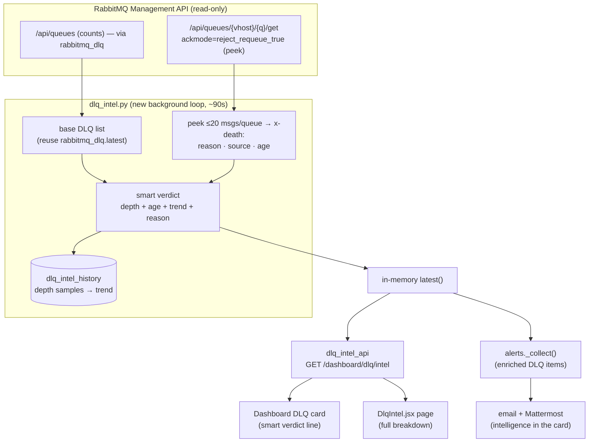
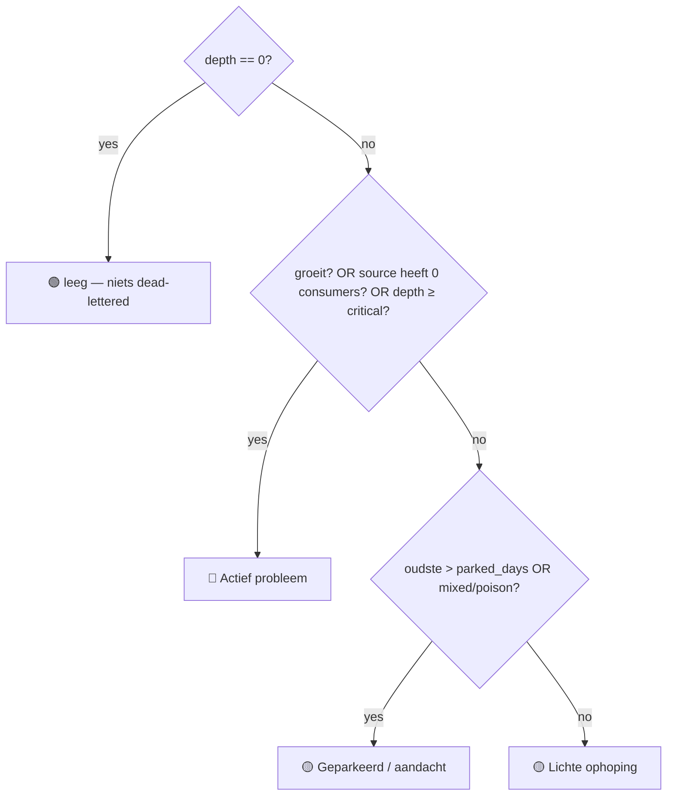
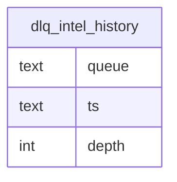

# DLQ Intelligence — Design Spec

- **Date:** 2026-06-18
- **Feature flag:** `DLQ_INTEL_ENABLED` (default **off**)
- **Status:** Approved design (Q1 C · Q2 B · Q3 B · Q4 C), ready for implementation plan
- **Author:** Anton Partono (with Claude)

---

## 1. Problem & goal

Today the dead-letter-queue (DLQ) feature only knows **how many** messages are
stuck (depth) and **whether the source queue has a consumer**. It can't tell you
**why** messages died, **how old** they are, or **whether the pile is growing** —
so when something is wrong it's hard to understand and act on.

**Goal:** make DLQ monitoring genuinely **intelligent, robust, consistent and
intuitive** — one engine that reads RabbitMQ **read-only**, explains *what is wrong
and why* in plain language, and feeds that same intelligence to the dashboard card,
a dedicated insight page, **and** the alert email/Mattermost — additively, behind a
flag, without modifying the existing working DLQ monitor or the FROZEN code.

---

## 2. Decisions (the 4 questions)

1. **Scope (C):** one shared `dlq_intel` engine feeds an insight page **and** smarter
   alerts — single source of truth → always consistent.
2. **Read depth (B):** **read-only message peeking** via the Management API
   (`ackmode=reject_requeue_true` → peek then requeue, never consume/delete), capped
   at 20 messages/queue on a ~90s loop. Remediation (requeue/purge) is **deferred**.
3. **Verdict (B):** a **smart verdict** from four signals — depth + oldest age +
   trend (growing/stable/draining) + dominant failure reason — not depth alone.
4. **Placement (C):** the dashboard DLQ card gains a one-line **smart verdict**;
   clicking opens a dedicated **DLQ Intelligence page** with the full breakdown.

**Confirmed:** smart-verdict severity may differ from today's depth-only severity
(a *growing* queue can go 🔴 earlier — intended). Peek = ~90s interval, 20 msg max.

---

## 3. Hard constraints (RULES.md)

- Additive only. `rabbitmq_dlq.py` is **reused, not modified** (`dlq_intel` calls its
  `latest()`/`classify()` and enriches on top). The FROZEN cert/Mistral code is
  untouched.
- Inert unless `DLQ_INTEL_ENABLED=true`; off = today's behaviour exactly.
- Read-only throughout — peeking requeues messages untouched; **no** requeue/purge.
- Rollback-safe: flip the flag off; drop the one new table.

---

## 4. Architecture



### Module responsibilities
- **`dlq_intel.py`** — collect (reuse base) → peek → trend → verdict → cache; the
  background loop. One purpose: *produce the DLQ intelligence*.
- **`dlq_intel_api.py`** — read-only HTTP surface, `require_feature("rabbitmq")`.
- **`DlqIntel.jsx`** — the page; talks only to the API.
- Alert renderers (`alerts_mattermost.py`/`alerts_email.py`) gain optional DLQ fields.

---

## 5. The peek (read-only, safe)

For each **non-empty** DLQ:
`POST /api/queues/{vhost}/{name}/get` with body
`{"count": 20, "ackmode": "reject_requeue_true", "encoding": "auto"}`.

- `reject_requeue_true` → messages are **read then requeued** (not consumed/deleted).
- From each message's **`x-death`** header (first entry) extract:
  - **reason**: `rejected` | `expired` | `maxlen` | `delivery_limit` (→ "max-retries")
  - **source**: `exchange` + `routing-keys`
  - **time** → **age** (now − time)
- Cap 20/queue, ~90s loop → negligible broker load on low-volume DLQs.
- **Caveat:** peeking can nudge message ordering; harmless for parked DLQs.

Graceful failure: a peek error for a queue → that queue keeps a **count-only**
verdict (reason "onbekend"); the engine and alert loop never raise.

---

## 6. Smart verdict (the intelligence)

Per queue, from `depth`, `oldest_age`, `trend`, `dominant_reason`, `source_consumers`:



- **trend**: compare current depth to the sample ~N minutes ago in
  `dlq_intel_history` → `growing` (↑ beyond threshold) / `draining` (↓) / `stable`.
- **dominant_reason**: most common `x-death.reason` among peeked messages.
- **headline** (human, Dutch): e.g.
  `🔴 Actief probleem — groeit · 240 berichten · oudste 3u · vooral max-retries op order-service`
  / `🟡 Geparkeerd — stabiel · 12 berichten · oudste 6 dagen · gemengde oorzaken`.
- **recommended action** keyed to dominant reason:
  - `delivery_limit`/max-retries → "poison-message: herstel of skip het falende bericht; controleer de consumer."
  - `expired` → "controleer of de downstream-consumer draait (TTL verlopen)."
  - `rejected` → "controleer validatie/schema van de afzender."
  - `maxlen` → "queue-limiet bereikt: schaal de consumer of verhoog de limiet."
  - mixed/unknown → "open de queue en onderzoek de oorzaken."

---

## 7. Data model



- One row per queue per poll; pruned to the last ~50 samples/queue (enough for trend
  over a few hours). Verdict, reason-groups and ages are computed live and cached in
  memory (like `uptime`) — not persisted.

---

## 8. Card + Page (Q4 C)

**Dashboard DLQ card** — additive verdict line under the existing count: the 🔴/🟡
headline for each problematic queue. Glance = *"is er iets mis?"*.

**`DlqIntel.jsx` page** (reached by clicking the card) — per queue:
- the **verdict** (colour + headline) and **recommended action**,
- a **failure-reason breakdown** (`180× max-retries · 60× rejected`),
- **oldest / newest age** and a small **trend** indicator,
- a **sample table** of peeked messages (reason · age · source routing-key),
- a plain-language line on **what that queue does** (per-queue description map).

Built on the dashboard design system (`.panel`, `.up-tile`, severity colours,
`.dash-table`) for consistency with Alerting/Uptime.

---

## 9. Smarter alerts (Q1 C)

DLQ alerts still fire **once per incident** (existing rule). `alerts._collect()`
pulls DLQ items from `dlq_intel` (falling back to `rabbitmq_dlq` if intel is cold),
attaching `reason`, `oldest_age`, `trend`, `source`, `action`. The email and the
Mattermost card render these extra fields, so an alert reads e.g.:

> 🔴 KRITIEK · indexatie.dlq — **groeit** · 240 berichten · oudste 3u
> Oorzaak: **max-retries** op `order-service` · Actie: poison-message herstellen/skippen.

---

## 10. Security & consistency

- Read-only everywhere; peek requeues untouched; **no** requeue/purge in this feature.
- Reuses the existing **`rabbitmq` feature grant** — no new permission key.
- RabbitMQ creds stay server-side (existing `RABBITMQ_*`); never sent to the frontend.
- Graceful degradation: any RabbitMQ/peek error → count-only verdict; never breaks the
  dashboard, the page, or the alert loop.

---

## 11. Configuration

```ini
DLQ_INTEL_ENABLED=false        # master flag (off = today's behaviour)
DLQ_INTEL_INTERVAL=90          # seconds between intelligence passes
DLQ_INTEL_PEEK_MAX=20          # max messages peeked per queue per pass
DLQ_INTEL_PARKED_DAYS=2        # oldest-age beyond this = "geparkeerd" warning
DLQ_INTEL_GROW_DELTA=5         # depth increase (vs prior sample) that means "growing"
DLQ_INTEL_HISTORY=50           # depth samples kept per queue (trend)
```

---

## 12. Testing strategy

| # | Test | Expectation |
|---|---|---|
| 1 | `x-death` parse | reason/source/age extracted from header array |
| 2 | verdict: growing | 🔴 even below old depth threshold |
| 3 | verdict: parked long, stable | 🟡 "geparkeerd" |
| 4 | verdict: no source consumer | 🔴 |
| 5 | verdict: empty | 🟢 |
| 6 | trend from history | growing/stable/draining computed correctly |
| 7 | peek uses ackmode reject_requeue_true | asserted in the request body (non-destructive) |
| 8 | peek failure | falls back to count-only verdict, no raise |
| 9 | API gating | `require_feature("rabbitmq")` enforced |
| 10 | alert enrichment | DLQ alert includes reason/age/trend/action |

Run via pytest in a `python:3.13` Docker container.

---

## 13. Rollback plan

1. `DLQ_INTEL_ENABLED=false` → engine inert; card/page/alerts revert to today's
   count-only behaviour. Instant.
2. Drop `dlq_intel_history` (additive table; nothing else altered).
3. Remove the new files + the additive registrations. `rabbitmq_dlq.py`, the FROZEN
   code and the alert engine's core were never structurally changed.

---

## 14. Out of scope (YAGNI / future)

- **Remediation** (requeue / purge) — separate super-admin-only, audited, confirm-
  dialog feature (Q2 C, deferred).
- **Anomaly baseline** vs per-queue normal levels (Q3 C) — needs history + tuning.
- Replacing the existing count monitor with `dlq_intel` (keep both for now).
