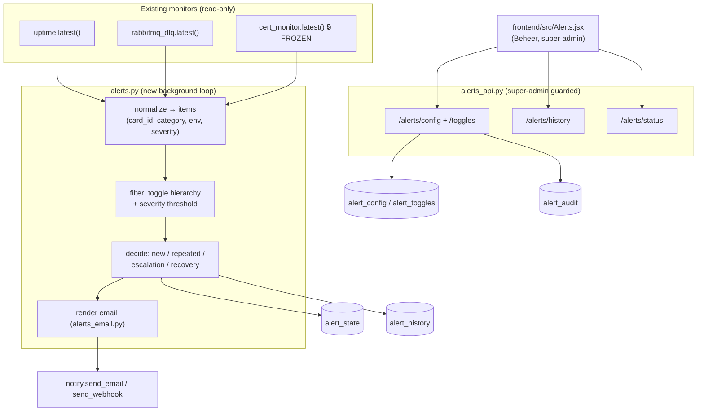
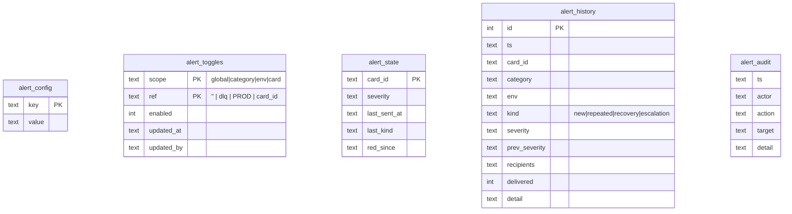
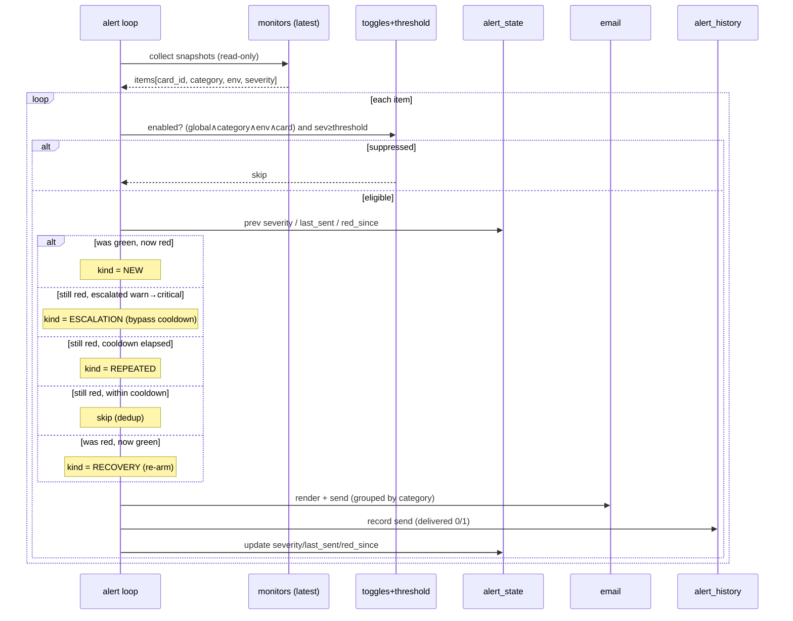
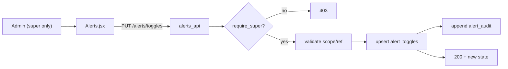
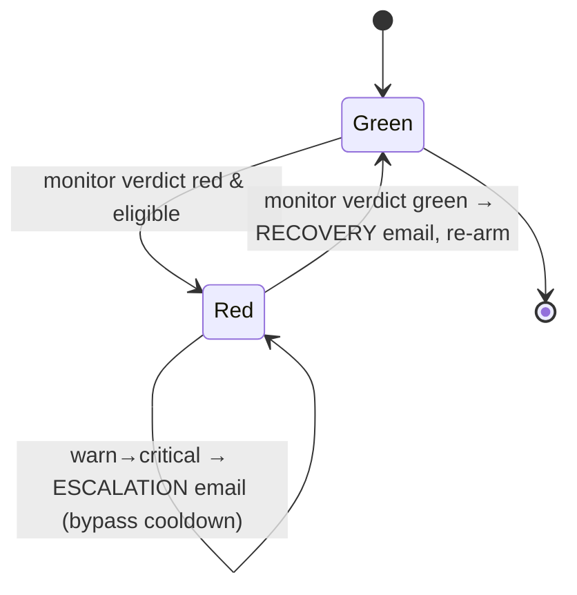

# Unified Alerting — Design Spec

- **Date:** 2026-06-18
- **Feature key:** `alerts`
- **Status:** Approved design (1A · 2B · 3A · 4A · 5A), ready for implementation plan
- **Author:** Anton Partono (with Claude)

---

## 1. Problem & goal

The monitoring dashboard surfaces three families of health signal — **Environment
status** (PROD/ACC/TST), **Dead-letter queues** (6 DLQs), and **Certificate & TLS
health** (PROD/ACC/TST). Each already emails an alert independently, but there is:

- no central place for an admin to manage alerting,
- no per-environment / per-category / per-card on-off control,
- no configurable cooldown, recipients, or severity threshold,
- no alert history, and
- no "back to green" recovery email.

**Goal:** one **admin-managed, intelligent, secure** alerting layer that emails
configured recipients when any monitored card becomes RED — with toggles, cooldown,
recovery, audit, and history — added **without changing existing working code** and
**without touching the FROZEN certificate code**.

---

## 2. Hard constraints (from RULES.md)

- Do **not** modify existing working code without explicit permission. Only the
  minimal additive touches in §6 are approved.
- `backend/certificates.py` and `backend/cert_monitor.py` are **FROZEN** — read-only
  access via `cert_monitor.latest()` only.
- Mistral code/config is **FROZEN** — irrelevant here, not touched.
- The feature is **inert unless `ALERTS_ENABLED=true`**; OFF reproduces today's
  behaviour exactly.
- Fully **rollback-safe**: takeover of alerting is achieved by flipping env flags
  (config), never by deleting working code.

---

## 3. Existing landscape (what we build on)

| Source | Module | Existing trigger | Existing gate | `.latest()` read-only? |
|---|---|---|---|---|
| Environment status | `uptime.py` | `DOWN` after settle | `UPTIME_ALERT_ENABLED` | yes |
| DLQ | `rabbitmq_dlq.py` | new / escalated critical | `RABBITMQ_ALERT_ENABLED` | yes |
| Certificates 🔒 | `cert_monitor.py` (FROZEN) | grade WARN/CRITICAL | `CERT_ALERT_ENABLED` | yes |

Delivery layer reused as-is: `notify.send_email(subject, html, text)` and
`notify.send_webhook(text)`. Shared DB via `backend/db.py`. Auth via
`permissions.py` (`has_feature`) + super-admin check.

**Decision (Q1A):** the new engine becomes the single source of truth; the three
inline alerters are switched **off** by setting `UPTIME_ALERT_ENABLED=false`,
`RABBITMQ_ALERT_ENABLED=false`, `CERT_ALERT_ENABLED=false` (config only). The engine
reads each monitor's already-computed verdict; it never re-derives their logic.

---

## 4. Decisions (the 5 questions)

1. **Trigger / ownership (A):** new engine owns alerting; old inline alerts disabled
   via env flags. RED = uptime `DOWN`, dlq `critical` (warn optional), cert
   `WARN`/`CRITICAL`, taken from each monitor's own verdict.
2. **Recipients (B):** admin-managed recipient list in the DB (`alert_config`),
   seeded from `DIGEST_RECIPIENT_LIST`, validated server-side. Per-category routing
   is a future additive option.
3. **Toggle structure (A):** strict hierarchy, AND precedence — alert fires only if
   **global ∧ category ∧ env ∧ card** are all enabled. Absent toggle = ON
   (default-ON); new cards covered automatically.
4. **Cooldown (A):** per-card cooldown (default 60 min, configurable). Repeats
   suppressed until cooldown elapses; **severity escalation (warn→critical) bypasses
   cooldown**; recovery email on return to green, then re-arm. Structured so
   time-based escalation (C) is a later additive change.
5. **Security & audit (A):** `alerts` feature key; **configuration super-admin-only**;
   viewing requires the `alerts` grant; server-side email validation; SMTP secrets
   stay in env; two audit trails (config changes + sends); safe failure.

**Threshold default:** **critical/DOWN only**. Admin may lower to include `warn`.

---

## 5. Architecture



### Module responsibilities

- **`alerts.py`** — collection, normalization, toggle/threshold filtering, the
  cooldown/dedup/recovery decision, state + history persistence, the background loop.
  One clear purpose: *decide and record what to alert*.
- **`alerts_email.py`** — pure rendering: an item + kind → (subject, html, text).
  No I/O. Independently testable.
- **`alerts_api.py`** — HTTP surface; auth guards; input validation; reads/writes
  config, toggles, history; never contains alert logic.
- **`Alerts.jsx`** — admin UI; talks only to the API.

---

## 6. Files

**New (additive):**
`backend/alerts.py`, `backend/alerts_api.py`, `backend/alerts_email.py`,
`frontend/src/Alerts.jsx`, `backend/tests/test_alerts.py`,
`docs/KIBANA-OO/Alerting (meldingen).md`, this spec.

**Touched (minimal, additive only):**
- `backend/permissions.py` — add `{"key": "alerts", "label": "Alerting (meldingen)", "group": "Beheer"}` to `CATALOG`.
- `backend/main.py` — register the `alerts_api` router; start `run_alert_loop()` task.
- `backend/config.py` — add `ALERTS_ENABLED`, `ALERTS_INTERVAL`, `ALERTS_COOLDOWN_MINUTES`, `ALERTS_DEFAULT_THRESHOLD`, recipient seed.
- `.env.example` — document new flags; set the three old `*_ALERT_ENABLED=false`.
- `frontend/src/App.jsx` / `Nav.jsx` — add the route/nav entry behind the `alerts` grant.

**NOT touched:** `notify.py` (reused), `cert_monitor.py` / `certificates.py` (FROZEN),
`uptime.py`, `rabbitmq_dlq.py` (only their env gates flip).

---

## 7. Data model (`kibana_oo.db`)



- `alert_config` keys: `global_enabled`, `cooldown_minutes`, `severity_threshold`,
  `recipients` (JSON array).
- `alert_toggles`: a row exists only when an admin turns something **off**; absence = ON.
- `alert_state`: one live row per card for the cooldown/recovery machine.
- `alert_history`: the admin-visible send log (also the send audit).
- `alert_audit`: config-change audit (who/what/when).

---

## 8. Alert decision flow



### Recovery & failure semantics

- **Recovery:** when a card that was red is green again, send one recovery email and
  clear `red_since`/severity → next red re-fires as NEW.
- **Safe failure:** a send error is caught, logged, and written to `alert_history`
  with `delivered=0`; the loop continues and never raises into a request.

---

## 9. Admin toggle flow



---

## 10. Email content

Subject: `⛔ [PROD] open-acc.overheid.nl is DOWN (new alert)`.
Body (HTML + plain text, all values HTML-escaped) includes:

- **Severity** (WARN / CRITICAL / DOWN)
- **Environment** (PROD / ACC / TST)
- **Affected card / component**
- **Current status** and **Previous status**
- **Time detected** (ISO + human)
- **Dashboard deep-link**
- **Suggested administrator action** (per-category lookup table)
- **Kind banner:** New / Repeated / Recovery / Escalation

---

## 11. Security model

```mermaid
graph TD
  subgraph Frontend["Browser (no secrets)"]
    UI["Alerts.jsx"]
  end
  subgraph Backend["FastAPI"]
    EP["alerts_api"]
    AUTH{"session + require_super / require_feature('alerts')"}
    VAL["validate emails / inputs"]
    DB[("kibana_oo.db")]
    ENV["env: SMTP creds<br/>(never leave backend)"]
  end
  UI -- "session cookie" --> EP
  EP --> AUTH
  AUTH -- "deny" --> D403["403"]
  AUTH -- "allow" --> VAL --> DB
  ENV -. used by notify.py .- Backend
```

- **RBAC:** configuration is **super-admin-only**; viewing requires the `alerts`
  grant (deny-by-default for everyone else).
- **Recipient storage:** validated server-side, stored as JSON in `alert_config`.
- **No secrets in frontend:** SMTP host/user/password remain env-only.
- **CSRF / validation:** mutations are session-guarded POST/PUT; all inputs validated
  and length-capped; numeric ranges enforced (cooldown ≥ 1, etc.).
- **Audit:** `alert_audit` (config) + `alert_history` (sends), both viewable.
- **Anti-spam:** per-card cooldown + dedup; severity escalation is the only bypass.
- **Safe failure:** alerting failures never break the loop or a request.

---

## 12. Failure / recovery flow



---

## 13. Testing strategy

| # | Test | Expectation |
|---|---|---|
| 1 | RED card, enabled | email sent, `alert_history` row `kind=new` |
| 2 | GREEN card | no email |
| 3 | Toggle off (any level) | no email |
| 4 | Second RED within cooldown | no duplicate email |
| 5 | warn→critical within cooldown | escalation email sent |
| 6 | RED→GREEN | recovery email sent, state re-armed |
| 7 | Non-super mutates config | 403, no change |
| 8 | Invalid recipient email | rejected, not stored |
| 9 | Any send | `alert_history` row written (delivered 0/1) |

Run with the project convention: pytest inside a `python:3.13` Docker container.

---

## 14. Rollback plan

1. **Instant:** set `ALERTS_ENABLED=false` → engine inert, zero emails, dashboard
   unchanged.
2. **Restore old behaviour:** set `UPTIME_ALERT_ENABLED=true`,
   `RABBITMQ_ALERT_ENABLED=true`, `CERT_ALERT_ENABLED=true` → the original inline
   alerts resume exactly as before.
3. **Full removal:** drop the new tables (additive; no existing table altered);
   remove the new files and the catalog/router/loop registrations. No FROZEN code,
   `notify.py`, or monitor logic was ever modified, so removal is clean.

---

## 15. Out of scope (YAGNI, future additive)

- Per-category recipient routing (Q2C).
- Time-based escalation after N windows (Q4C).
- SMS / push channels.
- Per-card custom cooldown overrides.
